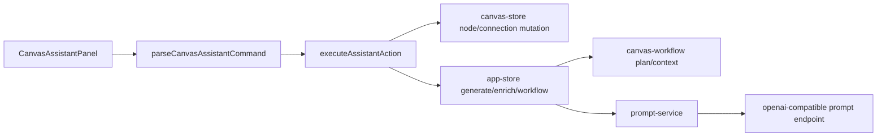

## 问题与范围

当前 Canvas Assistant 是怎么接入 Canvas、Provider 和运行链路的？Canvas Agent V1 要变成真正的 tool-calling agent，应该新增哪些边界，避免继续把能力堆在正则解析和面板组件里？

范围限定在当前仓库的 Canvas UI、Canvas store、App store、Provider 设置、OpenAI 兼容 adapter 和 Canvas workflow 相关服务。

## 速答

当前实现是“面板内解析命令 + 直接调用 Canvas 操作”的本地助手，不是 Agent。`CanvasAssistantPanel` 同时负责输入、@ mention、消息展示、正则命令执行和动作调度；底层 Canvas store/app store 已经具备大部分 V1 tool executor 所需原子能力。

Provider 系统目前只有 `image` 和 `prompt` 两种用途，adapter 只暴露 `generateImage`、`inspirePrompt`、`enrichPrompt`。Canvas Agent V1 需要新增独立的 `agent` provider usage/capability 和 adapter 方法，不能复用 Prompt Provider，否则无法表达“支持原生 tool calling”的硬约束。

Canvas Agent V1 应把 `Parser + LocalExec` 替换/包裹成 `AgentRunner -> ToolRegistry -> CanvasToolExecutor`，UI 只承载对话、timeline、pending change 与节点 focus/highlight。

## 关键证据

- `src/components/canvas/CanvasAssistantPanel.tsx:12` 定义了面板 props，直接接收 `onCreateNode`、`onAddConnection`、`onUpdateNodeContent`、`onEnrichTextNode`、`onTextNodeGenerate`、`onGenerateNodeRun`、`onRunWorkflow` 等执行函数，说明 UI 层已经知道所有操作入口。
- `src/components/canvas/CanvasAssistantPanel.tsx:106` 的 `submit` 先写 user message，再调用 `executeCanvasAssistantCommand`，最后把字符串结果写回 assistant message；没有 provider/LLM/tool loop。
- `src/components/canvas/CanvasAssistantPanel.tsx:428` 的 `executeCanvasAssistantCommand` 调用 `parseCanvasAssistantCommand` 并按 actions 顺序执行，失败和结果都被折叠成文本。
- `src/store/canvas-store.ts:49` 的 store interface 已提供创建节点、连接、更新内容、创建 text->generate 链、删除等 Canvas 原子动作；V1 可以复用其中低风险动作，暂不暴露删除。
- `src/store/app-store.ts:108` 暴露 `generateCanvasNode`、`runCanvasWorkflow`、`enrichCanvasTextNode`，其中 `generateCanvasNode` 会通过 `buildCanvasGenerationPlanForNode` 解析上下文并运行生成。
- `src/services/canvas-workflow.ts:67` 已有 `summarizeCanvasGenerationInput(project,nodeId)`，可作为 `inspect_generation_context` 的基础而不是重写上下文推断。
- `src/shared/types.ts:14` 目前 `ProviderUsage = 'image' | 'prompt'`，`src/shared/types.ts:167` 的设置只存 `selectedImageProfileId` 和 `selectedPromptProfileId`；没有 Agent Provider 选择位。
- `src/adapters/types.ts:28` 的 `ProviderAdapter` 只包含图片生成和提示词辅助方法；没有 tool calling agent 调用契约。

## 细节展开

### 当前 UI/执行混合点

`CanvasAssistantPanel` 是当前耦合最重的节点。它负责 contentEditable 输入、@ mention 定位、聊天消息持久化入口、命令执行、节点 ref 解析、连接合法性检查和执行结果文案。这使得“把所有 Canvas 功能提供给助手作为技能”的目标很难继续靠正则扩展，因为每加一个能力都会增加 UI 组件内部的解析分支和执行上下文。

### 可复用底层能力

Canvas store 已经提供 V1 的低风险 mutation 基础：创建文本/生成节点、添加连接、从文本创建生成节点、更新内容和更新 metadata。App store 已经提供高成本动作：运行生成节点、运行 workflow、丰富文本节点。V1 不需要从 DOM 反推 Canvas 状态，应该直接从 `activeProject.nodes/connections` 构造结构化摘要。

### Provider 缺口

Prompt Provider 只能表达“给一段输入返回一段提示词”。Canvas Agent 需要模型返回 `tool_calls`，还要接收多轮 tool results，因此应在 Provider 设置里新增 `agent` 用途和 `selectedAgentProfileId`，adapter 需要新增类似 `runCanvasAgentTurn(profile, request)` 的方法。

## 未决问题

- 当前没有稳定的 provider-side tool calling 类型；需要在 `src/shared/types.ts` 和 `src/adapters/types.ts` 先定义 V1 契约。
- 当前 assistant message 只有 role/content；timeline 与 pending change 可以先作为运行态 UI 状态，不一定进入消息持久化 schema。

## 后续建议

基于本探索进入 `canvas-agent-v1` roadmap：先做 Provider/adapter/runner/tool registry 最小闭环，再替换 UI 执行路径并保留 legacy regex fallback。

## 相关文档

- `.codestable/requirements/canvas-assistant.md`
- `.codestable/features/2026-06-06-canvas-assistant/canvas-assistant-design.md`
