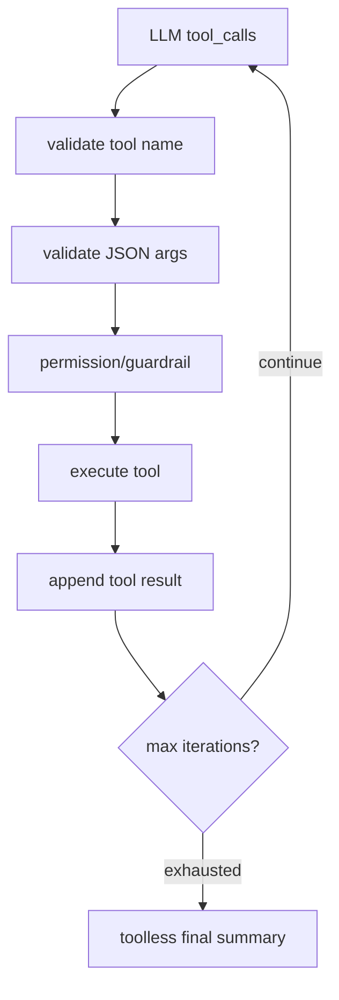

## 问题与范围

参考 hermes-agent 时，Canvas Agent V1 应借鉴哪些 agent 工程结构？本探索只记录能迁移到 PixAI Canvas 的模式，不复制 hermes 代码。

范围集中在 hermes-agent 的 conversation loop、tool executor、tool guardrails 和 ACP permission bridge。

## 速答

hermes-agent 的核心可借鉴点不是具体工具，而是 tool loop 的工程护栏：工具名校验、参数 JSON 校验、有限迭代预算、工具执行前 block/guardrail、工具进度回调、工具结果回填和权限桥接。

Canvas Agent V1 可以做一个更小的浏览器内版本：每次用户消息最多 8 次 tool call；每次 tool call 都进入 timeline；未知工具和非法参数返回 tool error 给模型；低风险工具自动执行，高风险工具进入 pending confirmation；重复失败/无进展时停止循环并给用户可读解释。

## 关键证据

- `agent/conversation_loop.py:3842` 在 assistant message 包含 tool calls 时进入工具处理分支，并打印/记录工具调用数量。
- `agent/conversation_loop.py:3850` 先校验工具名，未知工具会把可用工具列表作为 tool result 反馈给模型；重试达到 3 次后返回 partial error。
- `agent/conversation_loop.py:3903` 校验工具参数 JSON，并把空字符串修正成 `{}`；非法 JSON 会先重试，之后注入 tool error 让模型恢复。
- `agent/conversation_loop.py:4074` 执行工具后继续 agent loop；`agent/conversation_loop.py:4570` 在迭代预算耗尽时去掉工具再请求模型总结。
- `agent/tool_guardrails.py:63` 定义每轮工具 loop guardrail 阈值；`agent/tool_guardrails.py:224` 的 controller 跟踪重复失败和只读工具无进展。
- `agent/tool_executor.py:324` 在真正执行工具前先做 block evaluation；`agent/tool_executor.py:431` 和 `agent/tool_executor.py:717` 分别有 tool started/completed callback。
- `acp_adapter/permissions.py:41` 构造 allow once/session/always/deny 等权限选项，`acp_adapter/permissions.py:107` 将 UI 权限请求桥接为 agent 可消费的 callback。

## 细节展开

### V1 可迁移模式

PixAI 不需要 hermes 的并发工具、文件 checkpoint 或 ACP 协议复杂度，但需要保留它的“每个 tool call 都可观察、可阻断、可恢复”的结构。Canvas Agent Runner 应明确分层：adapter 只负责模型请求和 tool call 返回；runner 负责循环、预算和消息协议；tool registry 负责 schema/权限/执行；UI timeline 订阅 runner 事件。

### V1 不应迁移的复杂度

Canvas V1 工具大多会改 UI 状态和本地项目，不能默认并发执行 mutation。V1 应顺序执行工具，避免两个工具同时修改同一 Canvas project 造成状态竞争。只有纯读取工具未来可以考虑并发。

### 权限映射

V1 的低风险自动执行包括 list/inspect/focus/create/connect/generate-run 等已明确范围的 Canvas 操作。高风险或用户可见覆盖应走 pending/proposal：`propose_prompt_enrichment` 只生成候选变更，不自动覆盖；`apply_pending_change` 由用户确认后执行。

## 未决问题

- hermes-agent 是 Python CLI/ACP 环境，PixAI 是 React/Tauri 前端；只能迁移模式，不能复用代码。
- 当前未完整审计 hermes 的所有 provider adapter，V1 只需要 OpenAI-compatible Responses API 原生 tool calling。

## 后续建议

在 PixAI 中实现小型顺序 tool loop，并把 hermes 的校验、预算、timeline、权限分层作为验收标准。

## 相关文档

- `.codestable/compound/2026-06-07-explore-canvas-agent-current-architecture.md`
