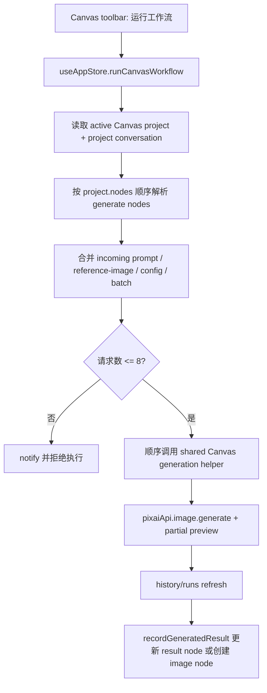

# Canvas Advanced Workflow Nodes Design

## 0. 术语约定

- **Canvas config node**：Canvas 中 `type: 'config'` 的节点，保存 ratio、quality 等生成参数覆盖项，只影响连到同一 generate node 的本次请求。
- **Canvas batch node**：Canvas 中 `type: 'batch'` 的节点，保存多行 prompt 变体；workflow run 会把每个非空行顺序展开为一次生成请求。
- **Canvas result node**：Canvas 中 `type: 'result'` 的节点，用来收纳 generate node 的最近成功结果，并可作为后续 reference-image 输入。
- **Bounded workflow run**：从 Canvas toolbar 触发的有限顺序执行；按 project.nodes 顺序运行 generate nodes，不做 DAG 拓扑、并发队列或 agent 调度。
- **Workflow request budget**：一次 bounded workflow run 最多允许的生成请求数，第一版固定为 8。

## 1. 决策与约束

### 1.1 需求摘要

本 feature 承接 roadmap 的最后一个后置单元：在现有文本、图片、生成节点之上增加配置、批量和结果节点，让用户能用轻量连线表达更完整的 Canvas 工作流，并可以从 toolbar 触发一次有上限的顺序 workflow run。

成功标准：

- Canvas toolbar 可以添加 config、batch、result 三种高级节点，并触发 workflow run。
- config node 连到 generate node 后，只覆盖该 generate node 的本次生成参数。
- batch node 连到 generate node 后，workflow run 会按非空行顺序展开 prompt 变体，并受 8 次请求上限保护。
- result node 连到 generate node 后，生成成功结果写入该 result node；没有 result node 时保留现有自动创建 image result node 行为。
- generate node 单独运行继续可用，并复用同一套 config/reference/prompt 解析。
- 导入导出和本地持久化保留新节点、新连接和 result/history binding；导入 running 状态仍降级为 idle。

明确不做：

- 不做端口体系、端口坐标、端口类型检查器或拖拽端口 UI。
- 不做复杂 DAG 执行器、拓扑排序、并发队列、失败重试编排或 workflow agent。
- 不做长期批量任务调度、后台队列、暂停 / 恢复 / 取消 workflow。
- 不新增 Canvas 专用 Provider、独立 history/run schema 或隐藏 conversation。
- 不把当前会话所有参考图自动带入 Canvas 生成；仍只使用连到目标 generate node 的输入。

### 1.2 复杂度档位

- 结构 = cross-store orchestration：扩展 shared types、Canvas service/store/UI、轻量 workflow 计划 service 和 app-store generation bridge。
- 兼容性 = L3：旧 project 继续加载，新 project JSON 需要 normalize 新 node/connection。
- 执行 = bounded sequential：有总请求数上限，无并发、无持久队列、无 DAG。
- UI = desktop tool：保持 Canvas toolbar + 节点 body，不新增项目管理页或复杂右侧属性面板。
- 可测试性 = tested：覆盖 service normalize、workflow 计划解析、store actions、app-store 执行和 Canvas UI 入口。

其余维度按项目默认档位：性能 bounded、可读性 team、可演进性 active。

### 1.3 关键决策

- `CanvasNodeType` 扩展为 `text | image | generate | config | batch | result`。
- `CanvasConnectionKind` 扩展为 `prompt | reference-image | result | config | batch`，连接语义仍由来源节点推导。
- config node 第一版只覆盖 `ratio`、`quality` 和可选 `n`；`n` 限制为 1..4，bounded workflow 仍以实际请求展开数做总上限。
- batch node 使用 `metadata.content` 保存多行 prompt 变体；空行会被忽略。
- result node 使用 `metadata.content` 保存可展示图片源，并保留 `historyItemId/runId/requestIndex/status/mimeType/storagePath`。
- `src/services/canvas-workflow.ts` 承担纯计划解析：config 合并、batch 展开、prompt 组装和请求数预估；`app-store` 保留生成状态、通知、runs/history refresh 与 partial preview 编排。
- `generateCanvasNode(nodeId)` 复用 workflow 计划解析；单节点运行只执行一个请求，batch node 存在时使用第一条变体。
- `runCanvasWorkflow()` 先解析所有 generate nodes 的请求计划并检查总量，超过 8 时不发起任何生成请求。
- 成功结果仍先进入现有 `ImageService` / history；Canvas 只绑定 history item 和展示源。

### 1.4 前置依赖

- `canvas-generate-node` 已完成，Canvas generate node 可以复用 ImageService、history 和 partial preview。
- `canvas-reference-bridge` 已完成，Canvas image node 可作为 reference 输入。
- `canvas-project-import-export` 已完成，项目 JSON 导入导出使用 `CanvasProjectService` normalize。

## 2. 名词与编排

### 2.1 名词层

#### 现状

- `CanvasNodeType` 只有 `text/image/generate`，`CanvasConnectionKind` 只有 `prompt/reference-image/result`。
- `CanvasNodeMetadata` 是宽对象，当前保存 content、运行状态、history/reference 绑定和图片信息。
- `useCanvasStore` 只有添加文本、图片、生成节点和生成结果 image node 的 action。
- `useAppStore.generateCanvasNode()` 只解析连到当前 generate node 的 text/image 输入，并把 `n` 固定为 1。
- `CanvasProjectService` normalize 会过滤未知节点类型和未知连接 kind。

#### 变化

扩展共享类型：

```ts
export type CanvasNodeType = 'text' | 'image' | 'generate' | 'config' | 'batch' | 'result'
export type CanvasConnectionKind = 'prompt' | 'reference-image' | 'result' | 'config' | 'batch'
```

扩展 metadata 字段：

```ts
export type CanvasNodeMetadata = {
  content: string
  status?: CanvasNodeStatus
  ratio?: ImageRatio
  quality?: ImageQuality
  n?: number
  runId?: string
  requestIndex?: number
  historyItemId?: string
  errorMessage?: string
  // existing image/reference fields...
}
```

扩展 Canvas store action：

```ts
export type CanvasStoreState = {
  addConfigNode(): Promise<void>
  addBatchNode(): Promise<void>
  addResultNode(): Promise<void>
  updateNodeMetadata(nodeId: string, patch: Partial<CanvasNodeMetadata>): Promise<void>
  recordGeneratedResult(sourceNodeId: string, input: CanvasImageNodeInput): Promise<void>
}
```

扩展 app store action：

```ts
export type AppState = {
  generateCanvasNode(nodeId: string): Promise<void>
  runCanvasWorkflow(): Promise<void>
}
```

行为示例：

- `config-1 -> generate-1`，config ratio 为 `16:9`、quality 为 `high`：运行 `generate-1` 时使用 config 覆盖当前 conversation 参数。
- `batch-1 -> generate-1`，content 为三行变体：workflow run 会顺序生成三次，prompt 为 text inputs + generate prompt + 当前变体。
- `generate-1 -> result-1`：成功 history item 的展示源写入 `result-1.metadata.content`，同时保存 `historyItemId/runId/requestIndex`。

### 2.2 编排层



#### 现状

- Canvas UI 已支持无端口的轻量连线；连接 kind 由来源节点推导。
- 单个 generate node 运行时会解析 prompt/reference，发起一次生成，成功后创建 image node 和 result connection。
- app-store 生成桥承担预检、运行态、partial preview、history refresh 和 Canvas 回写。

#### 变化

- Canvas UI 增加高级节点入口和 workflow run 入口；节点 body 分文件实现，`CanvasNodeLayer` 保留外壳、拖动、连接和删除职责。
- `canvas-workflow` service 只做纯计划，不调用 `ImageService`、不改 store、不读写 history；它让请求数预算、config patch 和 batch prompts 可独立测试。
- `connectionKindForNode()` 扩展为：generate -> result，image/result -> reference-image，config -> config，batch -> batch，text -> prompt。
- 生成输入解析合并四类 incoming connection：
  - `prompt`：来自 text node 的 content。
  - `reference-image`：来自 image/result node 的展示源或 reference binding。
  - `config`：来自 config node 的 ratio/quality/n 覆盖。
  - `batch`：来自 batch node 的非空 prompt 变体。
- 单节点运行使用同一 helper，但最多执行一次；如果连了 batch node，只取第一条非空变体。
- workflow run 使用所有 batch 变体展开请求；无 batch 时每个 generate node 生成一次。
- workflow run 先构建完整计划并检查总请求数，超过 8 个请求时不进入半执行状态。
- 单个请求失败会标记对应 generate node failed 并继续后续计划；已成功结果保留。

#### 流程级约束

- 缺 active project、缺绑定 conversation、缺 generate node 或缺 prompt 时不发起请求。
- running generate node 不重复运行。
- workflow run 不做并发，不保存队列状态，不提供暂停 / 恢复。
- config/batch/result 只影响与其连线的目标 generate node；未连接节点不参与请求。
- reference 输入仍必须先转为当前 project conversation 的 ReferenceImage。
- partial preview 仍是临时状态；最终结果必须先进 history，再回写 Canvas。

### 2.3 挂载点清单

- `src/shared/types.ts`：Canvas node / connection / metadata / app store action 类型扩展。
- `src/services/canvas-projects.ts`：新节点和连接 kind 的 normalize、默认尺寸和导入 running 降级。
- `src/services/canvas-workflow.ts`：config/batch/prompt 纯解析、workflow request budget 和执行计划。
- `src/store/canvas-store.ts`：高级节点创建、metadata 更新、result node 回写。
- `src/store/app-store.ts`：共享 Canvas generation helper、reference 解析、bounded workflow run 执行和 runs/history 刷新。
- `src/components/canvas/*`：高级节点 body、Canvas toolbar 入口、节点渲染分发和 workflow 按钮。

### 2.4 推进策略

1. 数据模型与持久化：扩展共享类型、service normalize、store 高级节点 action 和 result 回写。
   - 退出信号：service/store 测试证明新节点可创建、导入导出不被过滤、running 状态导入降级。
2. Canvas UI：增加 config/batch/result node body、toolbar 高级节点入口和 workflow run 按钮。
   - 退出信号：组件测试证明节点可见可编辑，入口禁用态正确。
3. 生成编排：新增纯 workflow 计划解析并抽共享 Canvas generation helper，单节点运行读取 config/reference/result 输入，workflow run 有上限顺序执行 batch 变体。
   - 退出信号：app-store 测试证明 config 覆盖、batch 上限、result node 回写和失败继续语义。
4. 验证收尾：跑定向测试、`pnpm check`、`pnpm build` 和前端 smoke。
   - 退出信号：测试、类型检查、构建通过，Canvas toolbar 与高级节点有截图证据。

### 2.5 结构健康度与微重构

##### 评估

- 文件级 -- `CanvasNodeLayer.tsx` 已同时承担节点外壳、拖动、连线和 body 分支。新增三类节点会进一步膨胀，body 必须拆到独立组件。
- 文件级 -- `CanvasWorkspace.tsx` toolbar 已拥挤，本次只加一个“高级节点”菜单和一个 workflow run 按钮，不新增项目管理区。
- 文件级 -- `canvas-store.ts` 是 Canvas project mutation 聚合点，新增节点 action 属于同一职责；不把生成执行塞进 store。
- 文件级 -- `app-store.ts` 已偏胖，但 Canvas 生成桥当前事实源在这里。本次把纯计划解析移到 `src/services/canvas-workflow.ts`，执行状态与 history refresh 仍留在 app-store。
- 目录级 -- `src/components/canvas/` 当前是 Canvas UI 目录，新增 3 个 node body 文件符合现有目录语义。
- compound convention 检索命中 Tailwind/shadcn 语义 token 决策；本次 UI 继续使用现有 shadcn primitives 和 token。

##### 结论：不做独立微重构

本 feature 不先做“只搬不改行为”的独立微重构，但新增节点 body 必须落到独立组件文件，纯计划解析必须落到 `canvas-workflow` service，避免继续扩大 `CanvasNodeLayer.tsx` 和 `app-store.ts`。`app-store.ts` 后续若继续增长，建议单独走 `cs-refactor` 拆 Canvas generation orchestration slice。

##### 超出范围的观察

- 完整 DAG / 端口体系需要重新设计节点执行模型和连接端口，不应作为本 feature 的补丁分支。
- 持久 workflow 队列、取消和恢复需要 service 层运行状态模型，不应堆在 app-store 临时 action 中。

## 3. 验收契约

### 3.1 关键场景清单

- 用户从 Canvas toolbar 添加 config、batch、result 节点：节点出现在画布中，刷新 / 导出导入后仍保留。
- 用户编辑 config node：ratio、quality、n 进入 metadata，连到 generate node 后请求参数被覆盖。
- 用户编辑 batch node 多行变体并运行 workflow：每个非空变体顺序触发一次生成，空行被忽略。
- workflow run 预估请求数超过 8：不发起任何生成请求，显示错误通知。
- generate node 连到 result node：成功结果写入 result node；没有 result node 时继续创建 image result node。
- result node 作为 reference-image 输入连到另一个 generate node：后续生成只使用该连接输入。
- 导入包含 running generate/result node 的 JSON：运行态降级为 idle，不恢复旧 run。
- 单个 workflow 请求失败：对应 generate node 标记 failed，后续计划继续执行。

### 3.2 明确不做的反向核对项

- 不新增端口 UI、端口坐标保存或端口类型检查。
- 不新增 DAG 拓扑排序、并发执行、持久队列、暂停 / 恢复 / 取消 workflow。
- 不绕过 `ImageService` / history 创建 Canvas-only 结果。
- 不默认携带当前会话全部参考图。
- 不新增 Canvas 专用 Provider 或隐藏 conversation。

## 4. 与项目级架构文档的关系

验收通过后更新 `ui-shadcn-workbench`：

- Canvas 模式术语补充 config/batch/result node 和 bounded workflow run。
- Canvas 数据与状态补充新 node types、connection kinds、store actions 和 service normalize。
- Canvas 生成流补充 `canvas-workflow` 计划解析、config/batch/reference/result 输入解析和 workflow request budget。
- 已知约束改为支持有上限顺序 workflow run，但仍不支持端口体系、复杂 DAG、并发队列或 workflow agent。

同步更新 `.codestable/architecture/ARCHITECTURE.md` 的 Canvas 模式摘要、模块索引和硬边界。

本 feature 不新增 requirement；它是 `workspace-canvas-mode` roadmap 的最后一个后置实现单元。
