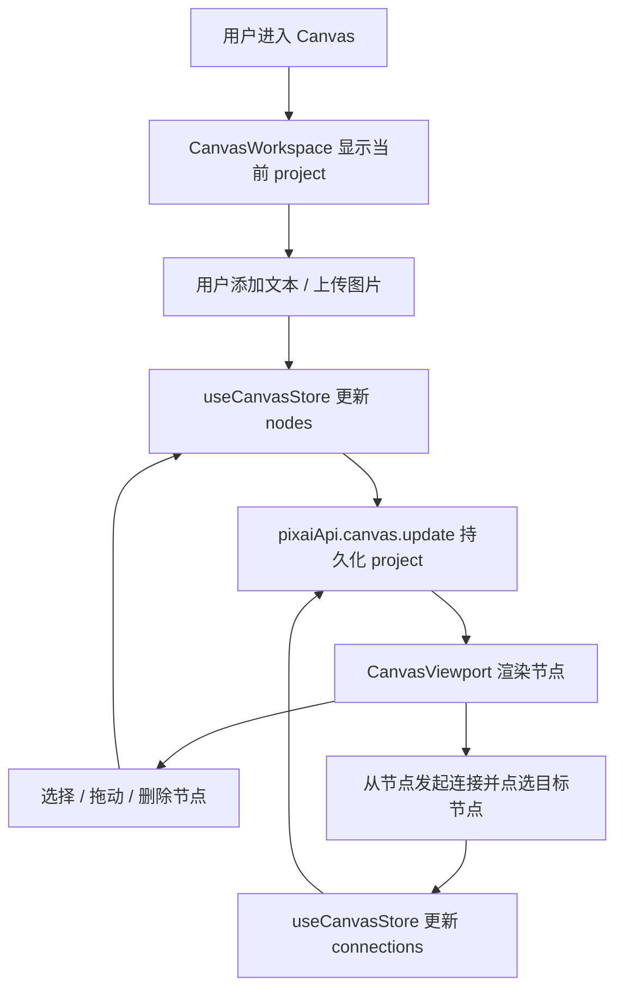

# Canvas Basic Nodes Design

## 0. 术语约定

- **Canvas node**：Canvas project 内可摆放的画布对象。当前 feature 只实现 `text` 和 `image` 两类节点，不实现 `generate` 节点。
- **Text node**：可编辑文本块，`metadata.content` 保存文本。后续生成桥可把它解释为 prompt 片段，但本 feature 不发起生成。
- **Image node**：Canvas 内展示图片的节点。当前只通过本地文件上传读成 data URL 后保存到节点 `metadata.content`，不接 reference/history/gallery。
- **Canvas connection**：节点之间的轻量语义连线，保存 `fromNodeId`、`toNodeId` 和 `kind`。当前不保存端口坐标，不做 DAG 执行。
- **Selected canvas item**：Canvas UI 内的临时选择态，可以是节点或连线；选择态不持久化到 Canvas project。

## 1. 决策与约束

### 1.1 需求摘要

本 feature 接在 `canvas-project-shell` 后，让空 Canvas project 变成可编辑画布：用户可以新增文本节点和图片节点，在画布上选择、拖动、删除节点，并在两个节点之间创建基础连线。修改后的 nodes/connections 需要保存到现有 Canvas project，刷新或重新进入后恢复。

成功标准：

- Canvas header / toolbar 提供“添加文本”和“添加图片”入口。
- 文本节点可显示和编辑内容，图片节点可显示上传图片。
- 节点可以被选中、拖动，位置持久化。
- 选中节点或连线后可以删除；删除节点会同步删除相关连线。
- 用户能从一个节点发起连线并连接到另一个节点，连线刷新后仍恢复。

明确不做：

- 不实现生成节点、批量节点、配置节点或完整 DAG 执行器。
- 不接入图片生成、partial preview、history、gallery 或 reference 桥。
- 不把 Canvas 图片导入参考图系统，不新增素材清理策略。
- 不支持多选、框选、复杂端口、曲线编辑、连接重排或自动布局。
- 不改变经典工作台 `CanvasArea` 结果网格行为。

### 1.2 复杂度档位

- 结构 = modules：沿用 `components/canvas`、`store/canvas-store`、`services/canvas-projects` 的边界，并新增节点渲染子组件，避免继续扩大 `CanvasViewport.tsx`。
- 可测试性 = tested：节点模型持久化、store actions、viewport 节点交互至少有单测；前端 smoke 覆盖新增节点、拖动、连线、删除、刷新恢复。
- 可观测性 = logged：沿用 `CanvasProjectService` 的坏 JSON 恢复日志；本 feature 不新增后台流程日志。

其余维度按项目默认档位：健壮性 L2、性能 reasonable、可读性 team、可演进性 active。

### 1.3 关键决策

- Canvas node 类型先落在 `src/shared/types.ts`，因为 service、store、UI、后续 generation bridge 都会共享。
- `CanvasProject.nodes` / `connections` 从空数组契约升级为真实数组；`schemaVersion` 仍保持 1，旧 project 的空数组可无迁移恢复。
- 图片节点通过本地 file input 读取 data URL，存进 project JSON。它是 Canvas 内临时展示能力，不进入 reference/history/gallery。
- 连线使用轻量语义：text 源节点默认 `kind: 'prompt'`，image 源节点默认 `kind: 'reference-image'`。没有 generate 节点时也允许连线存在，只表达用户的组织关系。
- 节点选择态留在 `CanvasViewport` 局部 UI，不写入 store；持久化只保存 project 数据。

### 1.4 前置依赖

- roadmap item `canvas-project-shell` 已完成，`CanvasProjectService`、`useCanvasStore`、`CanvasWorkspace`、`CanvasViewport` 已存在。
- 本 feature 使用 roadmap 第 4.2 Canvas project 持久化协议和第 4.3 Canvas 节点/连线协议；不触碰第 4.4 之后的流式预览和生成契约。

## 2. 名词与编排

### 2.1 名词层

#### 现状

- `CanvasProject.nodes` 和 `connections` 在 `src/shared/types.ts` 中固定为 `[]`，service clone/normalize 也强制返回空数组。
- `CanvasProjectInput` 只允许更新 `title` 和 `viewport`，store 只有 `updateViewport` / `resetViewport`。
- `CanvasViewport` 只渲染空占位、背景网格和视口控制，不接收 nodes/connections。

#### 变化

- 新增 Canvas node / connection 类型，并升级 Canvas project 数组字段。

```ts
export type CanvasNodeType = 'text' | 'image'
export type CanvasConnectionKind = 'prompt' | 'reference-image'

export type CanvasPoint = {
  x: number
  y: number
}

export type CanvasNodeMetadata = {
  content: string
  mimeType?: string
  fileSizeBytes?: number
  naturalWidth?: number
  naturalHeight?: number
}

export type CanvasNodeData = {
  id: string
  type: CanvasNodeType
  title: string
  position: CanvasPoint
  width: number
  height: number
  metadata: CanvasNodeMetadata
}

export type CanvasConnection = {
  id: string
  fromNodeId: string
  toNodeId: string
  kind: CanvasConnectionKind
}
```

- `CanvasProjectInput` 允许更新节点和连线。

```ts
export type CanvasProjectInput = Partial<
  Pick<CanvasProject, 'title' | 'viewport' | 'nodes' | 'connections'>
> & {
  conversationId?: string
}
```

- `useCanvasStore` 新增节点动作。

```ts
addTextNode(): Promise<void>
addImageNode(input: {
  name: string
  dataUrl: string
  mimeType: string
  fileSizeBytes: number
}): Promise<void>
updateNodeContent(nodeId: string, content: string): Promise<void>
moveNode(nodeId: string, position: CanvasPoint): Promise<void>
deleteNode(nodeId: string): Promise<void>
addConnection(fromNodeId: string, toNodeId: string): Promise<void>
deleteConnection(connectionId: string): Promise<void>
```

### 2.2 编排层



#### 现状

- `CanvasWorkspace` 只把 active project 的 viewport 传给 `CanvasViewport`。
- `CanvasViewport` 自己维护 draft viewport，用 pointer 事件处理平移缩放。
- `CanvasProjectService.update()` 当前只规范化 viewport，不处理 node/connection 数据。

#### 变化

- `CanvasWorkspace` 增加节点工具条：添加文本、上传图片。图片读取在 UI 层完成，store 只接收 data URL payload。
- `CanvasViewport` 接收 `nodes` 和 `connections`，渲染世界坐标层。空项目继续显示 Canvas 占位，有节点时显示节点层。
- 新增节点渲染子组件，负责节点卡片、图片预览、文本编辑、连接 handle、删除按钮和选中态。节点拖动期间使用本地 draft position，释放后调用 store 持久化。
- 连线使用 SVG overlay 根据节点中心点计算线段。用户点击源节点连接 handle 后，再点击目标节点 handle 创建连接；再次选择连线可删除。
- `CanvasProjectService` 规范化 nodes/connections：过滤无效节点、裁剪标题/内容、规范化尺寸/位置，过滤端点不存在或自连接的连线。

#### 流程级约束

- 没有 active project 时，添加节点按钮禁用，不创建孤立节点。
- 节点坐标、宽高必须规范化，避免 NaN 或极端尺寸导致 Canvas 布局失控。
- 图片节点只接受 `image/*` 文件；空文件或非图片文件不写入 project。
- 删除节点必须同步删除所有 from/to 指向该节点的 connections。
- 重复连线（同 from/to/kind）不重复写入。
- 持久化失败时 store 回滚到旧 project，并显示错误提示。

### 2.3 挂载点清单

- `src/shared/types.ts`：Canvas node / connection 共享类型，升级 `CanvasProject` 契约。
- `src/services/canvas-projects.ts`：nodes/connections 规范化、更新和持久化入口。
- `src/store/canvas-store.ts`：Canvas node/connection actions。
- `src/components/canvas/CanvasWorkspace.tsx`：添加文本/图片入口。
- `src/components/canvas/CanvasViewport.tsx` 与新增 canvas 子组件：节点、连线、选择、拖动和删除 UI。

### 2.4 推进策略

1. 节点名词骨架：升级共享类型、CanvasProjectInput 和 service normalize/clone。
   - 退出信号：旧 project 仍能加载，新 nodes/connections 可被 service 创建、更新、列摘要。
2. Store 计算节点：新增 add/update/move/delete node 与 add/delete connection actions。
   - 退出信号：store 测试覆盖新增文本、图片、移动、删除节点和去重连线。
3. Canvas UI 静态结构：新增工具条入口、节点卡片、图片预览、SVG 连线层。
   - 退出信号：Canvas 页面能渲染 text/image 节点和基础连线，不白屏。
4. 交互逻辑：接入节点选择、拖动提交、文本编辑、连接 handle、删除节点/连线。
   - 退出信号：用户操作能改变 nodes/connections，并显示选中态。
5. 持久化联调：节点/连线更新写回 Canvas project，刷新或重进后恢复。
   - 退出信号：浏览器 smoke 证明添加、移动、连接、删除和刷新恢复成立。
6. 验证收尾：补 service/store/component 测试，跑 `pnpm check` 和 `pnpm build`。
   - 退出信号：测试、类型检查、构建通过，关键验收场景有证据。

### 2.5 结构健康度与微重构

##### 评估

- 文件级 — `src/components/canvas/CanvasViewport.tsx`：约 5KB，已承担 pan/zoom 和 viewport controls；继续把节点卡片、连线 SVG、文件上传、拖动状态全部塞进去会职责过宽。
- 文件级 — `src/components/canvas/CanvasWorkspace.tsx`：页面容器约 2.5KB，可承载轻量工具条，但不应承载节点渲染细节。
- 文件级 — `src/store/canvas-store.ts`：当前约 5KB，新增 project mutation action 属于自然扩展，但需要抽一个内部 `updateActiveProject()` helper，避免每个 action 复制 optimistic/persist/rollback。
- 文件级 — `src/services/canvas-projects.ts`：当前约 6KB，新增 normalize node/connection 属于同一服务职责；如果实现明显变长，可把纯 normalize helper 保持在文件底部，不新增横向 util。
- 目录级 — `src/components/canvas/`：当前 4 个文件，新增 2-3 个 canvas 子组件仍在合理范围。

##### 结论：拆渲染子组件，不做纯微重构

本 feature 不需要先做“只搬不改行为”的独立微重构，但实现时必须把节点/连线渲染拆到新增 `CanvasNodeLayer` / `CanvasNodeCard` 这类 canvas 子组件中，避免 `CanvasViewport.tsx` 成为大文件。这个拆分是功能实现的一部分，不改变已有对外行为。

##### 超出范围的观察

- `src/services/app-api.ts` 随服务增加会继续变长，但本 feature 只新增 Canvas project 行为，不重组 service 门面。
- 图片节点把 data URL 写入 project JSON 是本 roadmap 允许的第一版取舍；长期文件引用、清理和 history/reference 追踪留给后续 feature。

## 3. 验收契约

### 3.1 关键场景清单

- 进入已有 Canvas project 后点击“添加文本”：画布出现文本节点，刷新后仍存在。
- 编辑文本节点内容：内容保存到 `metadata.content`，刷新后恢复。
- 通过“添加图片”选择本地图片：画布出现图片节点，图片预览可见，刷新后恢复。
- 拖动节点：节点位置变化，释放后持久化，刷新后位置一致。
- 删除选中节点：节点从画布消失，与它相关的连线也消失。
- 从一个节点发起连接并连接到另一个节点：出现连线，刷新后恢复。
- 删除选中连线：连线消失，不影响两端节点。
- 非图片文件或无 active project 时：不写入 nodes，UI 不白屏。

### 3.2 明确不做的反向核对项

- 代码中不应新增 Canvas 生成调用、`generate` 节点 UI、partial preview 状态或 DAG 执行器。
- 不应新增 reference/history/gallery 互通入口。
- 不应修改 `src/components/workspace/CanvasArea.tsx` 的经典工作台结果网格行为。
- 不应把节点选择态持久化到 project JSON。
- 不应新增云同步、项目包导入导出或图片文件清理策略。

## 4. 与项目级架构文档的关系

验收通过后更新 `ui-shadcn-workbench`：

- 在 Canvas 模式中补充 text/image node、Canvas connection 和节点交互。
- 在数据与状态中补充 `CanvasNodeData`、`CanvasConnection`、Canvas store node actions 和 service normalization。
- 在代码锚点中补充新增 canvas 子组件。
- 在已知约束中说明基础节点不接生成、reference/history/gallery，图片节点当前保存 data URL。

本 feature 不新增 requirement；它是 `workspace-canvas-mode` roadmap 下 Canvas 能力的第二个实现单元。
