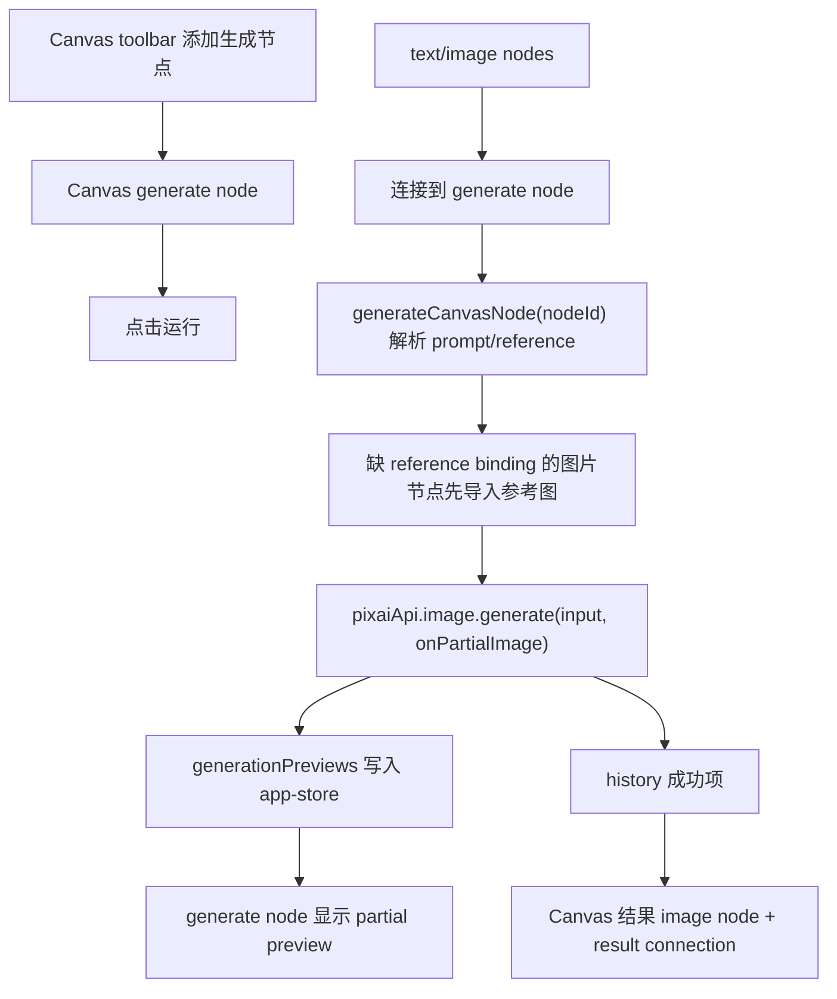

# Canvas Generate Node Design

## 0. 术语约定

- **Canvas generate node**：Canvas 中 `type: 'generate'` 的节点，保存本节点 prompt、运行状态和最近一次 run/history 绑定。
- **Canvas generation input resolution**：从 Canvas project 中解析某个 generate node 的输入，合并连接的文本节点 prompt 和图片节点 reference binding。
- **Canvas generated image node**：生成成功后由 history item 创建的 Canvas 图片节点，`metadata.historyItemId` 指向最终结果。
- **Result connection**：从 generate node 指向生成结果 image node 的 `kind: 'result'` 连线，只表达本次产出关系。
- **Canvas node partial preview**：generate node 运行中按 `runId/requestIndex` 读取 `generationPreviews` 展示的中间图。

## 1. 决策与约束

### 1.1 需求摘要

本 feature 让 Canvas 第一次拥有可执行生成节点：用户在 Canvas 添加生成节点，连接文本节点作为 prompt 片段、连接图片节点作为参考图，手动触发后复用现有 `pixaiApi.image.generate` / `ImageService` / history 链路。运行中如果 provider 返回 partial image，生成节点内显示中间图；完成后在 Canvas 中产出一个结果图片节点，并用 result connection 连接回生成节点。

成功标准：

- Canvas toolbar 可添加 generate node，节点可编辑本地 prompt。
- 用户可把 text/image node 连到 generate node；触发生成时只解析指向该 generate node 的 prompt/reference 连接。
- 图片节点已有 `referenceImageId` 时直接复用；没有绑定但有可导入图片源时，生成前导入当前 project conversation 的参考图并回写 image node binding。
- 生成请求复用当前 project conversation 的模型、尺寸、质量、stream/partial/retry 等参数，但第一版单次只生成一张结果图。
- 运行中 generate node 显示 running 状态和 partial preview；失败显示错误；成功后产出 image node 并写入 result connection。
- history / runs / 全局 generation 状态仍由现有 app-store/image service 链路维护。

明确不做：

- 不做完整 DAG 执行器、自动拓扑调度、批量节点运行或多节点队列。
- 不新增 Canvas 专用 Provider、模型参数面板或生成配置节点。
- 不把生成结果直接塞进 Canvas project 而绕过 history；最终结果必须先落 history。
- 不修改 `ImageHistoryItem` / `GenerationRun` 持久化 schema 来记录 Canvas origin；来源标识留给后续 `canvas-history-gallery-integration`。
- 不做 Canvas 节点级取消、重试历史失败项、批量结果节点或多张 `n > 1` 结果展开。

### 1.2 复杂度档位

- 结构 = orchestration bridge：横跨 Canvas node model、Canvas UI、app-store 生成编排、reference import、history 和 partial preview。
- 健壮性 = L3：输入可能缺 prompt、连接错误、图片节点缺 reference binding、参考图上限、provider preflight/请求失败都必须有可观察状态。
- 性能 = bounded：第一版单节点手动触发且 `n = 1`，不引入并行 Canvas 调度。
- 可测试性 = tested：覆盖输入解析、missing reference 导入、生成成功/失败状态、partial preview 渲染和结果节点落盘。

### 1.3 关键决策

- `CanvasNodeType` 扩展为 `'text' | 'image' | 'generate'`，不新增平行 Canvas generation project。
- Generate node 的可编辑 prompt 继续使用 `metadata.content`，避免和既有文本编辑链路重复；新增 `status/runId/requestIndex/errorMessage/historyItemId` 表达运行态。
- `CanvasConnectionKind` 扩展 `result`；用户手动从 generate node 连出时也按 result 语义保存。
- 跨 store 生成编排放在 `useAppStore.generateCanvasNode(nodeId)`，与现有 `addHistoryToCanvas` 一样由 app-store 协调 conversation、reference、runs/history、preview 和 Canvas store。
- Canvas store 只负责 project 内节点状态、生成节点添加、生成状态更新和结果图片节点落盘。
- Canvas generation 使用 project 绑定的 `conversationId`，不是盲目使用当前 active conversation；若 store 中缺该会话，则从 `pixaiApi.conversation.get()` 拉取。
- 第一版每次运行 `n = 1`，产出一个结果 image node，避免结果布局和多结果交互提前膨胀。

### 1.4 前置依赖

- `canvas-basic-nodes` 已完成，Canvas 节点、连线和 project 持久化可用。
- `streaming-partial-preview-core` 已完成，`generationPreviews` 可按 `runId/requestIndex` 提供 partial image。
- `canvas-reference-bridge` 已完成，Canvas image node 可持有 `referenceImageId/historyItemId/storagePath`。

## 2. 名词与编排

### 2.1 名词层

#### 现状

- `CanvasNodeType = 'text' | 'image'`，`CanvasConnectionKind = 'prompt' | 'reference-image'`。
- `CanvasNodeMetadata.content` 是文本内容或图片展示源；没有运行态字段。
- `useCanvasStore` 只有文本/图片节点 action，没有 generate node、状态更新或结果节点 action。
- `CanvasNodeLayer` 只渲染 text textarea 和 image preview。
- `useAppStore.generate()` 只使用当前会话 draft prompt 和全部 conversation.referenceImages，不适合 Canvas 单节点解析。

#### 变化

扩展 Canvas node / connection 契约：

```ts
export type CanvasNodeType = 'text' | 'image' | 'generate'
export type CanvasConnectionKind = 'prompt' | 'reference-image' | 'result'
export type CanvasNodeStatus = 'idle' | 'running' | 'succeeded' | 'failed'

export type CanvasNodeMetadata = {
  content: string
  status?: CanvasNodeStatus
  runId?: string
  requestIndex?: number
  errorMessage?: string
  historyItemId?: string
  referenceImageId?: string
  storagePath?: string | null
  mimeType?: string
  fileSizeBytes?: number
  naturalWidth?: number
  naturalHeight?: number
}
```

扩展 Canvas store action：

```ts
addGenerateNode(): Promise<void>
updateGenerateNodeState(nodeId: string, patch: Partial<CanvasNodeMetadata>): Promise<void>
addGeneratedImageNode(sourceNodeId: string, input: CanvasImageNodeInput): Promise<void>
bindImageNodeReference(nodeId: string, referenceImageId: string): Promise<void>
```

新增 app-store action：

```ts
generateCanvasNode(nodeId: string): Promise<void>
```

行为示例：

- text node `A` 内容为 `red dress`，generate node 内容为 `studio lighting`，A -> generate 为 prompt connection → 生成 prompt 为 `red dress\n\nstudio lighting`。
- image node 有 `metadata.referenceImageId = ref-1`，image -> generate 为 reference-image connection → 请求传 `referenceImageIds: ['ref-1']`。
- image node 没有 reference binding，但 `metadata.content` 是 data URL → 生成前先导入当前 project conversation referenceImages，再回写该 image node 的 `referenceImageId`。

### 2.2 编排层



#### 现状

- Canvas 连线只表达组织关系，不被生成逻辑消费。
- 图片生成只从 classic workspace 的会话草稿和会话参考图出发。
- partial preview 只在经典工作台 `GeneratingTile` 中展示。

#### 变化

- `CanvasWorkspace` 增加“添加生成”按钮，并把 `generateCanvasNode` 和 `generationPreviews` 传入 Canvas viewport/layer。
- `CanvasNodeLayer` 渲染 generate node：prompt textarea、状态 badge、运行按钮、partial preview 区和错误提示；运行按钮只触发本节点。
- `generateCanvasNode(nodeId)`：
  1. 获取 active Canvas project 和目标 generate node。
  2. 读取 project.conversationId 对应 conversation；找不到则尝试从 API 拉取。
  3. 收集指向 generate node 的 prompt connections，按 project.connections 顺序拼接 text node content，再追加 generate node 自身 prompt。
  4. 收集指向 generate node 的 reference-image connections，解析 image nodes 的 `referenceImageId`；缺 binding 时用 image node 展示源导入当前 project conversation 参考图，并回写 image node binding。
  5. 用 conversation 参数构造 `GenerateImageInput`，但 `n = 1` 且 `referenceImageIds` 只来自本节点解析结果。
  6. 将 generate node 标记为 running，调用 `pixaiApi.image.generate(input, { onPartialImage })`。
  7. onPartialImage 写入 `generationPreviews`，并把 node 的 `runId/requestIndex` 回写到 Canvas store，供节点读取 preview。
  8. 成功后刷新 runs/history，将第一张成功 history item 落为 Canvas generated image node，并加 result connection；失败则写 `status: failed` 和错误。

#### 流程级约束

- 缺 active project 或目标 node 不是 generate 时不发起请求。
- prompt 为空时不调用 `pixaiApi.image.generate`，generate node 标记 failed 并提示。
- 只解析指向当前 generate node 的 incoming connections；其他 Canvas 连线不影响请求。
- 图片节点缺 reference binding 时，必须先进入当前 project conversation 的 reference 链路；不能绕过参考图上限/格式/大小限制。
- 生成期间同一 generate node 处于 running 时，不重复发起第二次请求。
- provider 不返回 partial image 时，节点保持 running 状态，不报错。
- 生成失败不创建结果 image node；成功但没有 succeeded history item 时标记 failed。

### 2.3 挂载点清单

- `src/shared/types.ts`：Canvas generate node、result connection 和运行态 metadata。
- `src/services/canvas-projects.ts`：generate node / result connection normalize 和持久化。
- `src/store/canvas-store.ts`：generate node actions、状态回写、reference binding 回写和结果 image node 落盘。
- `src/store/app-store.ts`：`generateCanvasNode` 编排 action，复用 generation state、reference import、image generate、history/runs refresh 和 partial preview。
- `src/components/canvas/CanvasWorkspace.tsx` / `CanvasViewport.tsx` / `CanvasNodeLayer.tsx`：添加生成节点入口、运行触发和 partial preview 展示。

### 2.4 推进策略

1. 名词与持久化：扩展 shared types、CanvasProjectService normalize 和 Canvas store actions。
   - 退出信号：generate node/result connection 可保存恢复，store 可更新 running/succeeded/failed 状态并创建结果 image node。
2. 生成输入解析与 app-store 编排：实现 `generateCanvasNode`，复用现有生成状态、reference import、partial preview 和 history/runs refresh。
   - 退出信号：单测覆盖 prompt/reference 解析、缺 prompt、缺 binding 导入、成功/失败状态。
3. Canvas UI：toolbar 添加生成节点，generate node 渲染 prompt、运行按钮、状态、partial preview 和错误。
   - 退出信号：组件测试覆盖添加生成节点、点击运行、partial preview 展示。
4. 验证收尾：补 service/store/component 测试，跑定向测试、`pnpm check`、`pnpm build` 和浏览器 smoke。
   - 退出信号：测试、类型检查、构建通过，Canvas 生成节点 smoke 有截图证据。

### 2.5 结构健康度与微重构

##### 评估

- 文件级 — `src/store/app-store.ts` 已偏大，但本 feature 的跨模块编排与既有 `generate()` / `retryHistory()` / `addHistoryToCanvas()` 属同类职责。为避免新建 service 又要反向依赖 store 状态，本次新增一个 action，同时把解析逻辑拆成文件底部 helper，后续若继续扩大再走 `cs-refactor`。
- 文件级 — `src/store/canvas-store.ts` 仍在 Canvas project CRUD/action 边界内，新增 generate node action 属于同一 store 职责。
- 文件级 — `CanvasNodeLayer.tsx` 已接近 10KB；generate node body 不应全部塞进同一分支。实现时新增 `CanvasGenerateNodeBody.tsx` 承载 generate 节点主体，`CanvasNodeLayer` 只负责选择/拖动/连线外壳和分派。
- 目录级 — `src/components/canvas/` 是 Canvas UI 现有目录，新增一个 generate node body 文件符合目录语义，不做目录重组。
- compound convention 搜索未命中 Canvas 目录组织或 store 拆分相关长期规约。

##### 结论：不做独立微重构

本 feature 不先做“只搬不改行为”的微重构。新增 UI 逻辑用新组件承载，store 只做必要 action 扩展；`app-store.ts` 偏胖作为后续观察，不阻塞本 feature。

##### 超出范围的观察

- `app-store.ts` 后续若继续加入 Canvas history/gallery/source origin 编排，建议单独走 `cs-refactor` 拆 generation/canvas orchestration slice。

## 3. 验收契约

### 3.1 关键场景清单

- 点击 Canvas toolbar “添加生成”后，画布出现 generate node，可编辑本节点 prompt，刷新 project 后仍保留。
- 文本节点连接到 generate node 后点击运行：生成请求 prompt 包含连接文本和生成节点自身 prompt，`n` 固定为 1。
- 图片节点已带 `referenceImageId` 并连接到 generate node：生成请求只传该 reference id，不带当前会话未连接参考图。
- 图片节点没有 `referenceImageId` 但有可导入 data URL：生成前导入当前 project conversation referenceImages，回写该 image node binding 后再生成。
- 生成中收到 partial preview：generate node 内展示中间图，provider 不返回 partial 时保持 running 占位。
- 生成成功：history/runs 刷新，generate node 状态为 succeeded，Canvas 产出结果 image node，并创建 generate -> image 的 result connection。
- 生成失败或 preflight 报错：generate node 状态为 failed，显示错误，不创建结果 image node。
- 缺 prompt 或目标 node 不是 generate：不调用 `pixaiApi.image.generate`。

### 3.2 明确不做的反向核对项

- 不新增 DAG 自动调度、批量运行、配置节点或多节点执行队列。
- 不改 `ImageHistoryItem` / `GenerationRun` schema，不新增 Canvas origin 持久化字段。
- 不把当前会话全部 referenceImages 默认带入 Canvas 生成，只使用连线解析结果。
- 不新增 Canvas 节点级取消/重试 UI。
- 不改变经典工作台 `generate()`、`retryHistory()` 和 `CanvasArea` 行为。

## 4. 与项目级架构文档的关系

验收通过后更新 `ui-shadcn-workbench`：

- Canvas 模式补充 generate node、result connection 和 Canvas node partial preview。
- 数据与状态补充 `CanvasNodeStatus`、generate node metadata、`generateCanvasNode` 编排和结果 image node 落盘。
- 已知约束更新为：Canvas 已支持手动单节点生成，但不支持 DAG 调度、批量运行、Canvas origin schema 或节点级取消。

同步更新 `.codestable/architecture/ARCHITECTURE.md` 的 Canvas project shell/basic nodes/reference bridge 摘要，补一句 Canvas manual generate node 已接入现有 ImageService/history 链路。

本 feature 不新增 requirement；它是 `workspace-canvas-mode` roadmap 的 Canvas 生成桥实现单元。
