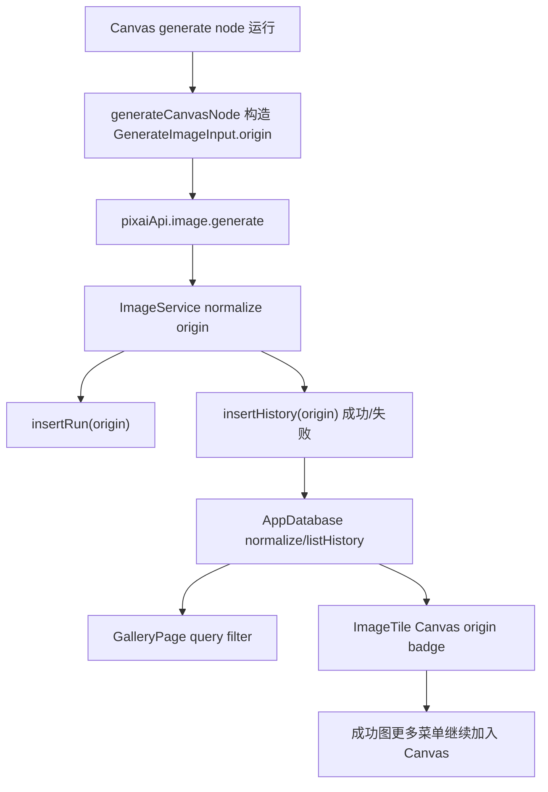

# Canvas History Gallery Integration Design

## 0. 术语约定

- **Generation origin**：生成请求来源。经典工作台为 `workspace`，Canvas 生成节点为 `canvas` 并带 `canvasProjectId/canvasNodeId`。
- **Canvas-origin history item**：由 Canvas generate node 触发、最终仍落在现有 history 的 `ImageHistoryItem`。
- **Canvas origin badge**：图库 / 历史卡片上显示“Canvas”的来源标识，成功图和失败记录都可显示。
- **Gallery source search**：Gallery 搜索中输入 `canvas` 或 `画布` 时可匹配 Canvas 来源历史项。
- **History fact source**：最终生成结果仍以 history/run 为事实源，Canvas project 只保留节点与 history/run 的绑定。

## 1. 决策与约束

### 1.1 需求摘要

本 feature 承接 roadmap 4.5 生成来源协议：Canvas generate node 已经能复用 `pixaiApi.image.generate` 并产出 history item，但 history/gallery 还看不出这些结果来自 Canvas。现在需要把来源作为可选字段贯穿 `GenerateImageInput -> ImageService -> GenerationRun/ImageHistoryItem -> Gallery/ImageTile`，让 Canvas 生成结果在图库中可识别、可搜索，并继续复用既有“加入 Canvas”入口。

成功标准：

- `GenerateImageInput` 支持可选 `origin`；缺省或经典工作台显式 `workspace` 都按原工作台语义处理。
- `GenerationRun` 与 `ImageHistoryItem` 持久化可保存可选 `origin`，旧数据缺字段时仍正常读取。
- `generateCanvasNode()` 调用图片生成时传入 `{ kind: 'canvas', canvasProjectId, canvasNodeId }`。
- Canvas 生成的成功项和失败项都带 Canvas 来源；Gallery / ImageTile 可显示 Canvas 来源 badge。
- Gallery 搜索 `canvas` 或 `画布` 可命中 Canvas 来源历史项。
- Gallery 中的 `ImageTile` 继续提供“加入 Canvas”入口，不因为来源字段改变而失效。

明确不做：

- 不做从 history/gallery 点击跳回 Canvas project 或定位节点。
- 不新增 Canvas 专用 history 表、素材系统或云同步字段。
- 不改变经典工作台生成、重试、删除、收藏、下载等行为。
- 不把 Canvas project 反查作为 Gallery 来源展示的主路径；本单元优先读取 history item 的 `origin`。
- 不实现批量加入 Canvas、DAG 调度或项目导入导出。

### 1.2 复杂度档位

- 结构 = schema bridge：跨 shared types、ImageService、AppDatabase normalize、app-store Canvas 生成和 Gallery UI。
- 兼容性 = L3：必须兼容旧 history/run 没有 `origin` 字段，未知 origin 需要被丢弃或降级，不能污染持久化数据。
- UI = restrained：只加来源 badge 和搜索匹配，不重排图库或新增复杂导航。
- 可测试性 = tested：覆盖 origin 持久化、Canvas 生成传参、Gallery 搜索和 ImageTile badge。

其余维度按项目默认档位：性能 bounded、可读性 team、可演进性 active。

### 1.3 关键决策

- `GenerationOrigin` 落在 `src/shared/types.ts`，作为 `GenerateImageInput`、`GenerationRun`、`ImageHistoryItem` 的共享可选值对象。
- `origin` 缺省即经典工作台；经典 `generate()` 和 `retryHistory()` 不需要主动传 `workspace`，避免无意义改动所有旧调用。
- `ImageService.generate()` 在创建 run、成功 history、失败 history 时原样透传规范化后的 `input.origin`。
- `AppDatabase.normalizeData()` 负责旧数据兼容和未知 origin 清理；list/search 只把合法 origin 纳入匹配。
- Canvas 来源展示放在 `ImageTile`，因为 workspace history 和 Gallery 都复用这张卡片。
- Gallery 页面本地 filter 和数据库 `listHistory()` 的 query 口径保持一致，避免输入同一个 query 时 reload 前后结果不同。

### 1.4 前置依赖

- `canvas-generate-node` 已完成，`generateCanvasNode()` 已经能把 Canvas 生成结果落入 history，并创建 Canvas result image node。
- `canvas-reference-bridge` 已完成，`ImageTile` 成功图已有“加入 Canvas”菜单入口，Gallery 通过复用 `ImageTile` 已具备基础复用能力。
- roadmap 4.5 已定义 `GenerationOrigin` 契约，本 feature 不重写该协议。

## 2. 名词与编排

### 2.1 名词层

#### 现状

- `GenerateImageInput` 没有 `origin`，`ImageService` 创建 run/history 时无法区分 classic workspace 与 Canvas。
- `GenerationRun` / `ImageHistoryItem` 没有来源字段；Gallery 只能按 prompt/model/size 搜索。
- `ImageTile` 只显示模型、尺寸、耗时、失败/重试状态，不显示来源。
- `generateCanvasNode()` 成功后只通过 Canvas store 绑定 `runId/historyItemId`，history item 本身不知道 Canvas 来源。

#### 变化

新增共享来源类型：

```ts
export type GenerationOrigin =
  | { kind: 'workspace' }
  | { kind: 'canvas'; canvasProjectId: string; canvasNodeId: string }

export type GenerateImageInput = {
  // existing fields...
  origin?: GenerationOrigin
}

export type ImageHistoryItem = {
  // existing fields...
  origin?: GenerationOrigin
}

export type GenerationRun = {
  // existing fields...
  origin?: GenerationOrigin
}
```

行为示例：

- 经典工作台调用 `generate()` 不传 `origin` -> 新 history item 没有 `origin` 字段，UI 不显示来源 badge。
- Canvas project `canvas-1` 中 generate node `node-2` 调用生成 -> run/history 均保存 `{ kind: 'canvas', canvasProjectId: 'canvas-1', canvasNodeId: 'node-2' }`。
- 用户在 Gallery 搜索 `canvas` / `画布` -> 命中 `origin.kind === 'canvas'` 的历史项。

### 2.2 编排层



#### 现状

- Canvas 生成和 classic 生成共用 `ImageService`，但从 run/history 视角不可区分。
- `GalleryPage` 的 `filtered` 和 `AppDatabase.listHistory()` 都只看 prompt/model/size。
- “加入 Canvas”已经存在于成功图 `ImageTileMoreMenu`，但用户不知道哪个结果本来来自 Canvas。

#### 变化

- `generateCanvasNode(nodeId)` 在 `GenerateImageInput` 上增加 `origin: { kind: 'canvas', canvasProjectId: project.id, canvasNodeId: nodeId }`。
- `ImageService.generate()` 规范化一次 `input.origin`，在 `insertRun()`、成功 `insertHistory()`、`createFailureItem()` 中透传。
- `AppDatabase.normalizeData()` 对 run/history 做 legacy 兼容：合法 `workspace/canvas` origin 保留，未知或缺 id 的 canvas origin 删除。
- `AppDatabase.listHistory()` 和 `GalleryPage` 使用同一个来源搜索文本拼接策略，把 `canvas` / `画布` / `workspace` / `工作台` 纳入 query。
- `ImageTile` 根据 `item.origin?.kind === 'canvas'` 渲染 Canvas badge；失败卡片也显示同一来源标识。
- 成功图更多菜单不新增入口，只确认 Gallery 复用 `ImageTile` 时“加入 Canvas”仍可调用 `addHistoryToCanvas()`。

#### 流程级约束

- 旧数据没有 `origin` 时不能被当成 Canvas 来源。
- Canvas origin 必须同时有非空 `canvasProjectId` 和 `canvasNodeId`，否则 normalize 时删除。
- `origin` 不参与 referenceImages 或 Canvas project 内容复制；history 只保存来源指针。
- classic workspace 的生成和重试不主动继承 Canvas origin；从失败 Canvas-origin history 重试仍按经典工作台重试处理，除非后续单独设计 Canvas 节点级重试。
- 来源 badge 不能遮挡图片主体操作，也不能让按钮文字溢出。

### 2.3 挂载点清单

- `src/shared/types.ts`：新增 `GenerationOrigin`，并挂到 `GenerateImageInput`、`GenerationRun`、`ImageHistoryItem`。
- `src/services/image-service.ts`：run/history 成功和失败记录透传 origin。
- `src/services/app-database.ts`：normalize legacy data、history query 搜索来源。
- `src/store/app-store.ts`：Canvas 生成请求写入 Canvas origin。
- `src/components/workspace/ImageTile.tsx`：成功/失败历史卡片显示 Canvas origin badge。
- `src/components/gallery/GalleryPage.tsx`：本地 Gallery filter 支持来源搜索，继续复用 ImageTile 的加入 Canvas 入口。

### 2.4 推进策略

1. 来源契约与持久化：落 `GenerationOrigin` 类型，ImageService / AppDatabase 保存并规范化 run/history origin。
   - 退出信号：服务测试证明 Canvas origin 可落到 run、成功 history、失败 history，旧/非法 origin 兼容。
2. Canvas 生成写来源：`generateCanvasNode()` 在生成请求中传 Canvas origin。
   - 退出信号：app-store 测试断言 `pixaiApi.image.generate` 收到 Canvas origin。
3. Gallery/ImageTile 可见与可搜索：ImageTile 加 Canvas badge，Gallery 与数据库 query 支持来源关键词。
   - 退出信号：组件测试覆盖 Canvas badge、Gallery 搜索 Canvas 来源、加入 Canvas 菜单仍可用。
4. 验证收尾：跑定向测试、`pnpm check`、`pnpm build` 和前端 smoke。
   - 退出信号：测试、类型检查、构建通过，Gallery 中 Canvas 来源 badge 有截图证据。

### 2.5 结构健康度与微重构

##### 评估

- 文件级 -- `src/store/app-store.ts` 已偏大，但本单元只在既有 `generateCanvasNode()` 输入对象补 `origin`，不新增大段编排；不在本 feature 拆 store。
- 文件级 -- `src/services/app-database.ts` 已包含 normalize/listHistory 逻辑，新增 origin normalize 与 query 文本属于同一持久化兼容职责。
- 文件级 -- `src/components/workspace/ImageTile.tsx` 已是 history 卡片统一展示面；badge 是该组件自然职责，不拆新组件。
- 文件级 -- `src/components/gallery/GalleryPage.tsx` 本地 filter 简单，新增来源搜索 helper 即可。
- 目录级 -- 不新增目录，不重组 components/workspace 或 gallery。
- compound convention 搜索未命中目录组织、文件归属或命名约定冲突。

##### 结论：不做独立微重构

本 feature 不先做“只搬不改行为”的微重构。`app-store.ts` 偏胖继续作为观察项；本单元改动足够窄，独立拆分会比直接补来源字段风险更高。

##### 超出范围的观察

- 后续如果要从 Gallery 跳回 Canvas project / node，需要新增 project 打开与节点定位协议，建议单独 feature 设计。
- Canvas 节点级重试不应复用 classic `retryHistory()` 的视图跳转语义，需要单独设计 run/history 到 node 的恢复流程。

## 3. 验收契约

### 3.1 关键场景清单

- Canvas 生成节点触发成功生成：`pixaiApi.image.generate` 收到 Canvas origin，成功 history item 与 run 都保留该 origin。
- Canvas 生成节点请求失败并落失败 history：失败 history item 保留 Canvas origin。
- 经典工作台生成：不显示 Canvas 来源 badge，history 查询行为保持原样。
- 旧 history/run 数据缺 `origin`：读取、列表、搜索不报错，字段保持缺省。
- 非法 Canvas origin（缺 project/node id）在 normalize 后被删除，不显示 badge。
- Gallery 搜索 `canvas` 或 `画布`：可命中 Canvas-origin history item；普通关键词仍按 prompt/model/size 工作。
- ImageTile 成功卡和失败卡都显示 Canvas badge；成功卡更多菜单的“加入 Canvas”仍调用 `addHistoryToCanvas(historyId)`。

### 3.2 明确不做的反向核对项

- 不新增 history/gallery 跳转 Canvas project/node。
- 不新增 Canvas 专用 history 表或素材表。
- 不改变 classic workspace `generate()` / `retryHistory()` 的 origin 语义。
- 不改变 Canvas project 保存结构，也不把完整 history 复制进 Canvas project。
- 不做批量加入 Canvas、项目导入导出或 DAG 执行。

## 4. 与项目级架构文档的关系

验收通过后更新 `ui-shadcn-workbench`：

- 术语补充 Generation origin / Canvas-origin history item。
- 工作台生成流和 Canvas 模式补充 Canvas generate node 会写 `origin` 到 run/history。
- 库页面补充 ImageTile Canvas 来源 badge 和来源搜索。
- 数据与状态补充 `GenerationOrigin`、history/run 可选来源字段和 legacy normalize 兼容。
- 已知约束删除“Canvas origin history schema 未支持”的旧边界，改为“不支持 Gallery 跳回 Canvas 节点 / Canvas 节点级重试”。

同步更新 `.codestable/architecture/ARCHITECTURE.md` 的 Canvas/图库摘要和硬边界。

本 feature 不新增 requirement；它是 `workspace-canvas-mode` roadmap 的 history/gallery 集成单元。
