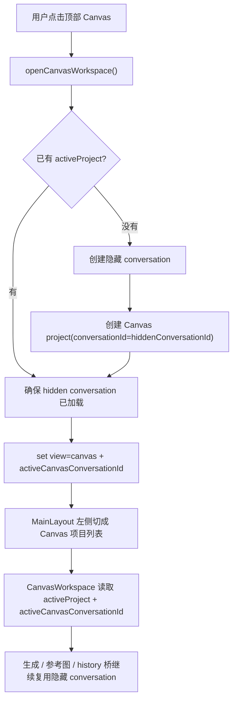

# Canvas Mode Sidebar Split Design

## 0. 术语约定

- **工作台会话**：用户在经典工作台可见、可切换、可删除的普通会话，继续由 `activeConversationId` 驱动。grep 当前代码，`conversation`/`activeConversationId` 默认都指这套对象，所以本 feature 不改这个已有术语。
- **Canvas 项目**：Canvas 左侧栏展示和切换的主对象，用户感知上只面对项目，不面对 Canvas 背后的会话。
- **隐藏专属会话**：每个 Canvas 项目在数据层绑定的一条内部 conversation，继续复用现有 `ImageService` / reference / history 链路，但不出现在经典工作台左侧栏中。
- **Canvas 活动上下文**：当前打开的 Canvas 项目及其隐藏专属会话；它和经典工作台的 `activeConversationId` 并行存在，不互相覆盖。
- **模式化侧栏**：左侧栏根据 `view` 切换数据源和新建动作；`workspace` 展示工作台会话，`canvas` 展示 Canvas 项目。

## 1. 决策与约束

### 1.1 需求摘要

本 feature 把左侧栏从“永远展示会话”改成“跟当前工作台模式同源”：进入经典工作台时只看普通会话，进入 Canvas 时只看 Canvas 项目；顶部全局“新建会话”按钮下放到左侧对应列表区域。同时，每个 Canvas 项目改为拥有自己的隐藏专属会话，不再直接复用当前普通工作台会话。

成功标准：

- 顶部导航不再放全局“新建会话”；工作台模式切换只负责切 view。
- `workspace` 模式左侧只展示普通会话，并在左侧提供“新建会话”动作。
- `canvas` 模式左侧只展示 Canvas 项目，并在左侧提供“新建 Canvas 项目”动作。
- 新建 Canvas 项目时会同步创建一条隐藏专属会话；该会话不出现在普通工作台列表。
- 切换 Canvas 项目不会覆盖经典工作台当前正在使用的普通会话。
- 删除 Canvas 项目时，绑定的隐藏专属会话会一起删除，不向用户暴露二次确认分支。

明确不做：

- 不把隐藏专属会话暴露成第三类列表对象。
- 不重写 `ImageService` / `AppDatabase` 的生成、history、reference 资产模型。
- 不在本 feature 中加入 Canvas 云同步、项目分组、项目重命名弹窗或批量管理。
- 不在本 feature 中改图库、提示词库或全局设置的布局结构；它们只需要继续使用普通工作台会话上下文。

### 1.2 复杂度档位

- 结构 = modules（偏离内部工具默认 functions 的原因：这次不是单点 UI 调整，而是 `MainLayout`、`app-store`、`canvas-store` 和 Canvas 页面之间的跨模块上下文重组，需要显式模块边界）。
- 可测试性 = tested（偏离默认 testable 的原因：会话/项目分流、隐藏会话生命周期和模式化侧栏都需要 store + 组件级回归测试兜底）。

其余维度按项目内部工具默认档位：健壮性 L2、性能 reasonable、可读性 team、可演进性 active、可观测性 logged。

### 1.3 关键决策

- **保留 `Conversation` 结构不加“kind”字段**。隐藏性不通过修改 conversation schema 表达，而是通过“被某个 Canvas 项目绑定的 conversationId”推导。这样可以避免一次 `AppDatabase` 数据迁移，并继续复用现有 conversation 持久化与生成链路。
- **工作台和 Canvas 分别维护 active 上下文**。`activeConversationId` 继续表示普通工作台会话；新增 `activeCanvasConversationId` 表示当前 Canvas 项目的隐藏会话。Canvas 项目切换不再覆盖工作台会话。
- **Canvas 项目仍然使用 `CanvasProject.conversationId`**。对下游生成 / reference / history 代码来说，这个字段就是“项目绑定的隐藏专属会话 id”，不另起第二套 runtime key。
- **Canvas 模式入口从“复用当前会话创建默认项目”改成“恢复最近项目，没有则创建一个新项目+隐藏会话”**。进入 Canvas 不再以当前普通工作台会话为种子。
- **左侧栏成为 Canvas 项目的唯一切换入口**。Canvas 页面头部不再承担项目切换职责，只保留与当前项目相关的操作（如导入/导出、引导、运行）。
- **Canvas 项目删除由 AppStore 编排**。因为它需要“先删项目，再删绑定 conversation，再清理 Canvas active 状态”，不能只放在 `canvas-store` 的纯项目层里。

### 1.4 前置依赖

- 当前 brainstorm 已确认：普通工作台只看会话，Canvas 只看项目；Canvas 项目不复用普通会话；删除项目不暴露“删不删会话”。
- 现有 `canvas-project-shell` / `canvas-basic-nodes` / `canvas-generate-node` 等 feature 已默认把 `CanvasProject.conversationId` 当成运行时 conversation，本 feature 需要保持这个下游契约可继续成立。

## 2. 名词与编排

### 2.1 名词层

#### 现状

- `src/store/app-store.ts` 只有一个 `activeConversationId`，既驱动经典工作台，也被 `CanvasWorkspace` 间接用作默认项目绑定来源。
- `src/components/layout/MainLayout.tsx` 左侧栏永远渲染 `conversations`，顶部导航同时承载 view 切换和“新建会话”。
- `src/store/canvas-store.ts` 的 `ensureDefaultProject(conversationId)` 以传入 conversationId 查找或创建 Canvas 项目，说明 Canvas 当前仍依赖“某个普通会话作为种子”。
- `src/store/app-store.ts` 的 `openCanvasProject(projectId)` 会把项目绑定的 `conversationId` 回写进全局 `activeConversationId`，导致 Canvas 和经典工作台共享一个 active 会话槽位。
- `src/components/canvas/CanvasWorkspace.tsx` 用 `activeConversationId` 找 `activeConversation`，并在 mount 时 `ensureDefaultProject(activeConversationId)`。

#### 变化

- `AppState` 新增 Canvas 活动上下文字段和动作。

```ts
type AppState = {
  activeConversationId: string | null
  activeCanvasConversationId: string | null
  openCanvasWorkspace: () => Promise<void>
  createCanvasProject: () => Promise<void>
  openCanvasProject: (projectId: string) => Promise<void>
  deleteCanvasProject: (projectId: string) => Promise<void>
}
// 来源：src/store/app-store.ts
```

- 新增模式化侧栏所需的 selector / helper。

```ts
type SidebarMode = 'workspace' | 'canvas'

function collectCanvasConversationIds(projects: CanvasProjectSummary[], activeProject?: CanvasProject | null): Set<string>
function listWorkspaceConversations(conversations: Conversation[], hiddenConversationIds: Set<string>): Conversation[]
// 来源：MainLayout / app-store 协作层
```

- `CanvasStoreState` 增加显式项目创建 / 删除能力，供左侧栏直接使用。

```ts
type CanvasStoreState = {
  createProject: (input?: { title?: string; conversationId: string }) => Promise<CanvasProject | null>
  deleteProject: (projectId: string) => Promise<void>
}
// 来源：src/store/canvas-store.ts
```

- `CanvasWorkspace` 读取 Canvas 专属活动上下文，不再把 `activeConversationId` 当作自己的默认 seed。

```ts
type CanvasWorkspaceContext = {
  activeProject: CanvasProject | null
  activeCanvasConversation: Conversation | null
}
// 来源：src/components/canvas/CanvasWorkspace.tsx 视图层语义
```

### 2.2 编排层



#### 现状

- 顶部导航切 `view`，左侧栏不跟模式切换。
- `openCanvasProject()` 会同步覆盖 `activeConversationId`，所以 Canvas 与经典工作台上下文互相污染。
- `addHistoryToCanvas()` 依赖当前 `activeConversationId`，默认把历史图导入当前工作台会话的参考图，再桥接到 Canvas。

#### 变化

- 顶部 Canvas 按钮不再直接 `setView('canvas')`，而是调用 `openCanvasWorkspace()`：如果已有活跃项目就恢复它；没有则先创建隐藏 conversation，再创建第一个 Canvas 项目。
- 左侧栏根据 `view` 决定数据源：
  - `workspace` -> 过滤掉所有 Canvas 隐藏 conversation，只显示普通会话。
  - `canvas` -> 显示 `useCanvasStore().projects`，点击条目走 `openCanvasProject(projectId)`。
- `openCanvasProject(projectId)` 只更新 `activeCanvasConversationId` 和 `view='canvas'`，不再改 `activeConversationId`。
- `CanvasWorkspace` 只消费 `activeCanvasConversationId` 对应的 conversation；其 mount 恢复逻辑改为“如果没有活跃项目，调用 `openCanvasWorkspace()`”，而不是拿普通会话 id 去 seed 默认项目。
- `createCanvasProject()` 负责：
  1. `pixaiApi.conversation.create()` 创建隐藏 conversation；
  2. `pixaiApi.canvas.create({ conversationId })` 创建项目；
  3. 刷新 `canvas-store.projects`、`activeProject`；
  4. 把隐藏 conversation 加入 `conversations` 缓存，并设置 `activeCanvasConversationId`。
- `deleteCanvasProject(projectId)` 负责：
  1. 读取项目，拿到隐藏 conversationId；
  2. 删除 Canvas 项目；
  3. 删除绑定 conversation；
  4. 刷新 `canvas-store` 和 `conversations`；
  5. 如果删的是当前项目，则打开下一个项目或清空 Canvas 活动上下文。
- `addHistoryToCanvas()` 不再依赖普通工作台 activeConversationId，而是优先把内容导入当前 Canvas 活动项目；没有活跃项目时，先 `openCanvasWorkspace()` 创建或恢复一个项目。

#### 流程级约束

- 经典工作台、图库、提示词库继续把 `activeConversationId` 视为唯一普通工作台上下文，不读取 `activeCanvasConversationId`。
- 左侧工作台会话列表永远不展示“被任一 Canvas 项目绑定”的 conversation。
- Canvas 隐藏 conversation 必须仍然完整保留 ratio/quality/model/reference/history 配置能力，因为 Canvas 生成节点继续走现有 conversation-based image pipeline。
- 删除 Canvas 项目是单一动作：用户只确认“删除项目”，内部 conversation 生命周期跟随项目走，不单独展示。
- 如果某个 Canvas 项目绑定的隐藏 conversation 丢失，打开项目要报错并阻止进入损坏状态。

### 2.3 挂载点清单

- `src/store/app-store.ts`：新增 `activeCanvasConversationId` 与 Canvas 侧栏/项目生命周期动作。
- `src/components/layout/MainLayout.tsx`：左侧栏根据 `view` 切换渲染数据源与新建按钮；顶部移除全局“新建会话”。
- `src/store/canvas-store.ts`：新增项目创建/删除 action，并支持无 conversation seed 的默认项目恢复。
- `src/components/canvas/CanvasWorkspace.tsx`：改为消费 Canvas 活动上下文，不再用普通会话 seed 默认项目。
- `src/store/app-store.ts` 的 `addHistoryToCanvas()` / `openCanvasProject()`：改为绑定 Canvas 活动上下文，而不是覆盖普通工作台 activeConversation。

### 2.4 推进策略

1. 上下文骨架：补 `activeCanvasConversationId`、Canvas 项目生命周期 action 和会话/项目列表 selector。
   - 退出信号：类型检查可识别新的 AppState / CanvasStoreState 接口，且不再要求 Canvas 复用 `activeConversationId`。
2. 数据编排：实现 `openCanvasWorkspace`、`createCanvasProject`、`openCanvasProject`、`deleteCanvasProject` 及隐藏 conversation 生命周期。
   - 退出信号：store 测试覆盖首个项目创建、项目切换不污染 workspace 会话、删除项目同时删除隐藏 conversation。
3. 模式化侧栏：让 `MainLayout` 按 `view` 切换左侧列表和新建按钮，并移除顶部全局“新建会话”。
   - 退出信号：workspace/canvas 两种视图下看到不同列表源，顶部不再出现新建会话按钮。
4. Canvas 页面与桥接修正：`CanvasWorkspace`、`addHistoryToCanvas`、相关 helper 改为使用 Canvas 活动上下文。
   - 退出信号：进入 Canvas 不再创建绑定当前 workspace 会话的默认项目，历史图加入 Canvas 会导入当前 Canvas 项目。
5. 验证收尾：补组件/store 测试并跑定向 vitest。
   - 退出信号：侧栏切换、项目创建/删除、Canvas 上下文切换的关键场景都有自动化证据。

### 2.5 结构健康度与微重构

##### 评估

- 文件级 — `src/store/app-store.ts`：约 1400+ 行，职责很重；本次会新增 Canvas 生命周期动作，但不在本 feature 内拆 store。
- 文件级 — `src/components/layout/MainLayout.tsx`：约 190 行，承担 shell / 顶栏 / 左侧栏；这次是其天然职责延伸。
- 文件级 — `src/store/canvas-store.ts`：约 500+ 行，已经承担 Canvas 项目与节点状态；新增 create/delete project 仍在职责范围内。
- 文件级 — `src/components/canvas/CanvasWorkspace.tsx`：约 390 行，当前同时承担头部工具栏、项目菜单、画布载入；本 feature 需要收窄其“项目切换”职责。
- 目录级 — `src/components/layout/`：当前只有少量 shell 文件，不存在摊平风险。
- 目录级 — `src/store/`：文件数量可控，但 `app-store.ts` 偏胖是既有问题。

##### 结论：不做微重构

这次以行为改造为主，不额外插入“只搬不改行为”的结构调整。为了把范围收紧，只做两条约束：

- 项目切换 UI 从 `CanvasWorkspace` 头部移出到 `MainLayout` 左侧栏，避免继续把页面组件做成第二个侧栏。
- Canvas 相关 helper 尽量以新函数形式附着在现有文件内，不顺手拆 `app-store.ts`。

##### 超出范围的观察

- `src/store/app-store.ts` 已经同时承载工作台、gallery、prompt、Canvas workflow、更新与通知，后续值得单独走一次 `cs-refactor` 做 store 拆分；本 feature 不把它扩成更大的架构重写。

## 3. 验收契约

### 3.1 关键场景清单

- 在经典工作台模式下：左侧只显示普通会话，顶部没有“新建会话”，左侧存在“新建会话”入口。
- 点击顶部 Canvas：左侧切成 Canvas 项目列表；如果还没有项目，会自动创建第一个 Canvas 项目并打开它。
- 新建 Canvas 项目：会创建一个新项目，并创建绑定的隐藏 conversation；该 conversation 不出现在工作台左侧会话列表。
- 切换 Canvas 项目：Canvas 当前项目和其隐藏 conversation 更新，但经典工作台当前普通会话保持不变。
- 切回工作台：左侧恢复普通会话列表，仍停留在用户之前使用的普通会话。
- 删除 Canvas 项目：项目从左侧消失，绑定的隐藏 conversation 被一起删除；剩余项目或空状态正确恢复。
- 从历史图加入 Canvas：如果当前没有 Canvas 活动项目，会自动准备一个；加入后的图片节点落到当前 Canvas 项目，而不是复用当前普通会话。

### 3.2 明确不做的反向核对项

- 代码中不应把 Canvas 隐藏 conversation 直接渲染到工作台左侧会话列表。
- 顶部导航中不应再存在全局“新建会话”按钮。
- 不应通过修改 `Conversation` schema 增加 `kind` / `hidden` 持久化字段。
- 不应改动 `ImageService`、`AppDatabase` 的生成/history/reference 数据结构契约。

## 4. 与项目级架构文档的关系

验收通过后需要更新 `ARCHITECTURE.md` 和 `ui-shadcn-workbench`：

- 把“Canvas project 绑定创建或导入时的当前会话，不创建隐藏会话”这条旧约束改成“Canvas 项目绑定隐藏专属会话，工作台与 Canvas 各自维护活动上下文”。
- 在 App shell / 左侧导航部分补充“模式化侧栏”的现状。
- 在 Canvas 模式数据流部分补充 `activeCanvasConversationId` 和隐藏 conversation 生命周期。
