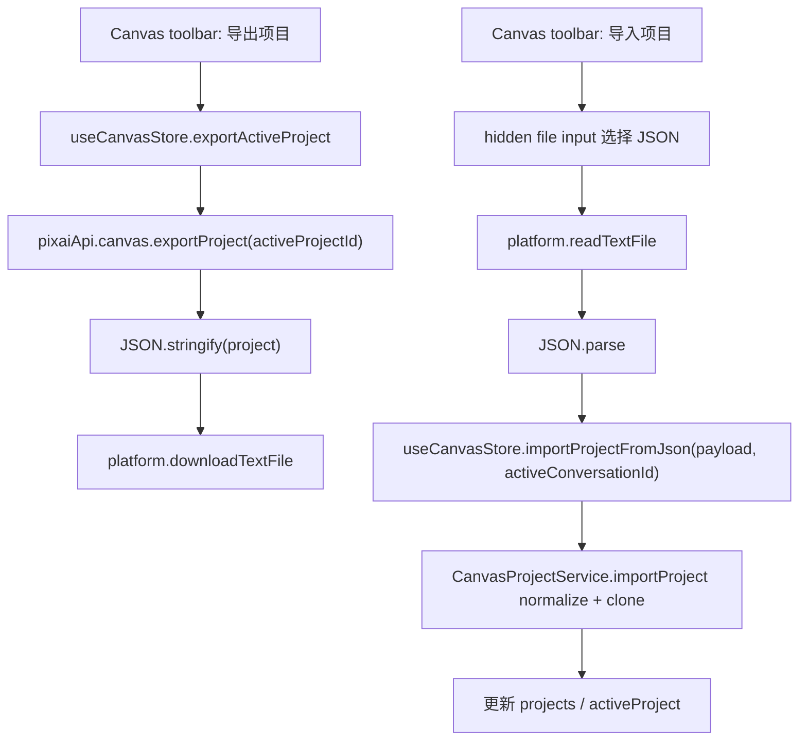

# Canvas Project Import Export Design

## 0. 术语约定

- **Canvas project export JSON**：一个 `CanvasProject` 形状的 JSON 快照，包含项目标题、节点、连线、视口和创建/更新时间；第一版不包含独立图片文件包。
- **Imported Canvas project**：从 export JSON 克隆出的新本地项目；它使用新的 project id，并绑定当前 active conversation。
- **Project package helper**：平台侧文本文件读写 helper，只负责 JSON 文本下载 / 读取，不理解 Canvas 业务。
- **Import normalize**：导入前复用 Canvas project service 的节点、连线和视口规范化；非法节点或失效连线会被过滤。

## 1. 决策与约束

### 1.1 需求摘要

本 feature 承接 roadmap 的 `project-package` 后置能力：用户在 Canvas 模式内可以把当前 Canvas project 导出为 JSON 文件，也可以导入一个 JSON 项目快照继续编辑。导入必须创建新项目，避免覆盖当前项目或污染已有 project id；导入项目绑定当前会话，保证后续 Canvas 生成节点仍能复用现有 conversation/reference/history 链路。

成功标准：

- Canvas toolbar 提供“导出项目”和“导入项目”入口。
- 导出当前 active Canvas project 时生成 `.json` 文件，文件内容是规范化后的 project 快照。
- 导入 JSON 时重新生成 project id，绑定当前 active conversation，title 带导入标识，并切换 active project 到导入结果。
- 导入 JSON 复用节点、连线、视口 normalize；非法节点、重复节点、失效连线不会进入新项目。
- 导入失败或用户未选择文件时，不改变当前 active project。
- 浏览器环境和 Tauri WebView 都能使用同一 UI 入口；导出在 Tauri 下走保存对话框，在浏览器下走下载链接。

明确不做：

- 不做包含图片文件的 zip/project package；图片节点仍只保留当前 project JSON 内已有的 data URL、asset/path 或远程展示源。
- 不做云同步、账号协作、批量导入导出或项目模板库。
- 不覆盖同 id 现有项目；导入永远是 clone。
- 不迁移或重写 history item 的 `origin`，也不为导入项目补建 history/run。
- 不新增隐藏 conversation；导入项目绑定当前 active conversation。

### 1.2 复杂度档位

- 结构 = package bridge：跨 Canvas service/store/UI 和 platform 文件 helper，但不引入新子系统。
- 兼容性 = L3：导入对象来自外部文件，必须把未知结构当不可信输入，走 normalize 和错误语义。
- UI = restrained：只在 Canvas toolbar 增加两个文件操作按钮，不做项目管理页。
- 可测试性 = tested：覆盖 service import/export clone、store active 切换、platform 文本下载和 CanvasWorkspace 按钮入口。

其余维度按项目默认档位：性能 bounded、可读性 team、可演进性 active。

### 1.3 关键决策

- 导出 JSON 的业务形状直接使用 `CanvasProject`，不包一层新 envelope，降低后续读取和人工排查成本。
- `CanvasProjectService` 增加 `exportProject(id)` 和 `importProject(input, conversationId)`，让 clone / normalize / id 刷新集中在持久化服务边界。
- 导入项目保留节点 id，以保持 connections 和节点级 history/reference binding 不被打断；project id 必须刷新，避免覆盖已有项目。
- 导入项目的 `conversationId` 总是当前 active conversation，而不是 JSON 中的旧 conversationId。
- 导入时 `running` generate node 降级为 `idle` 并清理 run/request 错误状态；导入不是恢复执行。
- `useCanvasStore` 增加 `exportActiveProject()` 和 `importProjectFromJson(input, conversationId)`，由 store 负责更新 project list 和 active project。
- `platform.ts` 增加通用文本 helper：`downloadTextFile(filename, text, mimeType?)` 与 `readTextFile(file)`。

### 1.4 前置依赖

- `canvas-project-shell` 已完成，Canvas project 本地持久化服务、默认项目和视口保存已存在。
- `canvas-basic-nodes` 已完成，节点 / 连线 normalize 已在 `CanvasProjectService` 中集中。
- `canvas-history-gallery-integration` 已完成，Canvas 生成结果的 history 来源已经可追踪；本 feature 不改 history 事实源。

## 2. 名词与编排

### 2.1 名词层

#### 现状

- `CanvasProject` 定义在 `src/shared/types.ts`，包含 project id、title、conversationId、schemaVersion、nodes、connections、viewport、createdAt 和 updatedAt。
- `CanvasProjectService` 只有 list/get/create/update/delete；外部无法用一份未知 JSON 安全创建克隆项目。
- `useCanvasStore` 只处理默认项目、打开项目和节点/连线修改；没有导入后切换 active project 的 action。
- `platform.ts` 只有图片下载和状态 JSON 持久化 helper，没有通用文本文件保存 / 读取 helper。

#### 变化

扩展 Canvas project API：

```ts
export type CanvasProjectApi = {
  // existing methods...
  exportProject(id: string): Promise<CanvasProject>
  importProject(input: unknown, conversationId: string): Promise<CanvasProject>
}
```

扩展 Canvas store action：

```ts
export type CanvasStoreState = {
  // existing state/actions...
  exportActiveProject(): Promise<CanvasProject | null>
  importProjectFromJson(input: unknown, conversationId: string): Promise<CanvasProject | null>
}
```

扩展 platform helper：

```ts
export function downloadTextFile(filename: string, text: string, mimeType?: string): Promise<void>
export function readTextFile(file: File): Promise<string>
```

行为示例：

- 当前项目 `canvas-1` 导出 -> 用户得到 `canvas-project-title.json`，内容保留 `id: "canvas-1"` 作为快照事实。
- 用户在当前会话 `conversation-2` 导入该 JSON -> 新项目 `canvas-3` 被创建，`conversationId` 是 `conversation-2`，nodes/connections/viewport 来自 JSON 的规范化结果。
- JSON 缺 `conversationId` 但 nodes/connections/viewport 合法 -> 可导入，因为导入只需要当前会话绑定。

### 2.2 编排层



#### 现状

- Canvas toolbar 已有添加文本、添加图片、添加生成、加入参考图、重置视图。
- 项目持久化服务已经有 `normalizeProject()` / `normalizeCanvasNodes()` / `normalizeCanvasConnections()`，但这些 helper 只用于读取现有 state 或 update。
- 文件保存能力主要围绕图片下载，浏览器与 Tauri 分支逻辑分散在 `downloadImageSource()`。

#### 变化

- 导出流程从 store 取最新 active project 快照，序列化为格式化 JSON，文件名由项目标题清理后生成。
- 导入流程由 UI 读取用户选择的 `.json`，JSON.parse 后交给 store；parse 失败或 service normalize 失败时 toast 错误，active project 不变。
- `CanvasProjectService.importProject()` 使用未知输入构造新 project：title 来自 JSON 并追加“导入”标识，conversationId 来自参数，id/createdAt/updatedAt 重新生成。
- 导入 normalize 允许 JSON 缺旧 `conversationId`，但必须至少是 object；schemaVersion 只接受当前 `1` 或缺省，未来 schema 迁移另起 feature。
- 导入时保留 `succeeded/failed/idle` 状态和 history/reference binding；`running` 状态降级为 `idle`，避免导入后出现不会结束的运行态。
- `downloadTextFile()` 在 Tauri 下复用保存对话框 + `write_binary_file`，浏览器下复用 object URL 下载；`readTextFile()` 只封装 DOM `FileReader`。

#### 流程级约束

- 导入永远创建新 project，不覆盖当前 project，不使用 JSON 内的 project id。
- 导入必须绑定当前 active conversation；没有 active conversation 时 UI 不触发导入。
- 导入失败必须保持 active project 和 projects list 不变。
- service normalize 是唯一可信入口，UI 不直接修 nodes/connections。
- 导出取消保存不应显示失败；导入取消选择不应 toast。
- 第一版不解析 zip，不补全丢失图片文件，不下载远程图片。

### 2.3 挂载点清单

- `src/services/canvas-projects.ts`：Canvas project export/import clone 和导入 normalize。
- `src/services/app-api.ts`：对外 `pixaiApi.canvas` 增加 export/import 方法。
- `src/store/canvas-store.ts`：导出 active project、导入后更新 active project 和摘要。
- `src/lib/platform.ts`：文本文件下载与读取 helper。
- `src/components/canvas/CanvasWorkspace.tsx`：Canvas toolbar 导入 / 导出按钮和隐藏 JSON file input。

### 2.4 推进策略

1. 服务契约：在 CanvasProjectService / app API 落 export/import 方法，并保证导入克隆新项目。
   - 退出信号：service 测试证明导出返回 clone，导入刷新 project id / conversationId，并过滤非法节点连线。
2. Store 编排：增加导出 active project、导入 JSON 并切换 active project 的 action。
   - 退出信号：store 测试证明导入成功后 activeProject 指向新项目，导入失败保持原状态。
3. Platform helper：增加文本下载 / 读取 helper，覆盖浏览器下载和 FileReader 读取。
   - 退出信号：platform 测试证明 JSON 文本按文件名下载，FileReader 失败会 reject。
4. Canvas UI 入口：CanvasWorkspace 增加导入 / 导出按钮、隐藏 JSON file input、成功/失败通知。
   - 退出信号：组件测试证明按钮可见，导出调用下载 helper，导入选择 JSON 后切换项目。
5. 验证收尾：跑定向测试、`pnpm check`、`pnpm build` 和前端 smoke。
   - 退出信号：测试、类型检查、构建通过，Canvas toolbar 中导入/导出入口有截图证据。

### 2.5 结构健康度与微重构

##### 评估

- 文件级 -- `src/services/canvas-projects.ts` 已是 Canvas project normalize 和持久化聚合点，import/export 属于同一职责；本次会复用现有 helper，不拆服务文件。
- 文件级 -- `src/store/canvas-store.ts` 已管理 Canvas project active state，新增两个 action 是自然扩展；不把文件操作逻辑放进 store。
- 文件级 -- `src/components/canvas/CanvasWorkspace.tsx` toolbar 已偏拥挤，但导入/导出是 Canvas project 顶部操作；本次只做按钮和隐藏 input，并调整工具条换行能力。
- 文件级 -- `src/lib/platform.ts` 已偏大；文本下载分支与图片下载共享 Tauri/browser 平台边界，先新增小 helper，后续若平台层继续膨胀再走 refactor。
- 目录级 -- 不新增目录，不重组 components/canvas 或 services。
- compound convention 检索未命中目录组织、文件归属或命名约定冲突。

##### 结论：不做独立微重构

本 feature 不先做“只搬不改行为”的微重构。`platform.ts` 和 `canvas-store.ts` 有后续拆分价值，但当前导入导出能力可以用窄扩展完成，独立拆分会把 project package 功能和结构整理混在一起。

##### 超出范围的观察

- 如果后续做带图片资源的 zip 包，需要新增资源 manifest、图片文件复制 / 引用重写和导入冲突策略，不能在当前 JSON MVP 中补丁式扩展。
- 如果后续做项目管理页，需要重新设计 project list、rename/delete/import/export 批量操作，不应继续堆在 Canvas toolbar。

## 3. 验收契约

### 3.1 关键场景清单

- 用户点击“导出项目”：当前 active Canvas project 被序列化为 JSON 并触发保存 / 下载。
- 用户选择合法 Canvas project JSON 导入：创建新 project，project id 不等于 JSON id，conversationId 等于当前 active conversation，视图切到导入项目。
- 导入 JSON 中包含重复节点、非法图片节点或失效连线：service normalize 后只保留合法节点和有效连线。
- 导入 JSON 中 generate node 为 `running`：导入后该节点变为 `idle`，不会显示永久运行态。
- 用户取消导入文件选择：不触发导入，不显示错误，active project 不变。
- 用户选择非法 JSON 或 schema 不支持：显示错误，active project 和 projects list 不变。
- 无 active conversation 或无 active project 时，导入 / 导出按钮禁用或不执行。

### 3.2 明确不做的反向核对项

- 不新增 zip/project package 图片资源包。
- 不覆盖现有项目，不复用 JSON 内 project id。
- 不新增云同步、批量导入导出或项目模板库。
- 不为导入项目创建隐藏 conversation。
- 不重写 history/run，也不迁移 history origin 到新 project id。

## 4. 与项目级架构文档的关系

验收通过后更新 `ui-shadcn-workbench`：

- Canvas toolbar 补充项目导入 / 导出入口。
- Canvas project service 补充 export/import clone 语义。
- 数据与状态补充导入时 current conversation rebinding、id refresh、normalize 和 running 状态降级。
- 已知约束删除“项目导入导出未支持”，改为“不支持带图片资源包、批量导入导出或云同步”。

同步更新 `.codestable/architecture/ARCHITECTURE.md` 的 Canvas 模式摘要和硬边界。

本 feature 不新增 requirement；它是 `workspace-canvas-mode` roadmap 的 project-package 实现单元。
