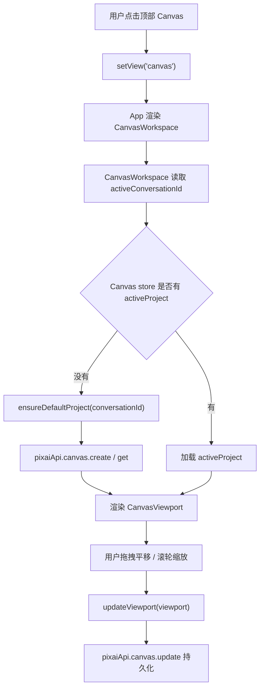

# Canvas Project Shell Design

## 0. 术语约定

- **Canvas 模式**：新增的工作台模式，用户在这里管理 Canvas project，并在无限画布里平移、缩放和保存视口。grep 现状未发现已有 `canvas` view，当前 `CanvasArea` 只是结果网格，不复用这个名称。
- **经典工作台**：现有 `view: 'workspace'` 对应的 `Workspace` 页面，包含 `Composer`、结果网格和右侧参数栏。Canvas 模式是新增同级 view，不替代经典工作台。
- **Canvas project**：一份可持久化的画布项目，第一版只保存标题、绑定会话、视口、空节点数组和更新时间。
- **Canvas viewport**：画布世界坐标到屏幕坐标的变换 `{ x, y, k }`，其中 `k` 是缩放比例。第一版不保存节点，因为节点由后续 `canvas-basic-nodes` feature 承载。

## 1. 决策与约束

### 1.1 需求摘要

本 feature 只实现 `workspace-canvas-mode` roadmap 的最小闭环：用户能从 PixAI 顶部导航进入 Canvas 模式；系统能自动创建或恢复一个默认 Canvas project；用户能在一个空无限画布中平移、缩放，并在离开后恢复上次视口。

成功标准：

- 顶部导航出现 Canvas 入口，点击后 `view` 变为 `canvas` 并渲染 Canvas 页面。
- 首次进入 Canvas 时，如果没有项目，自动创建一个绑定当前 `activeConversationId` 的默认项目。
- 画布支持鼠标拖拽平移、滚轮缩放、重置视图，刷新或切走再回来后保留视口。
- 本阶段不出现节点、连线、图片生成、参考图桥或导入导出入口。

明确不做：

- 不接入图片生成、partial preview、历史、图库或参考图。
- 不实现文本节点、图片节点、生成节点和连线。
- 不新增云同步、协作、项目包导入导出或文件清理策略。
- 不把现有 `CanvasArea` 改造成无限画布；它仍是经典工作台的结果网格。

### 1.2 复杂度档位

- 结构 = modules（偏离内部工具默认 functions 的原因：新增 Canvas 模式会成为后续多个 feature 的承载面，需要独立 `components/canvas`、`store/canvas-store` 和 `services/canvas-projects` 边界，避免继续扩大 `app-store.ts`）。
- 可测试性 = tested（偏离默认 testable 的原因：这是 roadmap 的最小闭环，至少要有 project store/service 的主要路径测试和 Canvas view 路由 smoke 测试）。

其余维度按项目内部工具默认档位：健壮性 L2、性能 reasonable、可读性 team、可演进性 active、可观测性 logged。

### 1.3 关键决策

- `canvas` 作为 `View` 的新成员，与 `workspace/gallery/prompts` 同级。这样接入点贴合当前 `App` 的条件渲染结构，不引入第二套路由系统。
- Canvas project 第一版绑定进入 Canvas 时的 `activeConversationId`。本 feature 不创建隐藏会话、不改变会话列表语义；后续 `canvas-generate-node` 如需要一项目一会话，再通过后续 feature 明确迁移策略。
- Canvas 项目状态放在独立 `useCanvasStore`，不塞进已有 `useAppStore`。`app-store.ts` 已约 901 行，继续加入 Canvas project actions 会扩大职责。
- Canvas project 持久化用独立服务 `CanvasProjectService`，通过 `readJsonState/writeJsonState` 保存到独立 state name，例如 `pixai-canvas-projects`。这样不需要在第一步修改 `AppDatabase` 的 conversations/runs/history 结构。
- 新 UI 组件放入 `src/components/canvas/`，不放入 `src/components/workspace/`。`workspace` 目录已有 12 个同层文件且存在旧 `CanvasArea` 命名冲突，独立目录更清晰。

### 1.4 前置依赖

- roadmap item `canvas-project-shell` 前置依赖为空，当前状态为 `planned`。
- 本 feature 使用 roadmap 第 4.1、4.2 的 view 和 Canvas project 持久化协议；不触碰第 4.3 之后的节点、流式预览和生成契约。

## 2. 名词与编排

### 2.1 名词层

#### 现状

- `View` 定义在 `src/store/app-store.ts`，当前是 `'workspace' | 'gallery' | 'prompts'`。
- `App` 根据 `view` 渲染 `Workspace`、`GalleryPage`、`PromptLibraryPage`，没有 Canvas 页面分支。
- `MainLayout` 顶部导航只有工作台、图库、提示词库入口。
- `pixaiApi` 暴露 settings、preferences、conversation、image、prompt、reference、history、templates、appUpdate、codexSkill、shell，当前没有 Canvas project API。
- `AppDatabase` 的 `PersistedData` 只有 conversations、runs、history。Canvas project 没有现状，全新。

#### 变化

- `View` 增加 `'canvas'`，并新增 helper 用于表达工作台类 view。

```ts
export type View = 'workspace' | 'canvas' | 'gallery' | 'prompts'

export function isWorkbenchView(view: View): view is 'workspace' | 'canvas' {
  return view === 'workspace' || view === 'canvas'
}
// 来源：src/store/app-store.ts View
```

- 新增 Canvas project 类型。

```ts
export type CanvasViewport = {
  x: number
  y: number
  k: number
}

export type CanvasProject = {
  id: string
  title: string
  conversationId: string
  schemaVersion: 1
  nodes: []
  connections: []
  viewport: CanvasViewport
  createdAt: string
  updatedAt: string
}

export type CanvasProjectSummary = {
  id: string
  title: string
  updatedAt: string
  nodeCount: number
}

export type CanvasProjectInput = Partial<Pick<CanvasProject, 'title' | 'viewport'>> & {
  conversationId?: string
}
// 来源：roadmap workspace-canvas-mode 第 4.2 节，收窄到 shell MVP
```

- 新增 Canvas API。

```ts
export type CanvasProjectApi = {
  list(): Promise<CanvasProjectSummary[]>
  get(id: string): Promise<CanvasProject | null>
  create(input: { conversationId: string; title?: string }): Promise<CanvasProject>
  update(id: string, input: CanvasProjectInput): Promise<CanvasProject>
  delete(id: string): Promise<void>
}
// 来源：src/services/app-api.ts createPixaiApi
```

- 新增 Canvas store。

```ts
export type CanvasStoreState = {
  projects: CanvasProjectSummary[]
  activeProjectId: string | null
  activeProject: CanvasProject | null
  loading: boolean
  errorMessage: string | null
  loadProjects(): Promise<void>
  ensureDefaultProject(conversationId: string): Promise<CanvasProject>
  openProject(projectId: string): Promise<void>
  updateViewport(viewport: CanvasViewport): Promise<void>
  resetViewport(): Promise<void>
}
// 来源：新增 src/store/canvas-store.ts
```

### 2.2 编排层



#### 现状

- 经典工作台加载由 `App.load()` 和 `useAppStore` 统一完成；页面切换只改变 `view`。
- 现有持久化主要集中在 `AppDatabase` 和 `readJsonState/writeJsonState`，本地状态以 JSON 形式保存。
- 现有 UI 页面由 `App` 分支渲染，页面组件自己消费 Zustand store。

#### 变化

- `MainLayout` 顶部导航增加 Canvas 按钮，点击后调用 `setView('canvas')`。
- `App` 增加 `CanvasWorkspace` 分支。Canvas 页面在自身 mount 后调用 `useCanvasStore` 加载或创建默认项目。
- `CanvasProjectService` 独立保存 `PersistedCanvasData = { projects: CanvasProject[] }`，不修改 `AppDatabase` 的 `PersistedData`。
- `CanvasViewport` 接管 pan/zoom 交互，并把视口变化交给 `useCanvasStore.updateViewport()`。实现阶段可做轻量防抖，但 design 不规定具体 debounce 细节。

#### 流程级约束

- 如果没有 `activeConversationId`，Canvas 页面显示可恢复空状态：提示先等待工作台数据加载或创建会话，不创建无绑定项目。
- `ensureDefaultProject(conversationId)` 必须幂等：已有 active project 时返回它；没有项目时创建默认项目；有项目但未打开时打开最近更新项目。
- 视口缩放必须被约束在合理范围，建议 `0.2 <= k <= 3`，避免缩到不可见或放到布局失控。
- 持久化失败时 UI 保留当前内存视口，并显示错误提示；不让画布白屏。
- 无效本地 Canvas JSON 可以恢复为空项目列表，但不能影响 conversations/runs/history。

### 2.3 挂载点清单

- `src/store/app-store.ts`：`View` 增加 `canvas`，这是进入 Canvas 的全局状态挂载点。
- `src/App.tsx`：新增 `view === 'canvas'` 的页面渲染分支。
- `src/components/layout/MainLayout.tsx`：顶部导航新增 Canvas 按钮。
- `src/services/app-api.ts`：`pixaiApi.canvas` 新增 Canvas project API 分区。
- 本地 state key：新增 `pixai-canvas-projects`，作为 Canvas project 持久化入口。

### 2.4 推进策略

1. 名词骨架：补 Canvas project 类型、Canvas service API 和独立 store 的空实现。
   - 退出信号：类型检查能识别 `CanvasProject`、`pixaiApi.canvas` 和 `useCanvasStore`。
2. 持久化节点：实现 Canvas project list/get/create/update/delete 和默认项目创建。
   - 退出信号：service/store 测试能覆盖首次创建、恢复项目、更新 viewport。
3. 页面静态结构：新增 CanvasWorkspace、CanvasViewport、项目标题区和空画布背景。
   - 退出信号：切到 `canvas` 后能看到完整 Canvas 页面，不白屏。
4. 交互逻辑：接入拖拽平移、滚轮缩放、重置视图。
   - 退出信号：手工操作能改变视口，UI 显示的缩放值同步变化。
5. 状态接入：CanvasWorkspace mount 时加载/创建默认项目，视口变化持久化。
   - 退出信号：切走/刷新/重进后保留项目和 viewport。
6. 验证收尾：补路由 smoke、store/service 测试，跑 `pnpm check`。
   - 退出信号：测试与类型检查通过，关键验收场景有证据。

### 2.5 结构健康度与微重构

##### 评估

- 文件级 — `src/App.tsx`：约 119 行，职责是 App 生命周期和页面分支；本次只新增一个 Canvas 分支和 import，改动密度低。
- 文件级 — `src/components/layout/MainLayout.tsx`：约 179 行，职责是 shell、导航和侧栏；本次新增一个导航按钮，仍属现有职责延伸。
- 文件级 — `src/store/app-store.ts`：约 901 行，职责已经很多；本次只允许改 `View` 和必要 helper，不把 Canvas project actions 塞进去。
- 文件级 — `src/services/app-api.ts`：约 124 行，职责是聚合服务门面；新增 `canvas` 分区属于现有门面职责。
- 目录级 — `src/components/workspace/`：已有 12 个同层文件且已有 `CanvasArea` 命名，继续新增 Canvas 文件会摊平并引发概念冲突。
- 目录级 — `src/components/`：现有一级目录 7 个，按页面/领域分组；新增 `canvas/` 与 `gallery/`、`workspace/` 同级，符合现有结构。
- 目录级 — `src/store/`：现有 4 个文件，新增 `canvas-store.ts` 不构成摊平风险。
- 目录级 — `src/services/`：现有 17 个同层文件，已有按服务名平铺的模式；新增 `canvas-projects.ts` 延续当前模式，不在本 feature 做目录重组。

##### 结论：不做微重构

本 feature 通过新增独立 `components/canvas/`、`store/canvas-store.ts` 和 `services/canvas-projects.ts` 控制边界，不需要先做只搬不改行为的微重构。`app-store.ts` 偏胖是已存在问题，但本次会刻意只做 `View` 层最小改动。

##### 超出范围的观察

- `src/store/app-store.ts` 已经承担会话、生成、历史、模板、更新、技能、通知等多类状态，后续如果继续扩功能，建议另起 `cs-refactor` 评估 store 拆分。本 feature 不阻塞。
- `src/components/workspace/CanvasArea.tsx` 的名字与新增 Canvas 模式冲突，建议在后续与工作区结果网格相关 feature 中重命名。本 feature 不改经典工作台结果区。

## 3. 验收契约

### 3.1 关键场景清单

- 首次启动后点击顶部 Canvas：页面切到 Canvas 模式，自动创建默认 Canvas project，显示项目标题和空无限画布。
- 已有 Canvas project 后重新进入 Canvas：打开最近使用项目，项目标题和 viewport 与上次保存一致。
- 在 Canvas 页面拖拽空白区域：画布背景随鼠标平移，释放后持久化新的 `{ x, y, k }`。
- 在 Canvas 页面滚轮缩放：缩放值变化并被限制在约定范围内，刷新后仍保留。
- 点击重置视图：viewport 回到默认值 `{ x: 0, y: 0, k: 1 }` 并持久化。
- 本地 `pixai-canvas-projects` 数据损坏：Canvas 页面不白屏，恢复为空项目列表，并可重新创建默认项目。
- 没有 `activeConversationId` 时进入 Canvas：显示“等待会话加载/请先创建会话”类空状态，不创建无绑定项目。

### 3.2 明确不做的反向核对项

- 代码中不应新增 `generateCanvasNode`、`onPartialImage` 或 Canvas 生成调用入口。
- Canvas 页面不应渲染文本节点、图片节点、生成节点或连线。
- 不应修改 `CanvasArea` 的现有结果网格行为。
- 不应新增云同步、项目包导入导出、S3/R2、视频节点相关 API。
- 不应把 Canvas project actions 加入 `useAppStore` 的主要 action 列表，除 `View` 类型和必要 helper 外保持独立 store。

## 4. 与项目级架构文档的关系

验收通过后建议更新 `ui-shadcn-workbench`：

- 在 App shell 与页面路由中补充 `canvas` view。
- 在数据与状态中补充独立 `useCanvasStore` 和 Canvas project 本地持久化服务。
- 在代码锚点中补充 `src/components/canvas/*`、`src/store/canvas-store.ts`、`src/services/canvas-projects.ts`。
- 在已知约束中说明第一版 Canvas project 绑定创建时的 `activeConversationId`，暂不接生成和图库互通。

本 feature 不改变 `reference-image-input` 当前能力，只为后续 `canvas-reference-bridge` 提供入口承载面。
