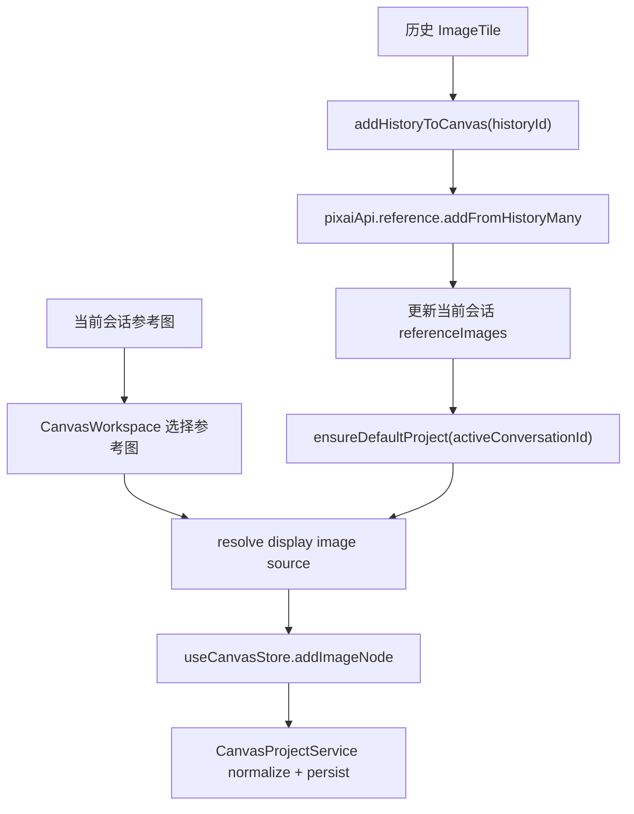

# Canvas Reference Bridge Design

## 0. 术语约定

- **Canvas reference image node**：由当前会话 `ReferenceImage` 创建的 Canvas 图片节点，`metadata.referenceImageId` 指向参考图。
- **Canvas history image node**：由 history item 创建的 Canvas 图片节点，`metadata.historyItemId` 指向历史结果，并通过导入参考图得到 `metadata.referenceImageId`。
- **Display image source**：Canvas 图片节点 `metadata.content` 中用于 `` 的展示源，可以是 data URL、asset URL、http(s) URL 或 browser-memory 路径。
- **Reference binding**：Canvas 图片节点到当前 project conversation 参考图的绑定；后续生成节点读取连接的 image node 时优先使用这个绑定。

## 1. 决策与约束

### 1.1 需求摘要

本 feature 让 Canvas 不再只能通过本地文件创建孤立图片节点，而是能复用当前工作台的参考图和历史结果：用户可以把当前会话参考图加入 Canvas，也可以从历史图卡片把图片加入当前 Canvas project。加入后的图片节点保留 reference/history 绑定，后续 `canvas-generate-node` 可把连接到生成节点的图片节点解析为现有 `referenceImageIds`。

成功标准：

- Canvas toolbar 提供“加入参考图”入口，列出当前会话参考图并创建绑定图片节点。
- 历史/图库图片卡片提供“加入 Canvas”入口，把历史图导入当前会话参考图后创建 Canvas 图片节点。
- Canvas 图片节点 metadata 支持 `referenceImageId`、`historyItemId`、`storagePath` 等来源字段，并通过 service normalize 保留。
- 图片节点展示源支持现有参考图/历史图可能出现的 data URL、asset URL、http(s) URL、browser-memory 路径。
- 重复加入同一 reference/history 时不重复创建节点。

明确不做：

- 不新增 Canvas generate 节点，不触发图片生成。
- 不实现从 Canvas 图片节点反向修改/删除会话参考图。
- 不新增素材文件清理策略，不改变 history/gallery 持久化结构。
- 不做批量历史选择、Canvas 项目导入导出或高级 DAG 执行。
- 不改变经典工作台已有“作为参考图编辑”的行为。

### 1.2 复杂度档位

- 结构 = bridge：横跨 Canvas store/UI、app store 和现有 reference/history，但不新增平行素材系统。
- 健壮性 = L3：历史图可能缺 dataUrl/storagePath，reference 图可能是本地 asset/path；无可展示源时必须失败并提示。
- 可测试性 = tested：覆盖 metadata normalize、Canvas store 去重、app-store 历史加入 Canvas、UI 菜单入口。

其余维度按项目默认档位：性能 reasonable、可读性 team、可演进性 active。

### 1.3 关键决策

- Canvas 图片节点仍沿用 `CanvasNodeData(type: 'image')`，不新增 reference node / history node 平行类型。
- `metadata.content` 继续作为展示源，但图片节点不再强制只允许 `data:image/`，允许本地存储路径或 asset/http(s) 展示源。
- `referenceImageId` 是后续生成输入解析的主绑定；`historyItemId` 只记录来源追溯。
- 从 history 加入 Canvas 时，先通过 `pixaiApi.reference.addFromHistoryMany(activeConversationId, [historyId])` 导入当前会话参考图，再创建带 `referenceImageId` 的 Canvas 图片节点。
- ImageTile 的“加入 Canvas”走 app-store action，方便同步更新当前会话 referenceImages、确保默认 Canvas project，并切到 Canvas 视图。
- Canvas toolbar 的“加入参考图”只使用当前会话已有 referenceImages，不跨会话拿素材。

### 1.4 前置依赖

- `canvas-basic-nodes` 已完成，Canvas 图片节点、连线、持久化和 store action 已存在。
- `reference-image-input` 已 current，当前会话参考图、URL 导入、本地文件导入和 `importReferencePayloads` 链路已存在。
- app API 已有 `reference.addFromHistoryMany(conversationId, historyIds)` 可把历史图批量导入当前会话参考图。

## 2. 名词与编排

### 2.1 名词层

#### 现状

- `CanvasNodeType = 'text' | 'image'`，图片节点 `metadata.content` 是展示图，service 要求它以 `data:image/` 开头。
- `CanvasImageNodeInput` 只包含本地文件读取后的 `name/dataUrl/mimeType/fileSizeBytes/naturalWidth/naturalHeight`。
- `ImageTile` 更多菜单只有复制图片和作为参考图编辑。
- `CanvasWorkspace` 顶部只支持添加文本和上传本地图片。

#### 变化

扩展 Canvas image metadata：

```ts
export type CanvasNodeMetadata = {
  content: string
  referenceImageId?: string
  historyItemId?: string
  storagePath?: string | null
  mimeType?: string
  fileSizeBytes?: number
  naturalWidth?: number
  naturalHeight?: number
}
```

扩展 Canvas store image input：

```ts
export type CanvasImageNodeInput = {
  name: string
  dataUrl: string
  mimeType: string
  fileSizeBytes: number
  naturalWidth?: number
  naturalHeight?: number
  referenceImageId?: string
  historyItemId?: string
  storagePath?: string | null
}
```

新增 app-store action：

```ts
addHistoryToCanvas(historyId: string): Promise<void>
```

行为示例：

- 当前会话已有 `reference-1`，用户在 Canvas 点“加入参考图 / reference-1” → 新增 image node，`metadata.referenceImageId = 'reference-1'`。
- 用户在历史图卡片点“加入 Canvas” → history 图先导入当前会话参考图，Canvas 新增 image node，metadata 同时有 `historyItemId` 和新 reference id。

### 2.2 编排层



#### 现状

- Canvas 本地上传图片只写 data URL 节点，不知道 reference/history。
- history 图可以通过 `addHistoryAsReference` 回到经典工作台编辑，但不能进入 Canvas。
- Canvas project 和 conversation 通过 `conversationId` 绑定，但 image nodes 尚未利用 referenceImages。

#### 变化

- `CanvasProjectService.normalizeCanvasNodeMetadata()` 保留 image node 的 `referenceImageId/historyItemId/storagePath`，并把可展示源合法性从 “必须 data:image” 放宽到“非空可展示图片源”。
- `useCanvasStore.addImageNode()` 接收来源绑定字段；若 active project 中已经存在相同 `referenceImageId` 或 `historyItemId` 的 image node，则不重复创建。
- `CanvasWorkspace` 从 `useAppStore` 读取当前 conversation 的 referenceImages，使用下拉菜单把单张参考图加入 Canvas。
- `ImageTile` 更多菜单新增“加入 Canvas”；点击后调用 `useAppStore.addHistoryToCanvas(historyId)`。
- `addHistoryToCanvas()` 负责当前会话校验、history item 获取、导入当前会话参考图、更新 app store conversations、ensure Canvas project、创建 Canvas image node、切换到 Canvas view 并 toast。

#### 流程级约束

- 无 active conversation 时不能从 history 加入 Canvas。
- history item 必须是 succeeded 且有 `dataUrl` 或 `storagePath`；失败图不提供加入 Canvas 入口。
- 参考图 / 历史图无可展示源时不创建 Canvas 节点。
- 同一 Canvas project 内相同 `referenceImageId` 或 `historyItemId` 的 image node 不重复创建。
- 加入 history 到 Canvas 必须复用 `reference.addFromHistoryMany`，不能绕过参考图数量/格式/大小限制。

### 2.3 挂载点清单

- `src/shared/types.ts`：Canvas image metadata 来源绑定字段。
- `src/services/canvas-projects.ts`：Canvas image metadata normalize 和展示源合法性。
- `src/store/canvas-store.ts`：Canvas image node input 扩展和 reference/history 去重。
- `src/components/canvas/CanvasWorkspace.tsx`：从当前会话参考图加入 Canvas 的入口。
- `src/store/app-store.ts`：从 history 加入 Canvas 的编排 action。
- `src/components/workspace/ImageTile.tsx`：历史图卡片“加入 Canvas”入口。

### 2.4 推进策略

1. 名词骨架：扩展 Canvas metadata / image input / service normalize。
   - 退出信号：绑定字段可持久化，data URL 之外的展示源不会被过滤。
2. Canvas store：新增来源字段写入和 reference/history 去重。
   - 退出信号：store 测试覆盖绑定字段和重复加入不创建节点。
3. Canvas reference UI：Canvas toolbar 可从当前会话参考图创建绑定图片节点。
   - 退出信号：组件测试或 smoke 证明入口可见并能创建节点。
4. History bridge：ImageTile 增加“加入 Canvas”，app-store 完成 history → reference → Canvas node 编排。
   - 退出信号：store 测试覆盖导入 reference、创建 Canvas node、切换 view。
5. 验证收尾：补测试，跑 `pnpm check` 和 `pnpm build`。
   - 退出信号：测试、类型检查、构建通过，验收场景有证据。

### 2.5 结构健康度与微重构

##### 评估

- 文件级 — `src/store/app-store.ts` 已偏大，但 history → Canvas 是跨 store 编排，短期新增一个 action 比新建 orchestration service 风险更低。
- 文件级 — `src/components/canvas/CanvasWorkspace.tsx` 仍较小，可承载 toolbar dropdown；不把节点渲染细节放回这里。
- 文件级 — `src/components/workspace/ImageTile.tsx` 已承担 history 图操作菜单，新增一个菜单项属于自然扩展。
- 文件级 — `src/services/canvas-projects.ts` 的 normalize helpers 已在文件底部集中，保留 metadata 字段属于同一职责。
- 目录级 — 不新增新目录，不重组 workspace/canvas 组件目录。

##### 结论：不做

本 feature 不做微重构。`app-store.ts` 后续确实适合拆 generation/canvas/reference orchestration slice，但本次范围只新增一个桥接 action，先保持最小改动。

##### 超出范围的观察

- `ImageTile` 作为 workspace 和 gallery 复用卡片，加入 Canvas 时默认使用当前 active conversation / Canvas project；跨会话 gallery 素材加入 Canvas 的更细交互可后续优化。

## 3. 验收契约

### 3.1 关键场景清单

- 当前会话有参考图时，Canvas toolbar “加入参考图”菜单可见；选择一张后 Canvas 出现 image node，metadata 有 `referenceImageId`。
- 同一参考图重复加入 Canvas：节点数量不增加。
- Canvas project 重新读取后，image node 的 `referenceImageId/historyItemId/storagePath` 仍保留。
- 历史成功图点击“加入 Canvas”：当前会话新增参考图，Canvas 出现 image node，metadata 同时有 `historyItemId` 和 `referenceImageId`，视图切到 Canvas。
- 历史失败图或没有图片源的 history item：不显示“加入 Canvas”或不创建节点。
- 当前会话已满 8 张参考图时从 history 加入 Canvas：沿用现有参考图上限错误，不创建 Canvas 节点。
- data URL、browser-memory 路径、asset/http(s) 展示源的 image node 不会被 CanvasProjectService 误过滤。

### 3.2 明确不做的反向核对项

- 不新增 Canvas generate 节点或发起生成。
- 不修改 `GenerateImageInput`、ImageService 或 adapter。
- 不新增 `ReferenceImage` / `ImageHistoryItem` 持久化字段。
- 不改变“作为参考图编辑”的现有行为。
- 不做 Canvas 节点删除时同步删除会话参考图。

## 4. 与项目级架构文档的关系

验收通过后更新 `ui-shadcn-workbench`：

- Canvas 模式补充 reference/history image node 绑定。
- 数据与状态补充 `referenceImageId/historyItemId/storagePath` metadata。
- 经典工作台 / gallery 的 `ImageTile` 记录“加入 Canvas”入口。
- 已知约束说明本 feature 不生成图片，只为后续 Canvas 生成节点提供 reference binding。

本 feature 不新增 requirement；它是 `workspace-canvas-mode` roadmap 的 Canvas/reference 互通实现单元。
