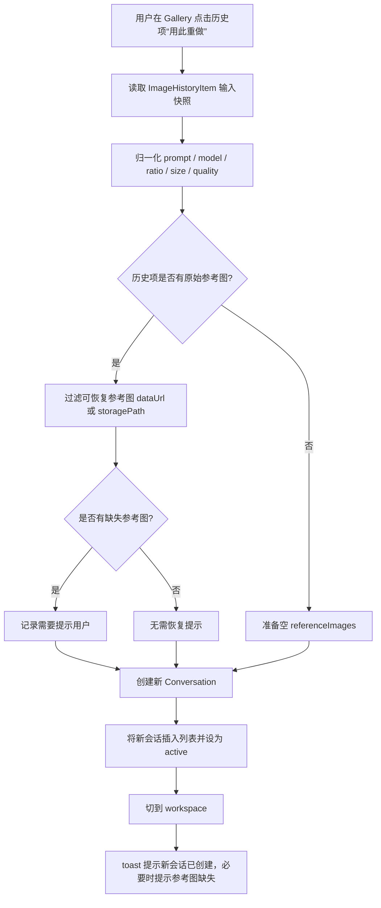

# History Reuse New Conversation Design

## 0. 术语约定

- **历史复用**：从 `ImageHistoryItem` 读取一次生成快照，作为后续编辑起点。grep 结论：代码里已有 `reuseHistory`，但现语义是更新当前会话；本 feature 将用户语义改成“创建新会话”。
- **重做会话**：点击“用此重做”后新建并激活的 `Conversation`。它不是历史项的原会话，也不是点击前的当前会话。
- **原始参考图**：历史生成请求当时使用的 `ImageHistoryItem.referenceImages`，区别于历史项自己的输出图 `dataUrl/storagePath`。本 feature 只恢复原始参考图，不自动把输出图当参考图。
- **复制提示词**：`ImageTile` 已有的剪贴板动作，只复制 `item.prompt`，不改变会话。它和“用此重做”并列存在。
- **失败重试**：`retryHistory` 是失败项在原会话中立即重新生成；本 feature 不替换它，且不自动发起生成。

## 1. 决策与约束

**需求摘要**：用户在 Gallery 中点击历史项的“用此重做”后，应用创建一个新的工作区会话，带入这条历史的 prompt、model、ratio、size、quality；如果历史项是图生图或带有 `referenceImages`，新会话也带入这些原始参考图。成功标准是当前正在编辑的会话不被覆盖，原历史会话不被改写，用户能在新会话里继续编辑或生成。

**明确不做**：

- 不再提供“回填到当前会话”的 Gallery 主按钮语义。
- 不自动点击生成，也不调用生图 API。
- 不把历史输出图自动加入参考图；已有“作为参考图编辑”继续承担输出图再编辑场景。
- 不改变“复制提示词”按钮，它仍只写剪贴板。
- 不修改历史项本身，也不追溯修复旧历史缺失的参考图文件。

**复杂度档位**：

- 状态隔离 = L3（偏离普通前端按钮 L2；本 feature 的核心是不能误改当前会话或源会话）。
- 数据恢复 = L3（偏离普通参数回填 L2；图生图历史需要按可恢复性复制 `referenceImages`，并处理旧记录缺失）。
- 可测试性 = tested（偏离 testable；需要覆盖 text-to-image、image-to-image、缺失参考图和不变性场景）。

**关键决策**：

1. Gallery 用户动作改名为“用此重做”，避免继续暗示“回填参数”会写入当前会话。
2. store 层把现有 `reuseHistory` 语义替换为“从历史创建新会话”，实现时可重命名为更明确的 `reuseHistoryAsConversation`；验收关注语义，不能保留更新当前会话的旧路径。
3. 新会话必须一次性获得 prompt、参数和可恢复参考图，而不是先创建空会话再覆盖点击前 active conversation。
4. `ConversationCreateInput` 已声明为 `Partial<ConversationUpdate>`，但现有 `AppDatabase.createConversation` 和 `store.createConversation` 只接收部分参数；本 feature 需要让创建链路承认 `title/draftPrompt/referenceImages` 等初始化字段。
5. 参考图恢复只使用历史项里的原始 `referenceImages`。可恢复的最小条件是条目至少保留 `dataUrl` 或 `storagePath`；缺失条目不复制，并通过 toast 告知用户。
6. 旧历史如果部分或全部参考图不可恢复，仍允许创建新会话复用 prompt 和参数；这比阻塞用户重做更符合历史复用预期。

## 2. 名词与编排

### 2.1 名词层

**现状**：

- `ImageHistoryItem` 定义在 `src/shared/types.ts`，已经包含 `prompt/model/ratio/size/quality/generationMode/referenceImages`，足够描述一次生成输入快照。
- `ReferenceImage` 定义在 `src/shared/types.ts`，包含 `id/name/mimeType/dataUrl/fileSizeBytes/storagePath/createdAt`。历史持久化会通过 `stripReferenceImagePayloads` 清空 `dataUrl`，但通常保留 `storagePath`。
- `ConversationCreateInput` 类型允许传入 `ConversationUpdate` 的部分字段，但 `src/services/app-database.ts` 的 `createConversation` 现状固定 `title: '新会话'`、`draftPrompt: ''`、`referenceImages: []`。
- `useAppStore.createConversation(template)` 现状只把参数栏相关字段透传给 API，不透传 `draftPrompt/title/referenceImages`。
- `useAppStore.reuseHistory(item)` 现状读取 `activeConversationId`，必要时新建空会话，然后调用 `pixaiApi.conversation.update(id, ...)` 更新当前会话。

**变化**：

- 引入“历史重做输入”契约：来源是单个 `ImageHistoryItem`，输出是一个新建的 `Conversation`。
- 创建会话链路需要支持初始化 `draftPrompt/title/referenceImages`，让重做会话在创建完成时就是正确状态。
- `referenceImages` 复制为新数组和新对象，避免内存对象共享；不要求重新生成 reference id，不要求复制底层文件。
- `size` 使用历史项 `item.size`；当为空或与 ratio 不兼容时使用 `getDefaultImageSize(item.ratio)`。
- 新会话标题可以由历史 prompt 摘要生成；标题只是识别辅助，不参与生成输入。

**接口示例**：

```ts
// 来源：src/store/app-store.ts 历史重做 action（新增/替换语义）
await reuseHistoryAsConversation({
  prompt: '雨夜玻璃城市',
  model: 'gpt-image-2',
  ratio: '16:9',
  size: '1792x1008',
  quality: 'high',
  generationMode: 'text-to-image',
  referenceImages: []
})
// 结果：创建并激活一个新会话，draftPrompt/model/ratio/size/quality 来自历史项。
```

```ts
// 来源：src/shared/types.ts ImageHistoryItem.referenceImages
// 图生图历史项有 2 张原始参考图，其中 1 张缺少 dataUrl 和 storagePath。
// 结果：新会话只带入可恢复的 1 张参考图，并提示“部分原始参考图不可用”。
```

### 2.2 编排层



**现状**：Gallery 卡片按钮调用 `reuseHistory(item)`；该 action 的拓扑是“取 active conversation → update active conversation → 切 workspace”。它会覆盖用户当前正在编辑的 prompt 和参数。

**变化**：主流程变成“取 history snapshot → create conversation → activate new conversation → 切 workspace”。它不再依赖点击前是否已有 active conversation，也不对任何既有会话调用 update。

**流程级约束**：

- 错误语义：创建会话失败时不改本地会话列表、不切 workspace，并显示错误；参考图部分缺失不算创建失败。
- 幂等性：每次点击都创建一个新会话；不按历史项 id 去重。
- 顺序：先完成新会话创建和状态插入，再切到 workspace；toast 在状态稳定后显示。
- 不变性：点击前 active conversation、历史项原 conversation、history 列表都不能被修改。
- 可观测点：左侧会话列表出现新会话，workspace 的 Composer 显示历史 prompt 和参数；图生图历史显示参考图缩略条和“图生图” badge。

### 2.3 挂载点清单

- Gallery 历史卡片主动作：按钮文案从“回填参数”改为“用此重做”，并调用新建会话语义。
- Zustand store 历史复用 action：把旧的 active conversation update 入口替换为新会话创建入口。
- Conversation 创建契约：`conversation.create` / `createConversation(template)` 支持初始化 prompt、标题和参考图。
- `history-reuse-workflow` requirement：新增 draft 需求，记录“安全重做”能力边界。

### 2.4 推进策略

1. 名词契约：让会话创建链路支持 `draftPrompt/title/referenceImages` 初始化。
   退出信号：直接创建会话时能得到带 prompt 和参考图的 conversation。
2. 编排骨架：把 Gallery 历史动作从更新 active conversation 改为创建并激活新 conversation。
   退出信号：点击后 activeConversationId 变为新 id，点击前会话对象不变。
3. 参考图恢复：从历史项复制可恢复的原始 `referenceImages`，并处理全部 / 部分缺失提示。
   退出信号：图生图历史的新会话显示参考图；缺失参考图有可见 toast。
4. UI 语义收口：Gallery 按钮文案、图标/布局和已有“复制提示词”“作为参考图编辑”保持清晰区分。
   退出信号：Gallery 中不再出现“回填参数”，复制提示词仍只复制剪贴板。
5. 测试覆盖：补齐 store 和 Gallery 组件关键场景。
   退出信号：text-to-image、image-to-image、缺失参考图、当前会话不变、按钮文案测试通过。
6. 文档对齐：实现验收时更新 requirement 状态与 UI 架构文档。
   退出信号：架构文档不再描述 Gallery “回填参数”，需求从 draft 升为 current。

### 2.5 结构健康度与微重构

##### 评估

- 文件级 — `src/store/app-store.ts`：约 937 行，已明显偏大，聚合了初始化、会话、参考图、生成、历史、模板、更新等多类 action。本次改动集中在 `createConversation` 与历史复用 action，属于既有 store 职责的窄语义替换，但该文件长期存在拆分价值。
- 文件级 — `src/services/app-database.ts`：约 456 行，会话创建和参考图持久化在同一数据库服务里；本次是让已有 `ConversationCreateInput` 字段在 create 时生效，改动区域单一。
- 文件级 — `src/components/gallery/GalleryPage.tsx`：约 136 行，职责集中在 Gallery 过滤、选择和卡片动作；本次只改主按钮文案与 action。
- 文件级 — `src/store/app-store.test.ts` / `src/components/gallery/GalleryPage.test.tsx`：已有历史删除、批量下载、失败重试测试，本次新增同域行为测试，不改变测试组织。
- 目录级 — `src/store/`：4 个文件，本次不新增文件。
- 目录级 — `src/components/gallery/`：2 个文件，本次不新增文件。
- compound convention 检索：未命中目录组织 / 命名 / 归属 convention。

##### 结论：不做

本次不做微重构。`app-store.ts` 偏胖，但“回填参数 → 新会话重做”是窄范围行为修正；为它先拆 store 会把功能边界扩成结构重组，风险和验证成本都高于收益。

##### 超出范围的观察

- `src/store/app-store.ts`：历史、会话、生成和设置 action 已经混在一个大 store。后续如果继续扩展历史工作流，建议另起 `cs-refactor` 评估按 domain slice 拆 store action；本 feature 不把它作为前置依赖。

## 3. 验收契约

**关键场景清单**：

- 输入 / 触发：Gallery 中点击一条文生图历史的“用此重做”。期望：创建并激活一个新会话，新会话 prompt、model、ratio、size、quality 与历史项一致，参考图为空。
- 输入 / 触发：点击前已有正在编辑的 active conversation。期望：该会话的 `draftPrompt/model/ratio/size/quality/referenceImages` 不被修改。
- 输入 / 触发：历史项带 `conversationId` 指向原会话。期望：原会话不被 update，历史项仍指向原会话。
- 输入 / 触发：Gallery 中点击一条图生图历史，`referenceImages` 均含 `storagePath` 或 `dataUrl`。期望：新会话带入这些原始参考图，Composer 显示缩略图并显示“图生图”。
- 输入 / 触发：图生图历史的部分原始参考图缺少 `dataUrl` 和 `storagePath`。期望：新会话带入可恢复的参考图，并提示部分原始参考图不可用。
- 输入 / 触发：图生图历史的全部原始参考图都不可恢复。期望：仍创建新会话复用 prompt 和参数，参考图为空，并提示原始参考图不可用。
- 输入 / 触发：历史项 `size` 为空或与 `ratio` 不兼容。期望：新会话 size 使用该 ratio 的默认尺寸。
- 输入 / 触发：点击“用此重做”。期望：不会调用生图 API，不会创建 run/history 新项。
- 输入 / 触发：用户点击 `ImageTile` 的“复制提示词”。期望：只复制剪贴板，不创建新会话、不修改任何会话。
- 输入 / 触发：用户点击已有“作为参考图编辑”。期望：它仍是单独的输出图再编辑入口；“用此重做”流程不调用 `addFromHistory` / `addFromHistoryMany`。

**明确不做的反向核对项**：

- Gallery 主按钮和 toast 不应再出现“回填到当前会话”的语义。
- 历史重做流程不应调用 `pixaiApi.conversation.update` 更新点击前 active conversation。
- 历史重做流程不应把 `ImageHistoryItem.dataUrl/storagePath` 作为参考图来源。
- 历史重做流程不应调用 `pixaiApi.image.generate`。
- 复制提示词代码路径不应调用会话创建或更新 action。

## 4. 与项目级架构文档的关系

验收阶段需要更新 `.codestable/architecture/ui-shadcn-workbench.md`：

- `GalleryPage` 职责从“回填参数”改为“从历史项创建新会话重做”。
- `数据与状态` 中补充：历史复用不再写入当前会话，而是通过会话创建链路初始化新会话；图生图历史会复用 `ImageHistoryItem.referenceImages` 中可恢复的原始参考图。
- `已知约束` 中补充：Gallery 历史重做不能自动把生成输出图当参考图，也不能覆盖 active conversation。

验收阶段还需要把 `.codestable/requirements/history-reuse-workflow.md` 从 `draft` 更新为 `current`，并把 `implemented_by` 指向 `ui-shadcn-workbench`。
