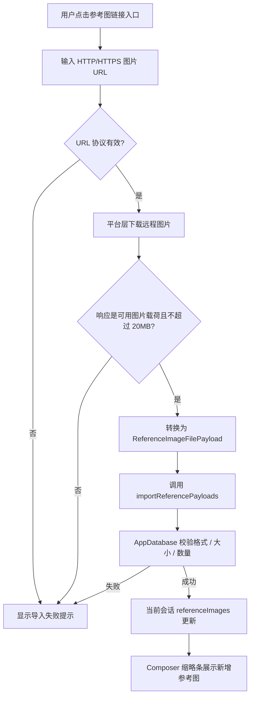

# Reference Image URL Import Design

## 0. 术语约定

- **参考图**：沿用 `ReferenceImage` 与 `conversation.referenceImages`，不新增“远程参考图”或“URL 参考图”平行实体。grep 结论：参考图链路已经覆盖 `Composer`、store、API 和数据库，本 feature 只新增一个来源入口。
- **图片 URL 导入**：用户显式输入 `http://` / `https://` 图片地址，应用下载其响应体并转成 `ReferenceImageFilePayload`。它不是 prompt 文本自动识别，也不是 Provider Base URL 配置。
- **远程图片载荷**：下载后的 `{ name, mimeType, dataUrl, fileSizeBytes }`，形状对齐 `src/shared/types.ts` 的 `ReferenceImageFilePayload`。后续校验、持久化和会话更新继续交给现有参考图导入链路。

## 1. 决策与约束

**需求摘要**：为工作台创作者增加参考图 URL 导入能力。用户在参考图区域点击链接入口，输入 HTTP/HTTPS 图片 URL 后，应用下载图片并追加到当前会话参考图；成功标准是缩略条出现新增参考图，生成模式随现有逻辑进入图生图。明确不做 prompt 文本 URL 自动识别，不改 Provider 服务连接，不保存远程 URL 作为长期外链依赖。

**复杂度档位**：

- 健壮性 = L3（偏离内部工具默认 L2；URL 是外部输入，必须处理无效协议、网络失败、非 2xx、非图片响应和超限图片；超大图片不能完整下载后才失败）。
- 安全性 = validated（偏离 trusted；只接受 HTTP/HTTPS，下载结果必须经过 MIME / 扩展名 / 大小校验，并沿用现有 20MB 单图上限）。
- 可测试性 = tested（偏离 testable；URL 下载转换、UI 交互和错误路径都应有测试覆盖）。

**明确不做**：

- 不扫描 prompt 文本里的 URL，也不在 prompt 中插入图片占位符。
- 不把任意网页、HTML `` 片段或非图片 URL 转成参考图。
- 不修改 Provider 服务配置、连接测试或 OpenAI-compatible adapter。
- 不新增参考图数量上限、大小上限或格式白名单；继续沿用当前最多 8 张、单张 20MB、PNG/JPG/WEBP 的限制。
- 不把远程 URL 直接存为参考图 `dataUrl`；导入后应成为本地可持久化图片载荷。

**关键决策**：

1. URL 导入是参考图入口增强，放在 `Composer` 参考图区域，而不是全局设置或 Provider 管理流。
2. 用户必须显式触发“链接导入”，不自动解析 prompt 文本，避免改变提示词输入语义。
3. 下载节点输出 `ReferenceImageFilePayload`，再复用 `importReferencePayloads`，让数据库继续统一处理数量、格式和大小校验。
4. URL 下载必须在平台层做大小防护：如果响应 `Content-Length` 已超过 20MB，直接拒绝；如果响应头缺失或不可信，下载过程中累计字节超过 20MB 就中止并报错。
5. Tauri runtime 下复用桌面侧 HTTP 能力下载，浏览器预览环境保留直接 `fetch` 兜底；两者都返回同一载荷形状。
6. 既有 `reference-image-input` requirement 需要在 acceptance 阶段更新边界：从“不负责远程 URL”改为“只通过显式链接导入入口处理远程图片”。

## 2. 名词与编排

### 2.1 名词层

**现状**：

- `ReferenceImageFilePayload` 定义在 `src/shared/types.ts`，包含 `name`、`mimeType`、`dataUrl`、`fileSizeBytes`，是 Tauri 本地路径导入和 store payload 导入的统一载荷。
- `Composer` 通过隐藏 file input、DOM paste/drop 和 Tauri `onDragDropEvent` 接收本地图片，然后调用 `importReferenceFiles` 或 `importReferencePayloads`。
- `useAppStore.importReferencePayloads` 调用 `pixaiApi.reference.importPayloads` 并更新当前会话 `referenceImages`，成功 / 失败都走现有 toast。
- `AppDatabase.importReferenceImages` 负责 8 张上限、PNG/JPG/WEBP 白名单和 20MB 单图上限。代码锚点：`MAX_REFERENCE_IMAGES = 8`、`MAX_REFERENCE_IMAGE_BYTES = 20 * 1024 * 1024`。
- `src/lib/platform.ts` 已有 `fetchJsonThroughPlatform` / `fetchMultipartThroughPlatform` 等 Tauri HTTP proxy 封装，但还没有“下载图片 URL 并转 ReferenceImageFilePayload”的公开函数。

**变化**：

- 新增“图片 URL 导入请求”概念，输入是用户提供的 URL 字符串，输出是一个 `ReferenceImageFilePayload`。
- 新增平台层函数，例如 `readRemoteImageUrl(url: string): Promise<ReferenceImageFilePayload>`，职责是校验 URL 协议、下载响应、按 20MB 上限拦截超大响应、推断文件名 / MIME、转成 data URL。
- `Composer` 新增链接导入 UI 状态：弹窗打开状态、URL 输入值、导入中状态。状态只属于组件内部，不进全局 store。
- store、API、数据库的参考图实体不变，URL 导入只是在进入 `importReferencePayloads` 之前多一个来源转换节点。

**接口示例**：

```ts
// 来源：src/lib/platform.ts readRemoteImageUrl（新增）
await readRemoteImageUrl('https://example.com/cat.webp')
// => {
//   name: 'cat.webp',
//   mimeType: 'image/webp',
//   dataUrl: 'data:image/webp;base64,...',
//   fileSizeBytes: 34567
// }
```

```tsx
// 来源：src/components/workspace/Composer.tsx Composer（新增交互）
// 用户输入 https://example.com/cat.png 并确认
const payload = await readRemoteImageUrl(url)
await importReferencePayloads([payload])
```

### 2.2 编排层



**现状**：参考图导入是线性流程。DOM `File` 入口先转 data URL 并持久化；Tauri 本地路径入口先读本地文件；两者最终都进入 `importReferencePayloads` / `importReferenceImages`，由会话状态驱动缩略条渲染。

**变化**：在 `Composer` 参考图入口旁新增 URL 导入支线。支线只负责“URL 字符串 → 远程图片载荷”，随后汇入现有 `importReferencePayloads`。整体拓扑仍是单入口支线汇入既有 pipeline，不新增参考图状态机。

**流程级约束**：

- 错误语义：URL 为空、协议不是 HTTP/HTTPS、网络失败、HTTP 非 2xx、响应不是图片、图片超过 20MB，都通过现有 toast 或导入弹窗错误提示可见；失败不修改当前会话参考图。
- 幂等性：每次确认导入都追加一张新参考图，不做 URL 去重或内容 hash 去重。
- 顺序：单 URL 一次只导入一张；多 URL 批量导入不在本 feature 范围内。
- 数据持久化：下载结果必须变成本地 data URL / 存储路径载荷后再进入数据库，不能把远程 URL 当作长期图片源；超过 20MB 的远程响应不得进入 data URL 转换和数据库导入。
- 可观测点：导入中按钮禁用并显示加载态；成功后参考图数量 badge / 缩略条更新；失败后用户能看到具体错误。

### 2.3 挂载点清单

- `Composer` 参考图工具区：新增“链接导入”公共 UI 入口；删掉它后用户无法触发 URL 导入。
- 平台图片读取接口：新增 `readRemoteImageUrl(url)` 作为 URL 到 `ReferenceImageFilePayload` 的公开平台函数；删掉它后 URL 导入没有下载来源转换。
- `reference-image-input` requirement：修改边界描述；删掉这条需求更新后项目愿景仍会声称“不负责远程 URL”，与新功能冲突。

### 2.4 推进策略

1. 交互骨架：新增链接导入按钮和弹窗输入，不接真实下载。
   退出信号：用户能打开 / 关闭弹窗，空输入不会触发导入。
2. 下载转换节点：实现 URL 校验、HTTP 下载、20MB 大小拦截、MIME / 文件名推断和 data URL 转换。
   退出信号：有效图片 URL 能转换为 `ReferenceImageFilePayload`，无效协议、非图片响应和超过 20MB 的响应有明确错误。
3. 状态接入：把转换结果接入 `importReferencePayloads`，保留加载态和失败提示。
   退出信号：成功导入后当前会话缩略条追加参考图，失败不改变会话。
4. 测试覆盖：补齐平台转换和 `Composer` URL 导入交互测试。
   退出信号：正常 URL、无效 URL、非图片响应和导入失败路径都有验证证据。
5. 文档对齐：更新 `reference-image-input` requirement 和 UI 架构文档。
   退出信号：需求边界不再与 URL 导入冲突，架构文档记录 `Composer` 可显式导入远程图片。

### 2.5 结构健康度与微重构

##### 评估

- 文件级 — `src/components/workspace/Composer.tsx`：约 408 行，职责集中在提示词输入、参考图缩略、导入入口、预览和生成按钮。本次要新增 UI 支线和组件局部状态，预计改动 2-3 个相邻区域，仍属于参考图入口职责。
- 文件级 — `src/lib/platform.ts`：约 834 行，已经聚合 Tauri / 浏览器平台能力、文件读写、下载、HTTP proxy 和通知等。新增 `readRemoteImageUrl` 属于平台 I/O 能力，但该文件偏大，后续继续扩展会有平台工具收纳风险。
- 文件级 — `src/store/app-store.ts`：约 922 行，但本 feature 预计复用 `importReferencePayloads`，不需要新增 store action。
- 文件级 — `src/services/app-api.ts` / `src/services/app-database.ts`：分别约 150 / 414 行，参考图导入契约已经存在，本 feature 不需要修改其名词语义。
- 目录级 — `src/components/workspace/`：已有 12 个文件，本次不新增 workspace 源文件，只改 `Composer` 和测试。
- 目录级 — `src/lib/`：已有 10 个文件，存在 `platform.ts` 偏胖问题，但本次新增一个平台函数，不新增多个同类文件。
- compound convention 检索：`.codestable/compound/` 未命中现有目录组织 / 命名 / 归属 convention。

##### 结论：不做

本次不做微重构。虽然 `platform.ts` 和 `app-store.ts` 已偏大，但 URL 导入可以通过新增一个平台函数并复用现有 store action 完成；为了一个窄支线先拆平台层，会把功能设计变成结构整理，收益不抵风险。

##### 超出范围的观察

- `src/lib/platform.ts`：平台 I/O、HTTP proxy、文件下载、图片显示和通知能力已经混在同一大文件中。建议后续若继续增加平台能力，走 `cs-refactor` 评估是否拆成 `platform/http`、`platform/files`、`platform/images` 等子模块；本 feature 不把它作为前置依赖。

## 3. 验收契约

**关键场景清单**：

- 输入 / 触发：用户在链接导入弹窗输入 `https://example.com/cat.png` 并确认。期望：导入按钮进入加载态，成功后新增参考图出现在当前会话缩略条。
- 输入 / 触发：用户输入 `http://127.0.0.1:<port>/image.webp`。期望：HTTP URL 和 HTTPS URL 一样被接受，下载后进入参考图导入链路。
- 输入 / 触发：用户输入空字符串或只有空格。期望：不发起下载，显示 URL 不能为空或保持确认按钮不可用。
- 输入 / 触发：用户输入 `ftp://example.com/a.png` 或普通文本。期望：不发起下载，提示仅支持 HTTP/HTTPS 图片链接。
- 输入 / 触发：远程响应为 404 / 500。期望：导入失败，当前会话参考图不变，用户能看到 HTTP 状态相关提示。
- 输入 / 触发：远程响应是 HTML / JSON / 非 PNG/JPG/WEBP 图片。期望：导入失败，当前会话参考图不变。
- 输入 / 触发：远程响应 `Content-Length` 超过 20MB。期望：下载前拒绝导入，当前会话参考图不变。
- 输入 / 触发：远程响应未提供 `Content-Length`，但下载过程中累计超过 20MB。期望：下载中止并拒绝导入，当前会话参考图不变。
- 输入 / 触发：当前会话已达到 8 张参考图。期望：沿用现有参考图数量限制提示，不新增特殊上限。

**明确不做的反向核对项**：

- 代码中不应出现从 prompt 文本自动提取 URL 并导入参考图的逻辑。
- Provider 设置、Provider 连接测试和 OpenAI-compatible adapter 不应因为本 feature 改变行为。
- `ReferenceImage` / `Conversation` 类型不应新增远程 URL 字段。
- URL 导入不应绕过 `AppDatabase.importReferenceImages` 的格式、大小和数量校验。
- URL 导入不应完整读取超过 20MB 的远程响应后才失败。
- 不应支持多 URL 批量输入、网页解析或 HTML `` 抽取。

## 4. 与项目级架构文档的关系

acceptance 阶段应更新 `.codestable/architecture/ui-shadcn-workbench.md` 中 `Composer` 的职责描述：参考图入口除了本地文件、粘贴 / 拖入、本地 Tauri 路径外，还支持显式 HTTP/HTTPS 图片 URL 导入。

需求文档 `.codestable/requirements/reference-image-input.md` 也需要同步更新：把原边界“不负责从网页地址下载远程图片”替换为“仅通过显式链接导入入口下载远程图片；不自动解析 prompt 或 HTML”。该能力不改变 `ReferenceImage` 数据模型和生成请求组装语义，架构总入口通常不需要新增子系统。
