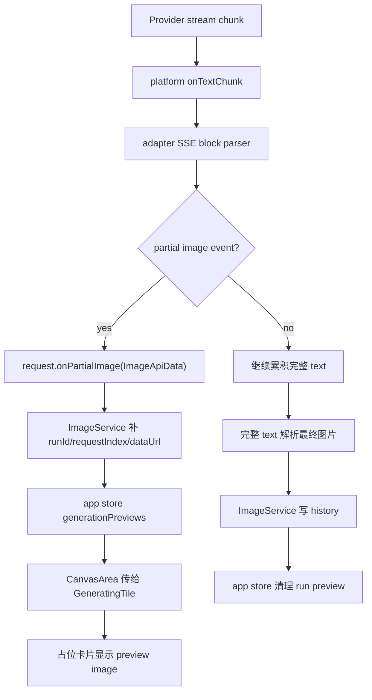

# Streaming Partial Preview Core Design

## 0. 术语约定

- **Partial image preview**：生成过程中由上游流式事件返回的中间图片，只用于当前 UI 预览，不写入 history。
- **Generation preview state**：Zustand store 中按 `runId -> requestIndex` 保存的临时 preview 字典。
- **Partial image callback**：adapter 从 provider stream 中识别 partial image 后向 ImageService 传递的回调。
- **Platform stream chunk**：浏览器 `ReadableStream` 或 Tauri `pixai://http-proxy-stream` 事件中的文本增量。
- **Final image result**：生成完成后写入 runs/history 的最终图片，仍由现有 `ImageService.generate()` 返回路径负责。

## 1. 决策与约束

### 1.1 需求摘要

本 feature 打通流式 partial preview 的核心链路：当 provider 支持 stream + partial images 时，经典工作台的生成占位卡片应在最终结果到达前显示中间图；不支持 partial 的 provider 继续显示现有 spinner。链路必须从 platform chunk、adapter 解析、ImageService 补齐 run/request 语义，一直到 app store 和 `GeneratingTile` UI。

成功标准：

- 浏览器和 Tauri stream 传输都能在读取 chunk 时触发文本回调，同时保持最终完整文本返回。
- OpenAI compatible adapter 能识别 `image_generation.partial_image`、`image_edit.partial_image`、`response.image_generation_call.partial_image`。
- ImageService 能把 adapter partial image 转成 `PartialImagePreview`，补齐 `runId`、`requestIndex`、`receivedAt`。
- 经典工作台生成占位卡片能展示对应 run/request 的 preview image。
- run 完成、失败或取消后，临时 preview 被清理，不污染 history。

明确不做：

- 不把 partial preview 写入 history、gallery、reference 或 Canvas project。
- 不新增 Canvas 生成节点，不改 Canvas node 模型。
- 不改变最终结果落库、失败记录、retry 记录和通知语义。
- 不新增 provider 配置项；仍使用现有 `stream` / `partialImages` 会话字段。
- 不要求所有 provider 都返回 partial image；缺失时 UI 保持现状。

### 1.2 复杂度档位

- 结构 = cross-module pipeline：改动横跨 platform、adapter、service、store 和 UI，但每层只承担自己的转换职责。
- 稳定性 = high：stream 回调、解析错误、UI 状态更新都不能中断最终生成请求。
- 可测试性 = tested：覆盖平台 chunk 回调、adapter partial 解析、service/store 状态更新和 UI preview 展示。
- 可观测性 = minimal：本 feature 不新增后台日志；错误仍通过现有 provider/http error details 记录。partial preview 失败默认静默降级为 spinner。

其余维度按项目默认档位：性能 reasonable、可读性 team、可演进性 active。

### 1.3 关键决策

- `PartialImagePreview` 放在 `src/shared/types.ts`，因为 app store、UI、后续 Canvas 生成节点都会复用。
- `ImageGenerationRequest.onPartialImage` 只传 provider 层图片数据和可选 index，不传 `runId`；`runId` 是 ImageService 的业务语义。
- platform 层只负责逐 chunk 传文本，不理解 SSE 和图片字段。
- adapter 层解析完整 SSE block，识别 partial image 事件并调用 callback；最终图片提取仍复用现有完整文本解析。
- `pixaiApi.image.generate(input, options?)` 扩展 service-only options，避免把函数塞进可持久化的 `GenerateImageInput`。
- app store 按 `runId/requestIndex` 保存最新 preview；同一 request 多张 partial 时只显示最新一张。

### 1.4 前置依赖

- roadmap 第 4.4 流式 partial preview 协议是本 feature 的硬约束输入。
- 现有 `GenerateImageInput.stream` / `partialImages` 已经能传到 images/responses 请求体。
- 现有 workspace running slot 已按 `run.id` 和 `requestIndex` 渲染 `GeneratingTile`，可直接挂 preview。

## 2. 名词与编排

### 2.1 名词层

#### 现状

- `src/shared/types.ts` 没有 partial preview 共享类型。
- `ImageGenerationRequest` 只有 `input`、`referenceImages`、`signal`、`onCallLog`。
- `src/lib/platform.ts` 的 stream helper 会收集完整文本后一次性返回，不暴露 chunk。
- `ImageService.generate(input)` 只返回最终 `GenerateImageResult`，无法把运行中的 partial 传给 app store。
- `useAppStore` 没有 preview 状态；`GeneratingTile` 只显示 spinner / retry / cancel。

#### 变化

新增共享临时 preview 类型：

```ts
export type PartialImagePreview = {
  runId: string
  requestIndex: number
  partialImageIndex?: number
  dataUrl: string
  receivedAt: string
}

export type GenerationPreviewState = Record<string, Record<number, PartialImagePreview>>
```

扩展 adapter request：

```ts
export type ImageGenerationRequest = {
  input: GenerateImageInput
  referenceImages: Array<{ name: string; mimeType: string; dataUrl: string }>
  signal?: AbortSignal
  onCallLog?: (log: ImageGenerationCallLog) => void
  onPartialImage?: (partial: {
    image: ImageApiData
    requestIndex?: number
    partialImageIndex?: number
  }) => void
}
```

扩展 platform stream options：

```ts
export type PlatformFetchOptions = {
  timeoutMs?: number
  firstByteTimeoutMs?: number
  onTextChunk?: (chunk: string) => void
}
```

扩展 image service / app API：

```ts
export type ImageGenerationOptions = {
  onPartialImage?: (preview: PartialImagePreview) => void
}

generate(input: GenerateImageInput, options?: ImageGenerationOptions): Promise<GenerateImageResult>
```

### 2.2 编排层



#### 现状

- 浏览器 runtime 调 `response.text()`，Tauri runtime 把 base64 chunks 收进数组后 `done` 时 decode。
- images endpoint streaming 最终由 `parseImagePayload(text)` 提取图片。
- responses endpoint streaming 最终由 `extractResponsesImageStreamResult(text)` 提取图片。
- 经典工作台生成卡片由 `CanvasArea` 根据 running run slots 渲染。

#### 变化

- 浏览器 stream helper 使用 `response.body.getReader()` + `TextDecoder` 逐段 decode；每段安全调用 `options.onTextChunk`，同时继续累积完整文本。
- Tauri stream helper 在每个 `kind: 'chunk'` 事件中 decode 文本增量并安全调用 `options.onTextChunk`；最终仍返回完整 `text`。
- OpenAI compatible adapter 给 streaming images/edit/responses 请求传入 `onTextChunk`，用增量 SSE parser 从 buffer 中取出完整 block。
- adapter 只对 partial image event 调 callback；完整响应中的最终图片仍走现有解析，避免 partial 被误写 history。
- ImageService 在每个 requestIndex 的 adapter 调用中闭包注入 `run.id` 和 `requestIndex`，把 `ImageApiData` 转成 data URL 后通知 options。
- app store 在 `generate()` 和 `retryHistory()` 调用 `pixaiApi.image.generate()` 时传入 `onPartialImage`，保存 preview；finally 阶段清理本次 run 的 preview。
- `CanvasArea` 从 store 读取 `generationPreviews`，给 running slot 的 `GeneratingTile` 传入 matching preview。
- `GeneratingTile` 有 preview 时在方形图片区域显示 ``，继续保留 spinner、耗时、retry 和取消入口。

#### 流程级约束

- `onTextChunk` / `onPartialImage` 回调必须 try/catch，异常不能中断请求。
- SSE 增量 parser 只处理完整 block，半截 JSON 留在 buffer，避免误解析。
- partial image data URL 为空或无法识别时不更新 preview。
- run 完成、失败、取消后清理该 run preview；不会清理其他并发 run。
- retry 过程中新的 partial 可以覆盖同一 `runId/requestIndex` 的旧 preview。
- 服务商没有 partial image 时不报错，UI 保持 spinner。

### 2.3 挂载点清单

- `src/shared/types.ts`：新增 `PartialImagePreview` / `GenerationPreviewState`。
- `src/lib/platform.ts`：stream fetch helper 增加 chunk callback。
- `src/adapters/types.ts` 与 `src/adapters/openai-compatible.ts`：partial image callback 协议和 SSE 增量解析。
- `src/services/image-service.ts` 与 `src/services/app-api.ts`：service-only generation options，补齐 run/request 语义。
- `src/store/app-store.ts`：`generationPreviews` 状态、写入和清理。
- `src/components/workspace/CanvasArea.tsx` / `GeneratingTile.tsx`：经典工作台占位卡片显示 preview。

### 2.4 推进策略

1. 名词和门面契约：新增 shared/adapters/service options 类型，扩展 app API generate 签名。
   - 退出信号：类型编译能表达 partial preview，但现有调用仍兼容。
2. Platform chunk 管道：浏览器/Tauri stream helper 在读取 chunk 时触发 `onTextChunk` 并保留完整 text。
   - 退出信号：平台测试证明 chunk 回调顺序正确且最终 text 不变。
3. Adapter partial 解析：增量解析 SSE partial image 事件，触发 `request.onPartialImage`。
   - 退出信号：images/edit/responses partial 事件能触发 callback，最终 images 仍正确返回。
4. Service/store 状态链：ImageService 补齐 preview 语义，app store 保存和清理 `generationPreviews`。
   - 退出信号：测试证明 partial 写入 store，完成/失败后清理。
5. 经典工作台 UI：`GeneratingTile` 接收 preview，`CanvasArea` 按 run/request 传入。
   - 退出信号：组件测试和浏览器 smoke 证明生成占位能显示 preview。
6. 验证收尾：跑 `pnpm check`、`pnpm build`，修正类型和回归。
   - 退出信号：测试、类型检查、构建通过，关键验收场景有证据。

### 2.5 结构健康度与微重构

##### 评估

- 文件级 — `src/lib/platform.ts` 已是平台能力集中入口，stream helper 属于现有职责；本 feature 只增加 callback 管道，不拆平台文件。
- 文件级 — `src/adapters/openai-compatible.ts` 已包含 images/responses SSE 解析；新增增量 parser 与 partial event 识别属于同一 provider adapter 职责。
- 文件级 — `src/services/image-service.ts` 负责 run/request/history 编排，补齐 `runId/requestIndex` 合理，但需要把 `imageDataToDataUrl` 复用到 preview，避免重复转换。
- 文件级 — `src/store/app-store.ts` 偏大，但 preview 是 workspace generation 全局状态，短期放入同一 store 最小；不在本 feature 中拆 store。
- 目录级 — `src/components/workspace/` 已有 `CanvasArea` / `GeneratingTile`，preview UI 是它们的自然扩展，不新增目录。

##### 结论：不做微重构

本 feature 不做独立“只搬不改行为”的微重构。实现时通过小 helper 控制新增逻辑体积；若 app-store 后续继续膨胀，建议单独走 `cs-refactor` 拆 generation slice。

##### 超出范围的观察

- 当前 `CanvasArea` 命名仍与真正 Canvas 模式冲突，但本 feature 是经典工作台 preview，不重命名该组件。
- 完整 provider event schema 差异可能继续增加；本 feature 只覆盖 roadmap 指定的三类 partial image event。

## 3. 验收契约

### 3.1 关键场景清单

- 浏览器 stream 返回多个 chunk：每个文本 chunk 触发 `onTextChunk`，最终 `text` 仍等于完整响应。
- Tauri stream proxy 返回多个 chunk：每个 chunk decode 后触发 `onTextChunk`，最终 `text` 仍等于完整响应。
- images endpoint `image_generation.partial_image`：adapter 调用 `onPartialImage`，最终 completed 图片仍作为最终结果返回。
- image edits `image_edit.partial_image`：adapter 调用 `onPartialImage`，最终响应仍能提取最终图片。
- responses endpoint `response.image_generation_call.partial_image`：adapter 调用 `onPartialImage`，最终响应仍能提取最终图片。
- 生成过程中收到 partial image：app store `generationPreviews[runId][requestIndex]` 出现 data URL，`GeneratingTile` 显示图片预览。
- 生成完成、失败或取消后：该 run 的 preview 被清理，不留在 store。
- partial callback 抛错或 provider 没返回 partial：最终生成不因此失败，UI 继续使用 spinner 或最终结果。

### 3.2 明确不做的反向核对项

- 不新增 Canvas 生成节点、Canvas result 节点或 DAG 执行入口。
- 不把 partial preview 写入 history item、reference image、gallery 或 Canvas project JSON。
- 不改变 `GenerateImageInput` 的可持久化字段，不把函数写入 input。
- 不改变最终图片落库、retry failure、cancel 和通知语义。
- 不新增 provider 设置项或环境变量。

## 4. 与项目级架构文档的关系

验收通过后更新 `ui-shadcn-workbench`：

- 在经典工作台生成链路中补充 streaming partial preview。
- 在数据与状态中补充 `PartialImagePreview` / `GenerationPreviewState`。
- 在模块交互中补充 platform chunk → adapter → ImageService → app store → `GeneratingTile`。
- 在已知约束中说明 partial preview 是临时状态，不写 history/reference/gallery/Canvas project。

验收通过后更新 `ARCHITECTURE.md` 总入口的工作台能力摘要。本 feature 不新增 requirement；它是 `workspace-canvas-mode` roadmap 下 streaming-preview-pipeline 的实现单元。
