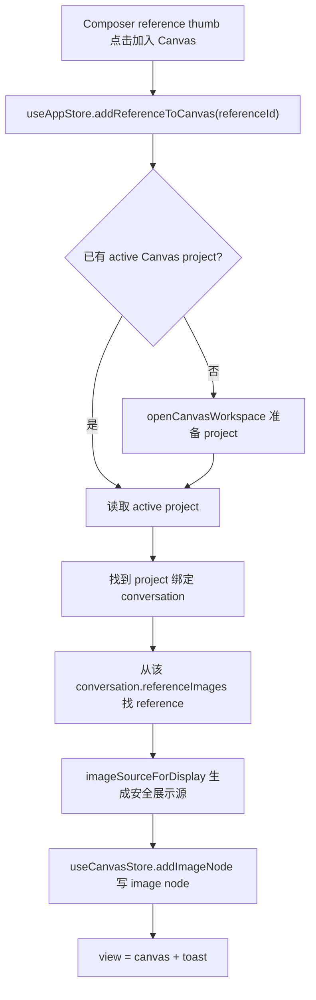

# Canvas Asset Bridge Polish Design

> 用户已授权本轮自主决策和实现，本 design 由 AI 自审通过后直接进入实现。

## 0. 术语约定

- **素材桥**：把 PixAI 既有图片来源放进 Canvas image node 的入口和编排，不代表新增素材库。
- **当前参考图**：经典工作台当前会话 `referenceImages` 里的图片。
- **历史 / 图库图**：`ImageHistoryItem` 成功图；工作台结果和图库卡片都复用 `ImageTile`。
- **Canvas 图片节点**：`CanvasNodeData(type: 'image')`，通过 metadata 保存 `referenceImageId/historyItemId/storagePath`。
- **安全展示源**：`imageSourceForDisplay()` / `imageSourceForDisplaySync()` 产出的可渲染图片地址，避免把不可用本地裸路径直接塞进 UI。

## 1. 决策与约束

### 1.1 需求摘要

当前 Canvas 已有本地图片 dock、Canvas 内参考图菜单、历史 / 图库图“加入 Canvas”，但经典工作台里的当前参考图缩略图只能预览和移除。用户在工作台把参考图准备好后，不能从这个最自然的位置直接进入 Canvas 继续节点化创作。

成功标准：

- 当前参考图缩略图提供明确“加入 Canvas”入口。
- 点击后确保有可用 Canvas project，把该参考图创建为 Canvas image node，并切换到 Canvas。
- Canvas image node 保留 `referenceImageId/storagePath/mimeType/fileSizeBytes`，同一参考图重复加入不创建重复节点。
- 历史 / 图库图仍走既有 `addHistoryToCanvas()`，不破坏 `reference.addFromHistoryMany()` 上限、格式、大小约束。
- 本地图片 dock 仍只创建 Canvas image node，不改变 reference/history 事实源。

明确不做：

- 不新增平行素材库、asset store、数据库表或 project 图片包。
- 不迁入参考项目的视频、音频、账号、Go 后端、AntD、Next.js 或 localforage。
- 不复制 AGPL 项目代码。
- 不修改 Provider、ImageService、history、reference API、Tauri API 或生成请求协议。
- 不做批量加入 Canvas、项目选择器、从图库反向定位 Canvas 节点、云同步或复杂资产管理页。

### 1.2 复杂度档位

- 结构 = app-store 跨 store 编排 + Composer 小入口。
- 可测试性 = tested，store 和组件测试覆盖当前参考图入口。
- 健壮性 = L2，缺项目、缺绑定会话、不可显示图片源时给出 toast，不创建坏节点。
- 其余维度走项目默认：性能 reasonable、可读性 team、可演进性 active。

### 1.3 关键决策

- **当前参考图加入 Canvas 由 app-store 编排**。Composer 只触发 action，不直接知道 Canvas project 创建、打开和持久化细节。
- **不重复导入 reference**。当前参考图已经在 conversation.referenceImages 中，直接用它创建 Canvas image node。
- **Canvas project 仍绑定 Canvas conversation**。如果当前已有 active Canvas project，就把参考图加入该 project；没有则先 `openCanvasWorkspace()` 准备默认项目。
- **去重仍放在 Canvas store**。`useCanvasStore.addImageNode()` 已按 `referenceImageId/historyItemId` 去重，本 feature 复用该语义。

## 2. 名词与编排

### 2.1 名词层

#### 现状

- `AppState` 已有 `addHistoryToCanvas(historyId)`，但没有 `addReferenceToCanvas(referenceImageId)`。
- `Composer` reference thumb 只渲染预览按钮和移除按钮，没有加入 Canvas 入口。
- `CanvasImageNodeInput` 已支持 `referenceImageId/historyItemId/storagePath/mimeType/fileSizeBytes`。
- `useCanvasStore.addImageNode()` 已过滤非法图片源，并对相同 `referenceImageId/historyItemId` 去重。

#### 变化

新增 app-store action：

```ts
type AppState = {
  addReferenceToCanvas(referenceImageId: string): Promise<void>
}
```

示例：

```ts
await useAppStore.getState().addReferenceToCanvas('reference-1')
```

结果：如果 `reference-1` 是当前 workspace conversation 的参考图，app-store 准备 Canvas project，调用 `useCanvasStore.addImageNode()` 创建 image node，metadata 至少包含：

```ts
{
  referenceImageId: 'reference-1',
  storagePath: reference.storagePath ?? null,
  mimeType: reference.mimeType,
  fileSizeBytes: reference.fileSizeBytes,
  content: displaySource
}
```

### 2.2 编排层



#### 现状

- `openCanvasWorkspace()` 会打开已有 Canvas project，或创建新的 hidden conversation + Canvas project。
- `addHistoryToCanvas()` 若无 active project 会先打开 Canvas，再通过 `reference.addFromHistoryMany()` 把 history 导入 Canvas project conversation。
- `Composer` 已有 reference thumb 的安全展示源计算，且能避免裸本地路径出现在 DOM。

#### 变化

- `AppState` 新增 `addReferenceToCanvas(referenceImageId)`：
  - 无 active Canvas project 时先 `openCanvasWorkspace()`。
  - 从 active project 获取绑定 conversation。
  - 在绑定 conversation 的 `referenceImages` 里查找目标 reference；若找不到，再允许从当前 workspace conversation 查找，避免首次创建 Canvas 后丢失用户刚看的参考图。
  - 用 `imageSourceForDisplay(reference.dataUrl, reference.storagePath)` 获取安全展示源。
  - 调 `useCanvasStore.addImageNode()` 写入 Canvas image node。
  - 切换到 Canvas 并 toast `参考图已加入 Canvas`。
- `Composer` reference thumb 增加 icon button：
  - `title/aria-label = 加入 Canvas`
  - 调用 `addReferenceToCanvas(reference.id)`
  - 不影响预览和移除按钮。

#### 流程级约束

- 如果 reference 不存在或无法得到安全展示源，不创建 Canvas node，并显示失败 toast。
- 同一参考图重复加入由 Canvas store 去重，不在 UI 层维护状态。
- `addReferenceToCanvas()` 不调用 `reference.importPayloads()` 或 `reference.addFromHistoryMany()`，避免复制当前参考图。
- 历史 / 图库图继续走 `addHistoryToCanvas()`，保持现有上限和格式校验。
- 不新增视频/音频文案、类型或入口。

### 2.3 挂载点清单

- `src/store/app-store.ts`：新增 `addReferenceToCanvas()` 跨 store 编排 action。
- `src/components/workspace/Composer.tsx`：当前参考图缩略图增加“加入 Canvas”按钮。
- tests：app-store 覆盖 reference -> Canvas image node；Composer 覆盖按钮调用 action。
- `.codestable/architecture/*` / requirement / roadmap：验收后同步当前素材桥现状。

### 2.4 推进策略

1. 文档与 roadmap：落 design/checklist，items.yaml 标记 in-progress。
   - 退出信号：feature 文档存在，YAML 校验通过。
2. Store 编排：实现 `addReferenceToCanvas()`。
   - 退出信号：store 测试证明参考图能写入 Canvas image node、切换 Canvas、保留 metadata。
3. UI 入口：Composer reference thumb 增加加入 Canvas 按钮。
   - 退出信号：组件测试点击按钮会调用 `addReferenceToCanvas(reference.id)`，预览/移除仍独立。
4. 反馈 polish：本地/历史/参考图加入 Canvas toast 更明确。
   - 退出信号：成功 toast 能区分参考图/历史图/本地图片路径。
5. 验证与 review：跑 typecheck、定向 vitest、浏览器 smoke 和代码 review。
   - 退出信号：测试通过，浏览器里当前参考图可加入 Canvas，页面仍无视频/音频入口。

### 2.5 结构健康度与微重构

- 文件级 — `app-store.ts` 仍偏胖，新增一个素材桥 action 会继续增加跨 store 编排职责，但该文件已有 `addHistoryToCanvas()` 和 Canvas generation bridge；本次保持局部一致，避免同时做拆分。
- 文件级 — `Composer.tsx` 已承担 prompt、reference 导入、URL 导入和 reference thumb；新增一个 thumb action 属于当前 UI surface 的直接能力，不拆新组件。
- 文件级 — `canvas-store.ts` 已有 image node 去重和输入过滤，本次复用，不修改。
- 目录级 — `src/components/workspace/`、`src/store/` 归属清晰，无需重组目录。
- compound convention 检索：未发现与 Canvas asset bridge、reference thumb 或目录归属冲突的长期约束。

结论：本次不做独立微重构。`app-store.ts` 的 Canvas 编排拆分仍作为后续 refactor 观察项，不阻塞本 feature。

## 3. 验收契约

### 3.1 关键场景清单

- 当前工作台 reference thumb 点击“加入 Canvas”：Canvas project 出现 image node，metadata.referenceImageId 等于该参考图 id，view 切到 canvas。
- 同一参考图重复点击“加入 Canvas”：Canvas image node 不重复创建。
- reference 使用本地 storagePath 时，Canvas node content 使用安全展示源，不把不可用裸路径塞进 DOM。
- reference 不存在或图片源不可用：toast 说明失败，不创建 Canvas node。
- reference thumb 的预览和移除按钮仍独立，点击加入 Canvas 不打开预览、不触发移除。
- 历史 / 图库图“加入 Canvas”继续通过 `addHistoryToCanvas()` 和 `reference.addFromHistoryMany()`。
- 本地图片 dock 仍能加入 Canvas，成功反馈可见。

### 3.2 明确不做的反向核对项

- 不出现“视频”“音频”或相关入口。
- 不新增素材库事实源、批量素材管理或项目选择器。
- 不修改 Provider、ImageService、history、reference API、Tauri API。
- 不引入参考项目代码、AGPL 代码、AntD、Next.js、localforage 或 Go 后端。

## 4. 与项目级架构文档的关系

验收通过后需要更新：

- `.codestable/architecture/ui-shadcn-workbench.md`
  - Composer 当前参考图缩略图可直接加入 Canvas；历史 / 图库 / 本地图片仍沿用既有桥接边界。
- `.codestable/architecture/ARCHITECTURE.md`
  - Canvas 模式和硬边界补充当前参考图入口 polish。
- `.codestable/requirements/reference-image-input.md`
  - 补充用户可从当前参考图继续进入 Canvas 节点化创作。
- `.codestable/roadmap/canvas-image-workbench-upgrade/*`
  - `canvas-asset-bridge-polish` 标记 done 并同步主文档。
