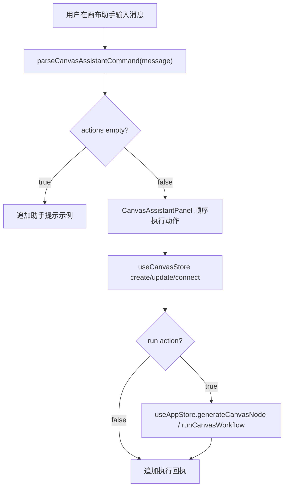

# Canvas Assistant Design

> 用户已授权本轮自主决策和实现，本 design 由 AI 自审通过后直接进入实现。

## 0. 术语约定

- **画布助手**：Canvas 右侧常驻对话面板，用用户消息驱动画布操作，并返回执行摘要。
- **助手指令**：用户在画布助手输入的一句话或多行动作描述。
- **调度动作**：助手从指令解析出的结构化动作，例如创建文本节点、创建生成节点、连接节点、修改提示词、运行生成。
- **助手调度器**：把助手指令解析为调度动作的纯函数模块，不读写 store、不调用网络。
- **执行回执**：UI 执行调度动作后追加到对话里的系统消息，说明完成了哪些操作或为什么失败。

## 1. 决策与约束

### 1.1 需求摘要

用户希望 Canvas 右侧出现类似“画布助手”的对话调度入口，可以用对话式命令生成节点、连接节点、修改提示词，并触发生成或 workflow 运行。它应服务当前 Canvas project，而不是回到 Workspace 参数栏。

成功标准：

- Canvas 右侧出现独立助手面板，不遮挡底部 dock，也不复用 Workspace 参数栏。
- 用户可以通过对话创建 text / generate / config / batch / result 节点。
- 用户可以通过对话创建最小生成链路：文本节点 + 生成节点 + prompt connection。
- 用户可以通过对话连接现有节点。
- 用户可以通过对话修改文本节点或生成节点提示词。
- 用户可以通过对话运行最新或指定生成节点，也可以运行 workflow。
- 每次执行都有对话回执和 toast，失败时说明原因。

明确不做：

- 不接入大模型 Agent，不调用 Provider/prompt API 自动理解复杂自然语言。
- 不新增视频、音频、3D、云同步、后台队列或并发调度。
- 不引入跨 project 调度，不操作非 active project。
- 不改变现有 Canvas 生成执行语义、workflow 预算和 history 写入链路。
- 不把助手对话持久化进 Canvas project；本轮只做当前页面会话内对话。

### 1.2 复杂度档位

- 结构 = pure dispatcher + Canvas 右侧 UI + store 原子动作。
- 可测试性 = tested，调度器单测覆盖解析，CanvasWorkspace 组件测试覆盖执行链路。
- 健壮性 = L2，解析失败可解释，执行非法连接或缺节点时不写盘。
- 其余维度走项目默认：性能 reasonable、可读性 team、可演进性 active。

### 1.3 关键决策

- **调度器放在 `src/services/canvas-assistant.ts`**。它只做文本解析和动作规划，便于后续替换为 LLM/bridge，也能纯单测覆盖。
- **Canvas store 增加返回节点的 add action**。现有 `addTextNode()` 等只返回 void，助手需要知道新节点 id 才能继续连接或运行，因此新增 `createNode()` 这类原子 action 返回 `CanvasNodeData | null`。
- **右侧 UI 挂在 `CanvasWorkspace` 内部**。CanvasShell 左侧已经是 project 导航，助手属于 active project 的操作层，放在 workspace 右侧更符合模式分离。
- **本轮采用规则解析而不是 AI API**。用户要求的是“画布助手可以对话式调度”，当前可先覆盖高频显式命令；复杂自由聊天返回可执行示例，不假装理解。

## 2. 名词与编排

### 2.1 名词层

#### 现状

- `useCanvasStore` 暴露 `addTextNode()`、`addGenerateNode()`、`addConnection()`、`updateNodeContent()` 等原子能力，但新增节点不返回 id。
- `CanvasWorkspace` 已持有 active project、node action 和 workflow run callback。
- `canvasConnectionKindForNodes()` 负责判断合法连接类型，非法连接在 store 层不写入。

#### 变化

新增调度动作类型：

```ts
type CanvasAssistantAction =
  | { type: 'create-node'; nodeType: CanvasNodeType; content?: string }
  | { type: 'create-chain'; prompt: string; run?: boolean }
  | { type: 'connect'; fromRef: CanvasAssistantNodeRef; toRef: CanvasAssistantNodeRef }
  | { type: 'set-prompt'; targetRef: CanvasAssistantNodeRef; content: string }
  | { type: 'run-node'; targetRef?: CanvasAssistantNodeRef }
  | { type: 'run-workflow' }
```

新增解析结果：

```ts
type CanvasAssistantPlan = {
  actions: CanvasAssistantAction[]
  summary: string
  hints: string[]
}
```

示例：

```ts
parseCanvasAssistantCommand('创建文本节点：赛博城市，然后生成并运行')
// => create-chain(prompt='赛博城市', run=true)
```

新增 store action：

```ts
createNode(input: { type: CanvasNodeType; content?: string; metadata?: Partial<CanvasNodeMetadata> }): Promise<CanvasNodeData | null>
```

### 2.2 编排层



#### 现状

- 用户必须通过底部 dock、节点动作条和手动连线完成 Canvas 编排。
- 文本一键生成只存在于文本节点动作条，不能通过右侧对话连续调度。
- 没有一个“执行回执”位置告诉用户本次动作完成了哪些节点操作。

#### 变化

- `CanvasWorkspace` 渲染右侧 `CanvasAssistantPanel`。
- `CanvasAssistantPanel` 管理临时 messages 和输入框，提交时调用调度器。
- 执行动作顺序：
  - `create-node`：调用 `createNode()`，记录新建节点 id。
  - `create-chain`：创建 text node 和 generate node，建立 prompt connection；`run` 为 true 时调用 `generateCanvasNode(generateId)`。
  - `connect`：按节点引用解析现有节点，调用 `addConnection(fromId, toId)`。
  - `set-prompt`：按节点引用解析 text/generate node，调用 `updateNodeContent(nodeId, content)`。
  - `run-node`：按引用或最新 generate node 调用 `generateCanvasNode()`。
  - `run-workflow`：调用 `runCanvasWorkflow()`。
- 执行失败不抛到 React 外层，转成助手回执和 toast。

#### 流程级约束

- 助手只操作 active project snapshot。
- 节点引用解析支持 `最新`、`第 N 个`、`文本`、`生成`、`结果` 等轻量规则；复杂模糊输入返回提示，不做错误写盘。
- 连接合法性仍由 Canvas store 和 `canvasConnectionKindForNodes()` 兜底。
- 运行生成仍复用现有 `generateCanvasNode()`，不绕过 history / Provider 链路。
- 面板不包含视频/音频入口或文案。

### 2.3 挂载点清单

- `src/services/canvas-assistant.ts`：助手指令解析和动作类型。
- `src/store/canvas-store.ts`：新增可返回节点的 `createNode()` 原子 action。
- `src/components/canvas/CanvasAssistantPanel.tsx`：右侧对话 UI 和动作执行编排。
- `src/components/canvas/CanvasWorkspace.tsx`：挂载助手面板并传入 store/app-store callbacks。
- 测试文件：调度器 service test、canvas-store test、CanvasWorkspace 组件测试。
- 架构文档：Canvas 子系统补充画布助手调度能力。

### 2.4 推进策略

1. 调度契约：实现纯调度器和单测。
   - 退出信号：常见创建、链路、连接、修改、运行命令可解析；未知命令返回 hints。
2. Store 原子能力：新增 `createNode()` 并复用已有创建逻辑。
   - 退出信号：store test 能拿到新增节点 id，非法类型不写盘。
3. UI 和执行编排：新增右侧助手面板并接入 CanvasWorkspace。
   - 退出信号：组件测试能通过助手创建文本+生成链路、修改提示词、运行生成。
4. 验证与落档：跑 typecheck、定向 vitest、全量 vitest，更新架构和验收报告。
   - 退出信号：测试通过，验收报告覆盖关键场景。

### 2.5 结构健康度与微重构

- 文件级 — `CanvasWorkspace.tsx` 已经偏大，直接塞助手 UI 会继续膨胀；本次新增独立 `CanvasAssistantPanel.tsx`，`CanvasWorkspace` 只负责挂载和传参。
- 文件级 — `canvas-store.ts` 已较大，但新增 `createNode()` 是对已有 add action 的小范围复用，暂不拆 store。
- 目录级 — `src/components/canvas/` 已承载 Canvas 专属组件，新增助手组件符合目录职责。
- service 目录已有 `canvas-workflow.ts` / `canvas-projects.ts`，新增 `canvas-assistant.ts` 作为纯解析服务符合当前 pattern。
- compound convention 检索：未发现与 Canvas assistant 命名或目录归属冲突的长期约束。

结论：做“新文件隔离”而不做行为保持型微重构；不拆 `CanvasWorkspace` 或 `canvas-store` 的既有内容。

## 3. 验收契约

### 3.1 关键场景清单

- 右侧助手面板在 active Canvas project 中可见，显示输入框、发送按钮和示例命令。
- 输入“创建文本节点：X”会新增 text node，内容为 X，并追加助手回执。
- 输入“创建文本节点：X，然后生成”会新增 text node、generate node，并建立 prompt connection。
- 输入“创建文本节点：X，然后生成并运行”会完成链路并调用 `generateCanvasNode()`。
- 输入“修改最新文本为：Y”会更新最新 text node 内容。
- 输入“连接第1个文本到第1个生成”会建立合法 prompt connection。
- 输入“运行最新生成”会调用当前最新 generate node 的生成函数。
- 输入“运行工作流”会调用 `runCanvasWorkflow()`。
- 未识别命令不会写入 Canvas project，会返回可执行示例。

### 3.2 明确不做的反向核对项

- 不出现视频/音频入口或调度动作。
- 不调用 Provider / prompt API / 外部 AI。
- 不把助手对话持久化进 Canvas project JSON。
- 不改变现有 Canvas workflow 预算和生成执行链路。

## 4. 与项目级架构文档的关系

验收通过后更新：

- `.codestable/architecture/ARCHITECTURE.md`
  - Canvas 模式能力描述补充画布助手。
  - Canvas 子系统索引补充 `canvas-assistant.ts` 和 `CanvasAssistantPanel.tsx`。
- `.codestable/architecture/ui-shadcn-workbench.md`
  - CanvasWorkspace 当前结构补充右侧助手面板。
