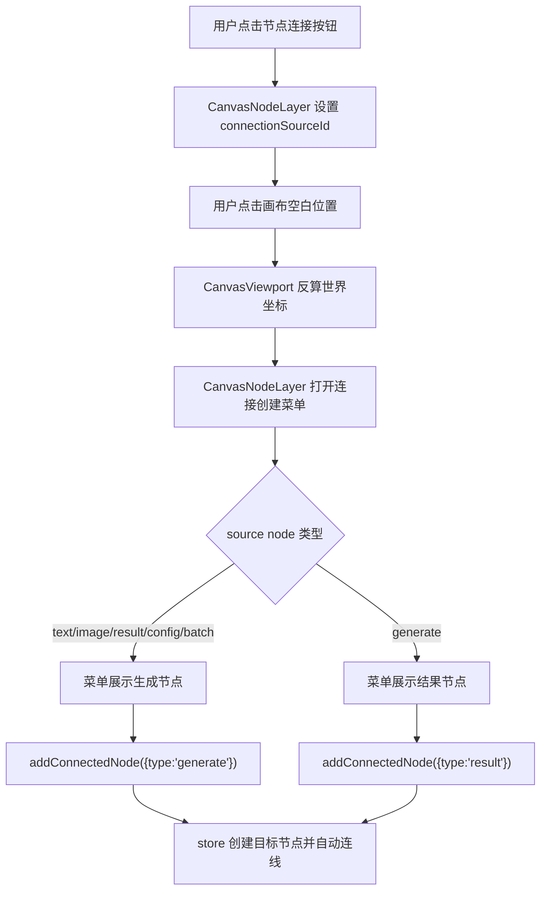

# Canvas Connection Create Menu Design

> 用户已授权本轮自主决策和实现，本 design 由 AI 自审通过后直接进入实现。

## 0. 术语约定

- **连接创建菜单**：用户从某个节点开始连线后点击画布空白位置出现的小菜单，用于创建一个合法下游节点并自动建立 connection。
- **source node**：已经开始连线的起点节点，即当前 `connectionSourceId`。
- **connected node**：由连接创建菜单创建的新目标节点。
- **合法下游类型**：由 `canvasConnectionKindForNodes(source, target)` 能推导出 connection kind 的目标类型。
- **世界坐标**：Canvas project 内节点持久化使用的坐标，等于屏幕坐标按当前 viewport 反算后的坐标。

## 1. 决策与约束

### 1.1 需求摘要

当前 Canvas 只能从一个节点连接到已有节点。用户如果想“从这个提示词继续生成”，需要先手动添加目标节点、再拖动或平移定位、再连接。参考无限画布的交互模型后，本 feature 需要支持从节点连接到空白位置时弹出创建菜单，选择目标节点后立即创建并自动连线。

成功标准：

- 从 text / image / result / config / batch 节点开始连接后，点击空白处可创建 generate node 并自动连接。
- 从 generate 节点开始连接后，点击空白处可创建 result node 并自动连接。
- 菜单位置贴近点击位置，新节点落在对应世界坐标附近。
- 菜单只展示当前 source node 的合法下游类型。
- 连接类型继续由 `canvasConnectionKindForNodes()` 决定，防重复和防环规则不变。

明确不做：

- 不新增视频、音频节点或入口。
- 不迁入参考项目的 Ant Design / Next.js / localforage / 后端逻辑。
- 不支持创建空 image node；图片节点仍通过本地图片、历史图、图库图等资产入口加入。
- 不改变 Provider、ImageService、history、reference 或 Tauri API。
- 不实现拖拽连线预览、多端口系统、多选批量连接或右键菜单系统。

### 1.2 复杂度档位

- 结构 = components + store-action（Canvas 交互菜单加一个原子 store action）。
- 可测试性 = tested（store 测试覆盖合法/非法创建，组件测试覆盖菜单打开和选择）。
- 其余维度走项目默认：健壮性 L2、性能 reasonable、可读性 team、可演进性 active、可观测性 logged。

### 1.3 关键决策

- **菜单状态放在 CanvasNodeLayer 局部**。`connectionSourceId` 已在 `CanvasNodeLayer` 内，菜单是同一段连接编排的延伸，先不把连接状态提升到 Workspace。
- **空白点击由 CanvasViewport 回调给 NodeLayer**。Viewport 负责背景 pointer 事件和屏幕坐标，NodeLayer 负责判断当前是否处于连接模式并打开菜单；这样不需要在 transformed layer 上铺一个易错的透明命中层。
- **目标节点创建放在 store 原子 action**。`addConnectedNode()` 在一次 project mutation 内创建目标节点并建立 connection；非法类型、非法连接或潜在环路都不写盘。
- **只暴露图像生图链路的下游节点**。source 为 text/image/result/config/batch 时只提供 generate；source 为 generate 时只提供 result。

## 2. 名词与编排

### 2.1 名词层

#### 现状

- `CanvasNodeLayer` 保存 `connectionSourceId`，通过 `startConnection(node)` 在源节点和目标节点之间切换连接状态；连接到已有节点时调用 `onConnectionAdd(fromNodeId, toNodeId)`。
- `CanvasViewport` 负责画布背景 pointer down / move / up，并在背景点击时默认开始平移视口。
- `useCanvasStore.addConnection()` 已使用 `canvasConnectionKindForNodes()`、重复 connection 检查和 `wouldCreateCanvasConnectionCycle()` 保护连接持久化。
- `useCanvasStore` 已有独立 `addTextNode()` / `addGenerateNode()` / `addConfigNode()` / `addBatchNode()` / `addResultNode()`，但没有“创建节点并连接”的单次 action。

#### 变化

新增 store 输入：

```ts
type CanvasConnectedNodeInput = {
  sourceNodeId: string
  type: CanvasNodeType
  position: CanvasPoint
}
```

新增 store action：

```ts
type CanvasStoreState = {
  addConnectedNode(input: CanvasConnectedNodeInput): Promise<CanvasNodeData | null>
}
```

示例：

```ts
await addConnectedNode({
  sourceNodeId: 'text-1',
  type: 'generate',
  position: { x: 520, y: 120 }
})
// => 创建 generate node，并建立 text-1 -> generate 的 prompt connection
```

`CanvasViewport` 新增连接空白点击回调：

```ts
type CanvasViewportProps = {
  onConnectionCreate?: (input: CanvasConnectedNodeInput) => CanvasNodeData | null | Promise<CanvasNodeData | null>
}
```

`CanvasNodeLayer` 内新增菜单状态：

```ts
type PendingConnectionCreateMenu = {
  sourceNodeId: string
  position: CanvasPoint
}
```

### 2.2 编排层



#### 现状

- 背景 pointer down 始终进入 pan 逻辑；连接状态下点击空白没有语义。
- 连接规则由 service 层纯函数表达，但 UI 只能通过已有节点触发。
- 用户要创建中间节点时会打断当前连接流程。

#### 变化

- `CanvasViewport` 在背景 pointer down 时先把点击屏幕坐标转换成世界坐标，并调用 NodeLayer 暴露的空白点击处理；如果 NodeLayer 接管了连接创建，则不启动 pan。
- `CanvasNodeLayer` 在连接状态下打开 `ConnectionCreateMenu`，菜单挂在已缩放的节点层内，并用反向 `scale(1 / viewport.k)` 保持菜单文字和按钮不随画布缩放变形。
- 菜单项由 source node 类型动态推导：
  - `text` → `generate`，连接 kind 为 `prompt`
  - `image` / `result` → `generate`，连接 kind 为 `reference-image`
  - `config` → `generate`，连接 kind 为 `config`
  - `batch` → `generate`，连接 kind 为 `batch`
  - `generate` → `result`，连接 kind 为 `result`
- 选择菜单项后调用 `addConnectedNode()`，成功或失败都关闭菜单并清空连接源；成功时选中新节点。

#### 流程级约束

- 菜单点击必须阻止背景 pan；菜单元素带 `data-canvas-connection-create-menu="true"`。
- `addConnectedNode()` 必须复用 `canvasConnectionKindForNodes()` 判断连接类型，不能手写平行规则作为最终事实源。
- `addConnectedNode()` 对非法 source、非法目标类型、重复 connection、cycle 和无 active project 均返回 `null` 且不写盘。
- 新节点位置必须 normalize 为整数世界坐标；不受当前缩放持久化影响。
- 禁止新增 `video` / `audio` 字符串、按钮或 node type。

### 2.3 挂载点清单

- `src/components/canvas/CanvasViewport.tsx`：背景点击优先交给连接创建处理，并把世界坐标传入 NodeLayer。
- `src/components/canvas/CanvasNodeLayer.tsx`：连接创建菜单、合法下游菜单项、选择菜单项后的回调编排。
- `src/components/canvas/CanvasWorkspace.tsx`：把 `useCanvasStore.addConnectedNode()` 透传到 Viewport。
- `src/store/canvas-store.ts`：新增 `addConnectedNode()` 原子创建并连接 action。
- `src/components/canvas/CanvasViewport.test.tsx` / `src/components/canvas/CanvasWorkspace.test.tsx` / `src/store/canvas-store.test.ts`：连接菜单和 store action 证据。
- `.codestable/roadmap/canvas-image-workbench-upgrade/*`：acceptance 回写状态。

### 2.4 推进策略

1. 编排骨架：在 Viewport/NodeLayer 加入空白点击接管和连接创建菜单状态。
   - 退出信号：连接状态下点击空白出现菜单，非连接状态下背景平移仍可用。
2. 目标类型和菜单 UI：根据 source node 类型展示合法菜单项，并阻止菜单点击触发 pan。
   - 退出信号：text/image/result/config/batch 只展示生成节点，generate 只展示结果节点，无视频/音频文案。
3. Store 原子 action：新增 `addConnectedNode()`，创建目标节点、判定 connection kind、防重复/防环并持久化。
   - 退出信号：store 测试覆盖 text->generate、generate->result、非法目标不写盘。
4. Workspace 接线与测试：接入 `addConnectedNode()`，补组件和集成测试。
   - 退出信号：通过 UI 能从 text 节点连接到空白并创建 generate 节点及 prompt connection。
5. 验证与 review：跑 typecheck、定向 vitest、浏览器 smoke 和代码 review。
   - 退出信号：测试通过，浏览器中菜单创建链路可用，页面仍无视频/音频入口。

### 2.5 结构健康度与微重构

- 文件级 — `CanvasNodeLayer.tsx` 已偏胖，本 feature 会继续增加菜单 UI。但连接状态和节点选择都在该文件内，菜单作为私有组件先落同文件，避免拆分时扩大 props 和行为变更。
- 文件级 — `CanvasViewport.tsx` 负责背景 pointer 事件，本 feature 只新增一个“连接模式优先接管”的早期分支，职责仍属于视口交互。
- 文件级 — `canvas-store.ts` 已承担 Canvas mutation；`addConnectedNode()` 需要和现有节点创建 helpers、`persistActiveProject()` 共用，放在同文件合理。
- 目录级 — `src/components/canvas/` 是 Canvas 专属组件目录，当前不需要重组。
- compound convention 检索：未发现与 Canvas 连接菜单命名、目录归属冲突的长期约束。

结论：本次不做独立微重构。`CanvasNodeLayer.tsx` 后续如果继续增加 inspector、右键菜单或多选系统，应另起 refactor 拆分为 `CanvasNodeCard`、`CanvasConnectionCreateMenu` 和 `CanvasConnectionLayer`，但当前 feature 不把这件事作为前置。

## 3. 验收契约

### 3.1 关键场景清单

- 点击 text node 的连接入口后，再点击画布空白处，会出现连接创建菜单。
- 在 text source 的菜单中选择“生成节点”，会创建 generate node 并建立 `prompt` connection。
- image / result / config / batch source 的菜单只提供生成节点，并分别建立 `reference-image` / `config` / `batch` connection。
- generate source 的菜单只提供结果节点，并建立 `result` connection。
- 菜单点击不触发背景平移或 viewport commit。
- 非连接状态点击空白仍可平移视口。
- 非法 source、非法目标、重复连接或潜在环路不写盘。
- 新节点坐标接近用户点击位置，且随 viewport 缩放正确反算为世界坐标。

### 3.2 明确不做的反向核对项

- 不出现“视频”“音频”或相关 icon。
- 不新增 Canvas node type。
- 不创建空 image node。
- 不修改 Provider、ImageService、history、reference 或 Tauri API。
- 不复制参考项目源码。

## 4. 与项目级架构文档的关系

验收通过后需要更新：

- `.codestable/architecture/ui-shadcn-workbench.md`
  - CanvasNodeLayer/CanvasViewport 描述补充连接到空白处创建合法下游节点。
  - Canvas store action 列表补充 `addConnectedNode()`。
- `.codestable/architecture/ARCHITECTURE.md`
  - Canvas 子系统索引补充 connection-authoring 当前能力。
