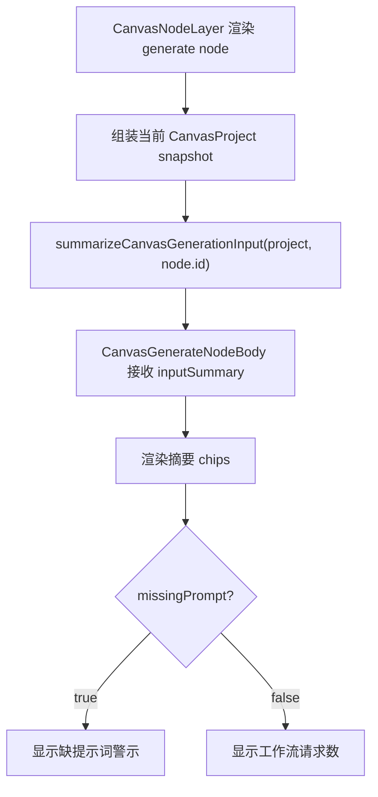

# Canvas Generation Context Panel Design

> 用户已授权本轮自主决策和实现，本 design 由 AI 自审通过后直接进入实现。

## 0. 术语约定

- **生成上下文摘要**：生成节点上显示的一组只读指标，用来说明当前节点运行前会接收到哪些上游输入。
- **本地提示词**：generate node 自身 `metadata.content` 中的提示词。
- **上游提示词**：通过 `prompt` connection 连到 generate node 的 text node 内容。
- **参考图输入**：通过 `reference-image` connection 连到 generate node 的 image / result node。
- **参数覆盖**：通过 `config` connection 连到 generate node 的 config node，可能覆盖 ratio / quality / n。
- **批量变体**：通过 `batch` connection 连到 generate node 的 batch node 非空行。

## 1. 决策与约束

### 1.1 需求摘要

当前生成节点虽然已经能读取上游 text / image / result / config / batch，但运行前 UI 只显示本节点 textarea 和状态。用户在无限画布里连续创作时，看不到“这次到底会用几个提示词、几张参考图、几个参数覆盖、多少批量请求”，需要靠自己检查连线，体验不够专业。

成功标准：

- generate node 在运行前展示上游输入摘要：提示词、参考图、参数、批量变体、请求数。
- 缺少有效提示词时显示明确警示，规则和 workflow 计划的 missing prompt 保持一致。
- 摘要只读，不触发生成，不写 store。
- 单节点运行和 workflow run 的生成语义不变。

明确不做：

- 不修改 Provider、ImageService、history、reference、Tauri API 或生成执行语义。
- 不把参考图内容、history 内容或 Provider 配置读进 summary。
- 不新增视频、音频、账号、后端或参考项目 UI 体系。
- 不实现节点 inspector、右侧参数面板、复杂 DAG 调度、并发队列或后台批量。
- 不把 `CanvasNodeLayer` 做大拆分；结构债记录在设计里，后续单独 refactor。

### 1.2 复杂度档位

- 结构 = service pure function + node body presentation。
- 可测试性 = tested，service 单测覆盖摘要规则，组件测试覆盖 UI 展示和缺 prompt。
- 健壮性 = L2，summary 对无效节点、断连、空文本、过大 n 做保守结果。
- 其余维度走项目默认：性能 reasonable、可读性 team、可演进性 active。

### 1.3 关键决策

- **摘要计算放在 `canvas-workflow.ts`**。它和 `buildCanvasGenerationPlanForNode()` 共享同一类输入解析职责，但只返回展示信息，不调用 app store。
- **UI 摘要作为 `CanvasGenerateNodeBody` props**。节点 body 只渲染摘要，不读取全量 project，避免 UI 组件重新实现连接解析。
- **`CanvasNodeLayer` 负责桥接 project snapshot**。它已拥有 nodes/connections，可以组装临时 `CanvasProject` 传给纯函数；不把 summary 写入 Canvas store。
- **请求数展示 workflow 全量潜在请求数**。单节点按钮仍只执行第一条 batch 变体；summary 显示“工作流请求”，让用户在点全局运行前能看到批量规模。

## 2. 名词与编排

### 2.1 名词层

#### 现状

- `buildCanvasGenerationPlanForNode(project, nodeId, batchMode)` 会合并本地提示词、上游 text prompt、config patch 和 batch 变体，返回实际生成计划。
- `buildCanvasWorkflowPlan(project)` 会遍历 generate node，过滤 running 节点和缺 prompt 节点，并用 batch 全量计算 workflow 请求数。
- `CanvasGenerateNodeBody` 当前只接收 node、partial preview 和 run callback。
- `CanvasNodeLayer` 已持有当前 nodes/connections，并在渲染 generate node 时把 preview 传入 `CanvasGenerateNodeBody`。

#### 变化

新增只读摘要类型：

```ts
type CanvasGenerationInputSummary = {
  promptTextCount: number
  localPromptPresent: boolean
  referenceImageCount: number
  configCount: number
  batchVariantCount: number
  requestCount: number
  missingPrompt: boolean
  hasConfig: boolean
  config: CanvasGenerationConfigPatch
}
```

新增纯函数：

```ts
function summarizeCanvasGenerationInput(
  project: CanvasProject,
  nodeId: string
): CanvasGenerationInputSummary
```

示例：

```ts
summarizeCanvasGenerationInput(project, 'generate-1')
// => {
//   promptTextCount: 2,
//   localPromptPresent: true,
//   referenceImageCount: 1,
//   configCount: 1,
//   batchVariantCount: 3,
//   requestCount: 3,
//   missingPrompt: false,
//   hasConfig: true,
//   config: { ratio: '16:9', quality: 'high', n: 4 }
// }
```

### 2.2 编排层



#### 现状

- 生成执行时才知道上下文解析结果，UI 运行前不可见。
- `CanvasGenerateNodeBody` 没有上游连接信息，无法判断缺 prompt 是“本地空”还是“整体缺输入”。
- 参考图连接已经进入生成桥，但 UI 不显示数量。

#### 变化

- `summarizeCanvasGenerationInput()` 复用 prompt / batch / config 的解析规则：
  - `promptTextCount` 统计 incoming `prompt` text node 中非空内容数量。
  - `localPromptPresent` 表示 generate node 本地提示词非空。
  - `referenceImageCount` 统计 incoming `reference-image` image/result node 中有内容或来源绑定的数量。
  - `configCount` 统计 incoming `config` config node 数量。
  - `batchVariantCount` 统计 incoming `batch` batch node 非空行总数。
  - `requestCount` 使用 batch 全量计划：有非空 batch 变体时等于变体数，否则为 1；缺 prompt 时仍显示潜在请求数。
  - `missingPrompt` 使用全量计划过滤后的 prompt 结果，和 `buildCanvasWorkflowPlan()` 对缺 prompt 的判断一致。
- `CanvasGenerateNodeBody` 在 header 和 textarea 之间显示紧凑 chips；缺 prompt 时展示 warning 文案。
- 摘要渲染不改变 textarea、preview、状态 badge 或运行按钮的行为。

#### 流程级约束

- summary 是纯函数：不读 Provider/history/reference，不写 store，不发网络请求。
- summary 只接受 `CanvasProject + nodeId`，对不存在或非 generate 节点返回空摘要。
- config patch 仍按当前规则 clamp `n` 到 1-4。
- batch 请求数只做可见化，不绕过现有 `MAX_CANVAS_WORKFLOW_REQUESTS` 预算。
- 禁止新增视频/音频文案、类型或入口。

### 2.3 挂载点清单

- `src/services/canvas-workflow.ts`：新增摘要类型和纯函数。
- `src/components/canvas/CanvasGenerateNodeBody.tsx`：新增只读摘要展示。
- `src/components/canvas/CanvasNodeLayer.tsx`：基于当前 nodes/connections 计算每个 generate node 的 summary 并传入 body。
- `src/services/canvas-workflow.test.ts` / `src/components/canvas/CanvasViewport.test.tsx` / `src/components/canvas/CanvasWorkspace.test.tsx`：摘要规则和 UI 证据。
- `.codestable/roadmap/canvas-image-workbench-upgrade/*`：验收后回写状态。

### 2.4 推进策略

1. 计算契约：在 workflow service 增加 `CanvasGenerationInputSummary` 和纯函数。
   - 退出信号：service test 能证明 prompt、reference、config、batch、missingPrompt、requestCount 规则。
2. UI 表达：让生成节点 body 展示摘要 chips 和缺 prompt 警示。
   - 退出信号：组件测试能在 generate node 内看到提示词/参考图/参数/批量/请求数。
3. 渲染接线：由 NodeLayer 基于当前 nodes/connections 传入 summary。
   - 退出信号：CanvasViewport 测试覆盖真实节点连线后的摘要展示。
4. 验证与 review：跑 typecheck、定向 vitest、浏览器 smoke 和代码 review。
   - 退出信号：测试通过，浏览器中生成节点能显示摘要，页面仍无视频/音频入口。

### 2.5 结构健康度与微重构

- 文件级 — `canvas-workflow.ts` 当前较小，新增纯函数属于同一计划解析职责，适合放在这里。
- 文件级 — `CanvasGenerateNodeBody.tsx` 当前职责单一，增加展示 props 不改变数据归属。
- 文件级 — `CanvasNodeLayer.tsx` 已偏胖，但本次只增加一次 summary 计算和 props 透传；若此时拆分会扩大行为风险。
- 目录级 — `src/components/canvas/` 与 `src/services/` 已有 Canvas 专属组件和 workflow service，无需重组目录。
- compound convention 检索：未发现与 Canvas workflow helper 或目录归属冲突的长期约束。

结论：本次不做独立微重构。`CanvasNodeLayer.tsx` 的拆分建议继续作为后续 refactor 观察项，不阻塞这项 feature。

## 3. 验收契约

### 3.1 关键场景清单

- generate node 没有本地或上游 prompt 时，显示缺提示词警示。
- generate node 有本地 prompt 时，显示本节点提示词已计入。
- generate node 有多个上游 text prompt 时，摘要显示对应提示词数量。
- image/result 通过 `reference-image` 连到 generate 时，摘要显示参考图数量。
- config 连到 generate 时，摘要显示参数数量并保留 ratio / quality / n patch。
- batch 连到 generate 时，摘要显示非空变体数量和工作流请求数。
- 单节点运行按钮行为不变，仍调用 `onGenerateNodeRun(nodeId)`。
- workflow run 预算和缺 prompt 过滤逻辑不变。

### 3.2 明确不做的反向核对项

- 不出现“视频”“音频”或相关入口。
- 不修改 Provider、ImageService、history、reference 或 Tauri API。
- 不把 summary 写入 Canvas project。
- 不改变 batch 单节点运行只取第一条变体的现有语义。

## 4. 与项目级架构文档的关系

验收通过后需要更新：

- `.codestable/architecture/ui-shadcn-workbench.md`
  - Canvas generate node 描述补充输入摘要。
  - Canvas workflow service 描述补充只读 summary 纯函数。
- `.codestable/architecture/ARCHITECTURE.md`
  - Canvas 子系统索引补充 generation-context 当前能力。
