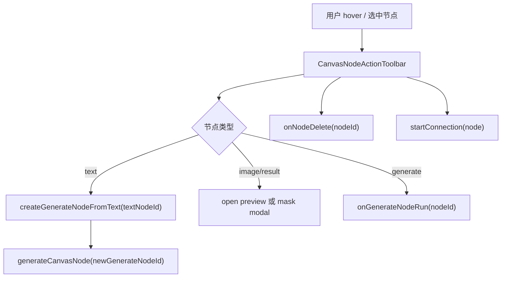

# Canvas Node Action Toolbar Design

> 用户已授权本轮自主决策和实现，本 design 由 AI 自审通过后直接进入实现。

## 0. 术语约定

- **CanvasNodeActionToolbar**：节点被选中或 hover 时出现的浮动动作条，承载当前节点的高频动作，减少节点 header 的按钮拥挤。
- **文本一键生成**：在 text node 上直接创建下游 generate node、建立 prompt connection，并调用现有 `generateCanvasNode()` 运行该 generate node。
- **图片动作**：image / result node 上的预览大图和 mask 编辑入口，复用现有 `CanvasImagePreviewModal` 与 `CanvasMaskEditorModal`。
- **生成动作**：generate node 上的运行 / 重试入口，复用现有 `onGenerateNodeRun` 和生成状态。
- **统一删除入口**：删除节点入口集中到 CanvasNodeActionToolbar；删除语义仍是既有 `deleteNode()`，会同步删除相关 connections。

## 1. 决策与约束

### 1.1 需求摘要

当前节点操作分散在 header 和节点 body：删除按钮挤在每个 header 右侧，图片预览 / mask 只在图片内部角落，文本节点只能先手动添加 generate 节点再连线运行，生成节点运行按钮也只在 body 里。参考无限画布体验后，本 feature 需要让用户在节点旁边直接继续创作。

成功标准：

- 选中或 hover 节点时显示浮动动作条。
- 文本节点可一键创建下游生成节点并开始生成。
- 图片 / 结果节点可从动作条预览大图和进入 mask 编辑。
- 生成节点可从动作条运行；失败或已完成后同一入口表达为重试。
- 删除节点入口统一到动作条，仍调用既有 store 删除逻辑。
- 连接入口仍可达，当前连接规则和 cycle 防护不变。

明确不做：

- 不新增视频、音频节点或按钮。
- 不改变 `ImageService`、Provider、history、reference、Tauri API 或数据库结构。
- 不实现“拖一条线到空白处创建节点”；这是后续 `canvas-connection-create-menu`。
- 不新增复杂右键菜单、快捷键系统或多选批量操作。
- 不改变 Canvas node type union。

### 1.2 复杂度档位

- 结构 = components + store-action（UI 动作条加一个最小 Canvas store 编排 action）。
- 可测试性 = tested（组件测试覆盖动作条、文本一键生成、预览/mask/运行/删除入口）。
- 其余维度走项目默认：健壮性 L2、性能 reasonable、可读性 team、可演进性 active、可观测性 logged。

### 1.3 关键决策

- **动作条只编排既有能力**。预览 / mask / 运行 / 删除继续走现有回调和 store action。
- **文本一键生成的原子性放在 Canvas store**。创建 generate node + prompt connection 需要同一次 project 持久化，新增 `createGenerateNodeFromText()` 返回新 generate node id，再由 Workspace 调用 `generateCanvasNode()`。
- **不把连接菜单提前做进来**。本 feature 只保留从节点开始连接 / 连接到目标节点的现有按钮语义，不做空白位置建节点。
- **旧 body 操作保留**。图片 body 的点击预览 / mask 按钮、生成 body 的运行按钮和文本 body 的放大/丰富入口保留，动作条只是更高可见度的快捷入口。

## 2. 名词与编排

### 2.1 名词层

#### 现状

- `CanvasNodeLayer` 保存局部 `selectedItem`、`connectionSourceId`、预览 modal、mask modal 和文本扩展编辑器；节点 header 里直接渲染连接按钮与删除按钮。
- `CanvasViewport` 向 `CanvasNodeLayer` 透传 `onTextNodeEnrich`、`onGenerateNodeRun`、`onNodeDelete`、`onConnectionAdd` 等回调。
- `CanvasWorkspace` 从 `useCanvasStore` 读取节点/连线 action，并从 `useAppStore` 读取 `generateCanvasNode()`。
- `useCanvasStore` 有 `addGenerateNode()` 和 `addConnection()`，但没有“基于某个 text node 创建并连接 generate node”的单次持久化 action。

#### 变化

新增动作条私有 props：

```tsx
type CanvasNodeActionToolbarProps = {
  node: CanvasNodeData
  connecting: boolean
  sourceLabel: string | null
  canPreview: boolean
  canMaskEdit: boolean
  canRun: boolean
  canGenerateFromText: boolean
  onStartConnection(): void
  onPreview(): void
  onMaskEdit(): void
  onRunGenerate(): void
  onGenerateFromText(): void
  onDelete(): void
}
```

新增 store action：

```ts
type CanvasStoreState = {
  createGenerateNodeFromText(textNodeId: string): Promise<string | null>
}
```

示例：

```ts
await createGenerateNodeFromText('text-1')
// => 创建空 generate node，建立 text-1 -> generate prompt connection，
//    返回 generate node id；prompt 事实源仍保留在 text node，避免重复拼接
```

`CanvasViewport` 增加可选回调：

```tsx
type CanvasViewportProps = {
  onTextNodeGenerate?: (nodeId: string) => void | Promise<void>
}
```

### 2.2 编排层



#### 现状

- 节点操作按钮与标题、拖拽区域混在 header 中，长标题或小节点时拥挤。
- 文本到生成的主链路需要用户手动加生成节点、连线，再运行。
- 图片 / 结果节点的 mask / preview 能力存在，但没有统一节点级动作入口。

#### 变化

- 每个节点外层改为可承载浮动 toolbar 的 wrapper；节点卡片本身仍保持 `overflow-hidden`。
- toolbar 在 hover 或 selected 时出现，按钮按 node type 精简展示。
- 文本一键生成调用 `createGenerateNodeFromText()`，成功返回 generate node id 后调用 `generateCanvasNode()`；新 generate node 的本地 prompt 为空，由 prompt connection 读取 text node 内容。
- 图片 / 结果 toolbar 通过现有图片显示解析 helper 打开预览或 mask modal；没有可展示源时按钮禁用或不显示。
- 生成 toolbar 根据 status 显示“运行”或“重试”，running 时禁用。
- 删除按钮从 header 移到 toolbar；store 删除语义不变。

#### 流程级约束

- Toolbar 不持久化 UI 状态，选中 / hover 仍是组件局部状态。
- `createGenerateNodeFromText()` 必须只接受 text node；空 prompt 不创建节点；prompt 内容不得同时复制到 generate node，避免 workflow 重复拼接。
- 生成运行仍由 `generateCanvasNode()` 调用现有 ImageService/history 链路。
- 删除节点仍由 `deleteNode()` 同步删除相关 connections。
- 禁止新增 `video` / `audio` 字符串、节点类型或入口。

### 2.3 挂载点清单

- `src/components/canvas/CanvasNodeLayer.tsx`：节点 wrapper、toolbar、preview/mask/run/delete/connection 动作编排。
- `src/components/canvas/CanvasViewport.tsx`：透传 `onTextNodeGenerate`。
- `src/components/canvas/CanvasWorkspace.tsx`：把 `createGenerateNodeFromText()` 和 `generateCanvasNode()` 接成文本一键生成。
- `src/store/canvas-store.ts`：新增 `createGenerateNodeFromText()` 原子 action。
- `src/components/canvas/CanvasViewport.test.tsx` / `src/store/canvas-store.test.ts`：动作条和 store action 证据。
- `.codestable/roadmap/canvas-image-workbench-upgrade/*`：acceptance 回写状态。

### 2.4 推进策略

1. 动作条界面骨架：把节点容器改为外层 wrapper + 内层 card，新增 hover/selected toolbar 和统一删除入口。
   - 退出信号：节点选择、拖动、连接、删除测试仍可通过，toolbar 在选中节点时可见。
2. 文本一键生成链路：新增 store action，Workspace/Viewport/NodeLayer 接线。
   - 退出信号：点击文本节点动作条“生成”会创建 generate node、连 prompt connection，并调用现有 `generateCanvasNode()`。
3. 图片/结果/生成动作：toolbar 接入预览、mask、运行/重试。
   - 退出信号：image/result 可从 toolbar 打开预览/mask，generate 可从 toolbar 运行。
4. 测试与浏览器 smoke：补 store/组件测试，跑 typecheck、定向 vitest 和本地浏览器验证。
   - 退出信号：测试通过，浏览器中 hover/选中节点时动作条可见且无视频/音频入口。

### 2.5 结构健康度与微重构

- 文件级 — `CanvasNodeLayer.tsx` 已经偏胖，承载节点渲染、拖动、连线、图片预览、mask、文本弹窗和连接删除。动作条继续放这里会增加体积，但当前 action 都依赖其局部状态，先作为私有组件落在同文件，避免中途抽组件造成更大 props 面。
- 文件级 — `canvas-store.ts` 已经承担 Canvas project 主要 mutation。本 feature 的 `createGenerateNodeFromText()` 需要一次持久化创建节点和连接，放在 store action 合理。
- 目录级 — `src/components/canvas/` 已有 Canvas 专属组件，暂无目录重组前置。
- compound convention 检索：本轮未发现与 Canvas action toolbar 命名 / 目录归属冲突的长期约束。

结论：本次不做独立微重构。后续如果继续增加节点级 inspector、菜单或快捷键，应把 Canvas node rendering 拆成 `CanvasNodeCard` / `CanvasNodeActionToolbar` 独立文件，但这超出当前 feature 的安全边界。

## 3. 验收契约

### 3.1 关键场景清单

- 选中或 hover text node 时显示动作条。
- text node 内容非空时，点击“生成”会创建 generate node、建立 prompt connection，并调用现有 `generateCanvasNode()`。
- text node 内容为空时，“生成”不可触发或不创建节点。
- 选中 image node 时，动作条可打开图片预览和 mask 编辑。
- 选中 result node 且已有图片时，动作条可打开结果预览和 mask 编辑。
- 选中 generate node 时，动作条可运行；failed / succeeded 状态显示重试语义，running 状态不可重复点击。
- 删除节点入口从动作条触发，仍会调用 `deleteNode()` 并清掉相关连线。
- 连接入口仍可从动作条或既有端口按钮触发，连接规则不变。

### 3.2 明确不做的反向核对项

- 不出现 `Video` / `Music` / `Audio` icon 或“视频”“音频”文案。
- 不新增 Canvas node type。
- 不修改 `ImageService`、Provider、history、reference、Tauri API 或数据库结构。
- 不实现连接到空白处创建节点。

## 4. 与项目级架构文档的关系

验收通过后需要更新：

- `.codestable/architecture/ui-shadcn-workbench.md`
  - CanvasNodeLayer 描述补充节点动作条、文本一键生成、图片/结果 preview/mask 和生成重试入口。
- `.codestable/architecture/ARCHITECTURE.md`
  - Canvas 子系统索引补充节点动作条现状；硬边界继续强调不引入视频/音频。
