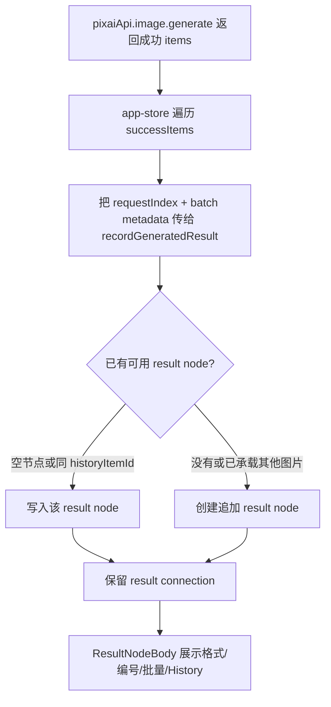

# Canvas Result Composition Design

> 用户已授权本轮自主决策和实现，本 design 由 AI 自审通过后直接进入实现。

## 0. 术语约定

- **结果组织**：生成成功后 Canvas 如何写入 result node、创建新 result node、连线并展示编号/批量信息。
- **显式 result node**：用户已从 generate node 连到的空 result node。
- **追加结果节点**：同一次生成或同一条 workflow 中，已有 result node 不能承载新图片时自动创建的 result node。
- **结果编号**：面向 UI 的短编号，优先来自 `requestIndex`，其次来自批量变体或当前组内顺序。
- **批量上下文**：由 batch node 产生的 `batchIndex` / `promptVariant`，只用于 Canvas 展示和追踪。

## 1. 决策与约束

### 1.1 需求摘要

当前 `recordGeneratedResult()` 遇到已连接的 result node 时，会把每个成功图片都写进同一个 result node。单次 `n > 1` 或 workflow/batch 返回多张成功图时，前一张会被后一张覆盖，Canvas 丢失结果，也无法继续把每张图作为参考图。

成功标准：

- 显式 result node 为空时，第一张成功图写入它。
- 后续成功图不覆盖已承载不同 `historyItemId` 的 result node，而是在 generate node 右侧追加 result node 并建立 `result` connection。
- 每个 result node 保留 `historyItemId`、`requestIndex`、`batchIndex`、`promptVariant` 等 Canvas metadata。
- result node UI 显示简短格式、请求编号、批量编号和 History 绑定信号。
- 生成执行、history 事实源、Provider、ImageService 不变。

明确不做：

- 不改 Provider、ImageService、history、reference、Tauri API 或生成请求协议。
- 不实现参考项目的复杂 batch group 折叠/展开、动画或媒体资源包。
- 不新增视频/音频节点、入口或文案。
- 不把 Canvas result metadata 变成新的图片事实源；最终结果仍以 `historyItemId` 指向 history。
- 不做多节点并发调度、后台队列、节点级取消 UI。

### 1.2 复杂度档位

- 结构 = Canvas store 编排增强 + result node 展示增强。
- 可测试性 = tested，store/app/UI 三层覆盖多结果不覆盖。
- 健壮性 = L2，非法图片 payload、重复 history item、旧项目导入保守处理。
- 其余维度走项目默认：性能 reasonable、可读性 team、可演进性 active。

### 1.3 关键决策

- **保持 `historyItemId` 为最终事实源**。Canvas 只保存展示和继续引用所需的轻量 metadata。
- **显式 result node 只在可安全承载时复用**。空节点或同一 `historyItemId` 可写入；已绑定其他结果时不覆盖。
- **追加结果节点继续使用 `result` connection**。多张图在图结构上都是 generate 的输出，便于继续拖线作为下游参考图。
- **批量上下文从 `CanvasGenerationPlanItem` 透传到 result metadata**。`batchIndex` 和 `promptVariant` 帮助用户知道结果来自哪一条变体，但不影响生成服务。

## 2. 名词与编排

### 2.1 名词层

#### 现状

- `CanvasNodeMetadata` 仅有 `runId/requestIndex/historyItemId/storagePath/mimeType/fileSizeBytes/naturalWidth/naturalHeight` 等结果字段。
- `CanvasImageNodeInput` 不带批量上下文。
- `CanvasProjectService.normalizeCanvasNodeMetadata()` 已保留 `requestIndex`，但不认识 `batchIndex` / `promptVariant`。
- `CanvasResultNodeBody` footer 只显示 mime type，缺少编号和批量语义。

#### 变化

扩展 Canvas 结果 metadata：

```ts
type CanvasNodeMetadata = {
  requestIndex?: number
  batchIndex?: number
  batchRootId?: string
  promptVariant?: string
}

type CanvasImageNodeInput = {
  historyItemId?: string
  requestIndex?: number
  batchIndex?: number
  batchRootId?: string
  promptVariant?: string
}
```

示例：

```ts
recordGeneratedResult('generate-1', {
  name: 'history-2.png',
  dataUrl: 'data:image/png;base64,...',
  mimeType: 'image/png',
  fileSizeBytes: 100,
  historyItemId: 'history-2',
  requestIndex: 1,
  batchIndex: 0,
  promptVariant: 'night mood'
})
```

结果：已有空 result node 承载第一张；第二张创建新的 result node，metadata 保留 `requestIndex: 1`，UI 显示 `PNG · #2 · 批量 1 · History`。

### 2.2 编排层



#### 现状

- `runCanvasGenerationPlanItem()` 对 `successItems` 循环调用 `recordGeneratedResult()`。
- `recordGeneratedResult()` 只要发现任何 connected result node，就把每个成功项都写入这些节点，导致覆盖。
- 没有显式 result node 时，`findResultNodeBinding()` 会按 `historyItemId` 去重，能保留多张自动 result node。

#### 变化

- app-store 传入：
  - `requestIndex: successItem.requestIndex ?? index`
  - `batchIndex: planItem.batchIndex`
  - `promptVariant: planItem.batchVariant`
  - `batchRootId: planItem.batchIndex != null ? planItem.nodeId : undefined`
- canvas-store 写入策略：
  - 查找 connected result nodes。
  - 优先选择空 result node，或已绑定同一 `historyItemId` 的 result node。
  - 若所有 connected result nodes 已绑定不同结果，则创建追加 result node。
  - 追加节点位置按现有 result connection 数量错开，避免重叠。
  - 每次写入同时把 generate node 状态更新为 succeeded，并保留最新 `historyItemId` / `requestIndex`。
- result body 展示：
  - header 仍显示状态和短标题。
  - footer 显示格式、请求编号、批量编号、History 标记。
  - tooltip/`title` 保留完整 promptVariant 或标题，避免长文本撑爆节点。

#### 流程级约束

- `historyItemId` 去重仍生效，重复记录同一个 history item 不创建第二个 result node。
- 未连接 result node 的自动创建路径不退化。
- 已有旧项目没有新 metadata 时照常渲染。
- normalize 导入保留成功 result node 的 `requestIndex/batchIndex/promptVariant`；running 导入仍降级 idle 并清除运行绑定。
- 禁止新增视频/音频文案、类型或入口。

### 2.3 挂载点清单

- `src/shared/types.ts`：扩展 Canvas result metadata 字段。
- `src/store/app-store.ts`：把 success item 的 request/batch 上下文传给 Canvas store。
- `src/store/canvas-store.ts`：改写 result node 选择、追加和 metadata 写入策略。
- `src/services/canvas-projects.ts`：normalize 新 metadata，导入 running 节点时清掉批量运行绑定。
- `src/components/canvas/CanvasResultNodeBody.tsx`：显示格式、请求、批量和 History。
- tests：store/app/viewport/project normalize 覆盖结果组织。

### 2.4 推进策略

1. 数据契约：扩展 Canvas metadata 和输入类型，更新 normalize。
   - 退出信号：project service test 能保留合法 metadata 并过滤无效值。
2. Store 编排：重写 `recordGeneratedResult()` 的 result node 选择与追加逻辑。
   - 退出信号：显式 result node 多图不会覆盖，重复 history item 不重复创建。
3. App 桥接：生成成功时透传 request/batch 上下文。
   - 退出信号：app-store 测试证明 `n > 1` 会形成多个 result node。
4. UI 表达：result node footer 显示编号、批量和 History。
   - 退出信号：CanvasViewport 测试能看到 `PNG/#/批量/History`。
5. 验证与 review：跑 typecheck、定向 vitest、浏览器 smoke 和代码 review。
   - 退出信号：测试通过，浏览器中 result node 多结果展示正常，页面仍无视频/音频入口。

### 2.5 结构健康度与微重构

- 文件级 — `canvas-store.ts` 已包含节点/连线编排，本次修改属于 `recordGeneratedResult()` 同一职责，先不拆文件。
- 文件级 — `app-store.ts` 偏胖，但本次只在已存在 Canvas 生成桥透传 metadata；拆分 Canvas action 应作为后续 refactor，不阻塞。
- 文件级 — `CanvasResultNodeBody.tsx` 职责单一，适合直接增加 footer 展示。
- 目录级 — `src/components/canvas/`、`src/store/`、`src/services/` 已有清晰归属，无需重组目录。
- compound convention 检索：未发现与 Canvas result metadata 或目录归属冲突的长期约束。

结论：本次不做独立微重构。`app-store.ts` 的 Canvas 生成桥拆分继续保留为后续 refactor 观察项。

## 3. 验收契约

### 3.1 关键场景清单

- generate node 连接一个空 result node，单张成功图写入该节点。
- 同一 generate node 连接一个空 result node，连续记录两张不同 `historyItemId` 时，第二张创建追加 result node，不覆盖第一张。
- `n > 1` 返回多个 success item 时，Canvas 最终有多个 result node 和多个 result connection。
- 重复记录同一 `historyItemId` 时复用已有 result node，不产生重复节点。
- `requestIndex/batchIndex/promptVariant` 写入 result metadata，并通过 project normalize 保留。
- result node footer 显示图片格式、请求编号、批量编号和 History 绑定。
- 结果节点仍可作为 `reference-image` 连到下游 generate node。
- 旧项目缺少新 metadata 时不报错，UI 使用兼容展示。

### 3.2 明确不做的反向核对项

- 不出现“视频”“音频”或相关入口。
- 不修改 Provider、ImageService、history、reference 或 Tauri API。
- 不引入参考项目代码、AGPL 代码、AntD、Next.js、localforage 或 Go 后端。
- 不把 Canvas metadata 当成 history 的替代事实源。

## 4. 与项目级架构文档的关系

验收通过后需要更新：

- `.codestable/architecture/ui-shadcn-workbench.md`
  - Canvas result node 和生成成功回写策略补充多结果追加语义。
- `.codestable/architecture/ARCHITECTURE.md`
  - Canvas 子系统索引补充 result-composition 当前能力。
