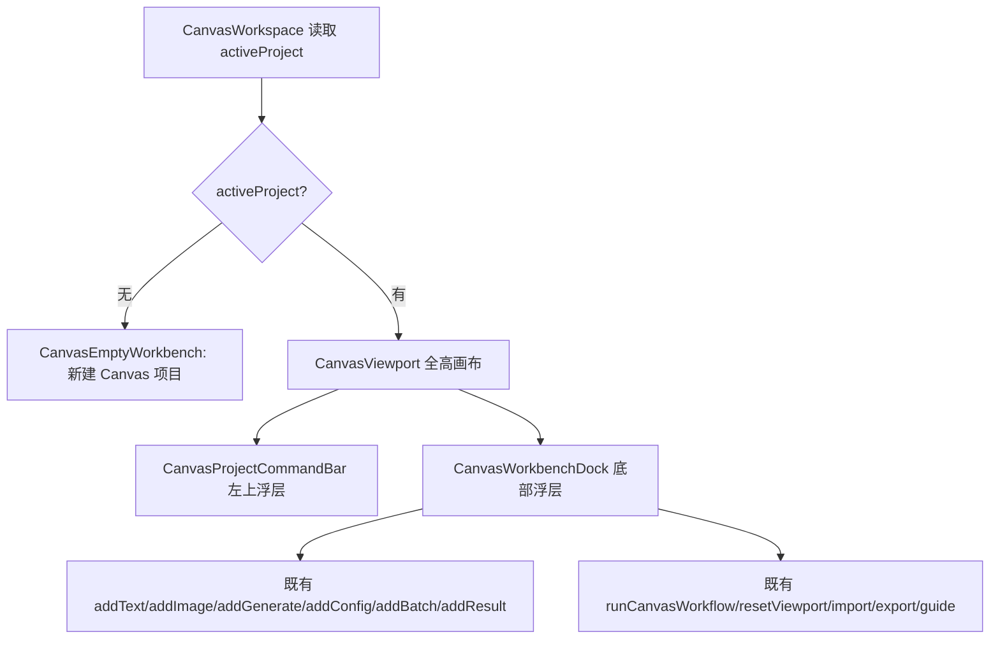

# Canvas Workbench Dock Shell Design

> 用户已授权本轮自主决策和实现，本 design 由 AI 自审通过后直接进入实现。

## 0. 术语约定

- **CanvasWorkbenchDock**：Canvas 画布底部浮动工具 dock，承载移动/选择、添加文本、添加图片、添加生成、配置、批量、结果、运行、导入导出、重置和引导入口。只包含生图相关命令，不包含视频/音频。
- **CanvasProjectCommandBar**：Canvas 画布左上轻量项目信息和项目级命令区，显示项目名、节点数、错误状态、导入导出和引导，不占用整行 header。
- **CanvasEmptyWorkbench**：无 active project 或空节点时的画布内空状态，引导用户直接新建项目或从 dock 添加文本/图片/生成节点。
- **画布优先界面**：CanvasWorkspace 的主视觉是无限画布，工具和状态以浮层形式覆盖，不再使用顶部大 header + 下方视口的页面式结构。

## 1. 决策与约束

### 1.1 需求摘要

当前 CanvasWorkspace 仍像普通后台页面：顶部 header 占一整行，节点工具和项目命令混在一起，空画布只有一个小 “Canvas” 占位。用户希望参考 `E:\MyWork\infinite-canvas` 的画布体验，让 PixAI Canvas 更像专业生图工作台。

成功标准：

- Canvas 有全高画布区域，工具以底部浮动 dock 呈现。
- 项目信息和导入/导出/引导等低频命令移到轻量浮层，不压缩画布空间。
- dock 只出现生图相关命令：文本、图片、生成、配置、批量、结果、运行、重置、导入、导出、引导。
- 空项目 / 空节点状态能直接引导用户开始生图链路。
- 现有节点 store、生成 workflow、导入导出、引导弹窗和项目侧栏语义不变。

明确不做：

- 不新增或迁入视频、音频按钮 / 节点 / 设置。
- 不改 `ImageService`、Provider、history、reference、Tauri API 或数据库结构。
- 不实现节点 hover toolbar、连接创建菜单、生成上下文摘要或结果编组；这些属于后续 roadmap item。
- 不改变 CanvasShell 的项目侧栏职责。

### 1.2 复杂度档位

- 结构 = components（涉及 CanvasWorkspace UI 拆分与 CanvasViewport 空状态输入，但不改数据模型）。
- 可测试性 = tested（需要组件测试和浏览器 smoke 覆盖 dock 命令、无视频音频、空状态）。
- 其余维度走项目默认：健壮性 L2、性能 reasonable、可读性 team、可演进性 active、可观测性 logged。

### 1.3 关键决策

- **先改界面骨架，不碰生成计算**。本 feature 只重新组织 CanvasWorkspace 的命令入口和空状态，所有命令继续调用既有 store action。
- **dock 是 CanvasWorkspace 私有组件**。本阶段不新增全局设计系统组件，避免把一次性画布体验抽到全局。
- **导入/导出保留双入口**。dock 提供常用入口，项目 command bar 也可保留低频入口；两者调用同一函数。
- **空状态内嵌在 CanvasViewport**。无节点时仍展示在世界坐标中心，但 copy 和操作指向生图链路。

## 2. 名词与编排

### 2.1 名词层

#### 现状

- `src/components/canvas/CanvasWorkspace.tsx` 同时承担项目 header、工具按钮、导入导出 input、引导弹窗和 `CanvasViewport` 组合。
- `CanvasViewport` 的空状态只显示一个居中的 “Canvas” 文案。
- 工具按钮以 header 中间按钮组呈现，视觉上更像设置页工具条，不像无限画布 dock。

#### 变化

新增 CanvasWorkspace 内部私有结构：

```tsx
type CanvasWorkbenchDockProps = {
  disabled: boolean
  onAddText: () => void
  onAddImage: () => void
  onAddGenerate: () => void
  onAddConfig: () => void
  onAddBatch: () => void
  onAddResult: () => void
  onRunWorkflow: () => void
  onResetViewport: () => void
  onImportProject: () => void
  onExportProject: () => void
  onOpenGuide: () => void
}
```

`CanvasViewport` 增加可选空状态 props：

```tsx
type CanvasViewportProps = {
  emptyTitle?: string
  emptyDescription?: string
}
```

### 2.2 编排层



#### 现状

- CanvasWorkspace 使用 `grid-rows-[auto_minmax(0,1fr)]`，顶部 header 挤占画布高度。
- 节点添加、运行 workflow、导入导出、引导、重置混在同一 header 行。
- 空 project 和空节点状态分散，无法直接表达 “先添加文本/图片/生成节点”。

#### 变化

- CanvasWorkspace 改为 `relative h-full overflow-hidden` 的画布容器。
- 有 active project 时，CanvasViewport 占满容器；ProjectCommandBar 和 Dock 绝对定位覆盖其上。
- 无 active project 时显示 CanvasEmptyWorkbench，直接提供新建项目入口。
- CanvasViewport 空节点 copy 改为生图链路引导，保留同一 viewport/zoom 行为。

#### 流程级约束

- Dock 的每个按钮只调用既有 action，不自行读写项目。
- 图片导入仍通过隐藏 `input[type=file]` + `readImageFile()` + `addImageNode()`。
- 项目导入仍通过隐藏 JSON input + `importCanvasProjectFile()`。
- 禁止出现“视频”“音频”按钮或导入 accept。

### 2.3 挂载点清单

- `src/components/canvas/CanvasWorkspace.tsx`：主界面从页面式 header 改为画布优先 + 浮动 command/dock。
- `src/components/canvas/CanvasViewport.tsx`：空节点状态文案可由 CanvasWorkspace 传入。
- `src/components/canvas/CanvasWorkspace.test.tsx`：补 dock 命令、无视频/音频、空状态测试。
- `.codestable/roadmap/canvas-image-workbench-upgrade/*`：本 feature 来自 roadmap item，acceptance 回写状态。

### 2.4 推进策略

1. 静态界面骨架：提取 CanvasProjectCommandBar 和 CanvasWorkbenchDock 私有组件，替换顶部 header。
   - 退出信号：CanvasWorkspace 编译通过，dock 按钮可见且没有视频/音频入口。
2. 命令接线：dock / command bar 接入既有 add/import/export/run/reset/guide 函数。
   - 退出信号：现有导入导出、运行、重置、引导测试不退化。
3. 空状态 polish：优化无 active project 和空节点 copy。
   - 退出信号：空项目可新建，空节点提示生图链路。
4. 测试与浏览器 smoke：补组件测试并用本地浏览器验证 Canvas 页面 UI。
   - 退出信号：定向 vitest、tsc 和浏览器 smoke 通过。

### 2.5 结构健康度与微重构

- 文件级 — `CanvasWorkspace.tsx`：已超过 300 行，混合 header、dock、文件读取、图像尺寸解析和引导弹窗。继续直接追加会更胖，但本 feature 的新增组件都只被 CanvasWorkspace 使用，先作为同文件私有组件落地；图片尺寸解析后续可单独 refactor。
- 文件级 — `CanvasViewport.tsx`：职责清晰，只需增加空状态文案 props，不做拆分。
- 目录级 — `src/components/canvas/` 已有多个 Canvas 专属组件，继续放在此处合理。
- compound convention 检索：未发现与 Canvas dock 私有组件归属冲突的长期约束。

结论：本次不做独立微重构。只在 `CanvasWorkspace.tsx` 内部新增私有组件，避免为一条 UI 骨架 feature 额外扩大文件移动范围。

超出范围观察：`CanvasWorkspace.tsx` 里的图片文件读取和 natural size 解析适合后续拆到 `src/components/canvas/canvas-image-file.ts` 或 `src/lib/image-utils.ts`，但这会触发“只搬不改行为”的单独重构，不作为本 feature 前置。

## 3. 验收契约

### 3.1 关键场景清单

- 进入有 active project 的 Canvas：画布区域占满主界面，底部显示浮动 dock。
- dock 中存在文本、图片、生成、配置、批量、结果、运行、重置、导入、导出、引导入口。
- dock 中不出现视频或音频入口。
- 点击 dock 的文本/生成/配置/批量/结果按钮仍能新增对应节点。
- 点击 dock 的图片按钮仍触发图片 file input。
- 点击运行仍调用现有 workflow run。
- 点击导入/导出仍复用现有项目导入导出函数。
- 无 active project 时仍能新建 Canvas 项目。
- active project 无节点时，CanvasViewport 显示面向生图链路的空状态文案。

### 3.2 明确不做的反向核对项

- 不出现 `Video` / `Music` / `Audio` icon 或“视频”“音频”文案。
- 不修改 `ImageService`、Provider、history、reference、Tauri API 或数据库结构。
- 不新增 Canvas node type。

## 4. 与项目级架构文档的关系

验收通过后需要更新：

- `.codestable/architecture/ui-shadcn-workbench.md`
  - Canvas 模式描述补充“CanvasWorkspace 是画布优先界面，项目命令和节点工具以浮层 dock 呈现”。
- `.codestable/architecture/ARCHITECTURE.md`
  - 如总入口已有 CanvasShell/CanvasWorkspace 边界足够，可只补一条硬边界：Canvas dock 只承载生图相关命令，不引入视频/音频。

