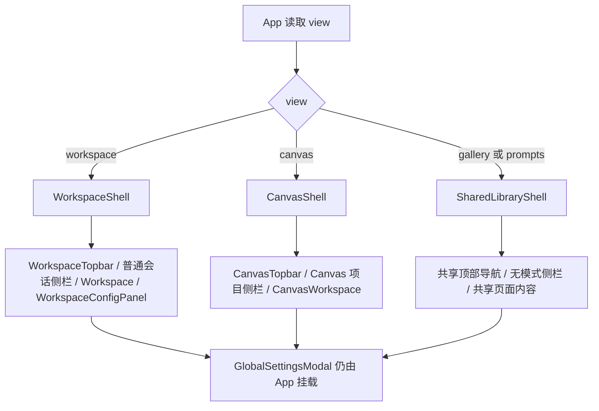

# Workspace Canvas Shell Split Design

## 0. 术语约定

- **WorkspaceShell**：经典工作台的主界面外壳，包含品牌区、工作台导航、普通会话侧栏、`Workspace` 主内容和右侧 `WorkspaceConfigPanel` 参数栏。grep 结论：当前没有同名组件，现有实现集中在 `src/components/layout/MainLayout.tsx` 与 `src/App.tsx`。
- **CanvasShell**：Canvas 的主界面外壳，包含品牌区、Canvas 导航、Canvas 项目侧栏、`CanvasWorkspace` 主内容和未来可扩展的 Canvas 专属 inspector / project panel。grep 结论：当前没有同名组件，Canvas 仍通过 `MainLayout` 复用工作台外壳。
- **SharedAppChrome**：Workspace / Canvas / Gallery / Prompt Library 共用的应用级 chrome 能力，包括主题、全局设置入口、更新提示、图库 / 提示词库导航和全局设置弹窗挂载。该术语是本 feature 新增，用于区分“共享应用框架”和“模式专属主界面”。
- **工作区参数栏**：已有术语，指经典工作台右侧高频生成参数编辑层。架构文档已限定它只承载当前会话的生图参数与引擎选择，本 feature 不把它带入 Canvas。
- **Canvas 项目侧栏**：CanvasShell 的左侧项目列表和新建/删除项目入口。它不是工作台会话侧栏的一个分支，而是 Canvas 主界面自己的导航面。

## 1. 决策与约束

### 1.1 需求摘要

当前 `MainLayout` 同时承载经典工作台和 Canvas，导致工作台专属 UI（例如“参数栏”按钮和 `settingsVisible`）出现在 Canvas 模式下，并且 `toggleSettings()` 会把 `view` 强制切回 `workspace`。用户目标是让“工作台”和“画布”成为两套完全分离的主界面，后续开发时各自维护自己的侧栏、工具栏和面板；图库、提示词库、全局设置、Provider 和生成服务继续共用。

成功标准：

- 经典工作台进入 `WorkspaceShell`，Canvas 进入 `CanvasShell`，两者不再共享同一个 `MainLayout` 侧栏 / 参数栏布局。
- “参数栏”按钮只存在于 WorkspaceShell；Canvas 下点击任何 Canvas 顶部/侧栏操作都不应跳回工作台。
- WorkspaceShell 的侧栏只表达普通会话；CanvasShell 的侧栏只表达 Canvas 项目。
- Gallery / Prompt Library 继续可从两套主界面访问，并保持共享的应用级全局设置入口。
- `settingsVisible` 和 `toggleSettings()` 只表达 Workspace 参数栏显隐，不再承担导航副作用。
- Canvas 生成、图库来源、Provider 设置、全局设置弹窗和 app update 状态不因 Shell 拆分改变业务语义。

明确不做：

- 不重写 Canvas 节点系统、workflow run、生成桥、history/gallery 来源协议。
- 不把图库或提示词库复制成 Workspace / Canvas 两份；它们仍是共享页。
- 不新增 Canvas inspector / 节点属性面板的具体功能，只预留 Shell 边界。
- 不拆分 `ImageService`、Provider settings、Tauri API 或本地数据库结构。
- 不在本 feature 中做大规模 store 分层重构；只把 Shell 需要的布局状态命名收窄。

### 1.2 复杂度档位

- 结构 = modules（偏离内部工具默认 functions 的原因：这次涉及 App 路由、layout 组件拆分、Workspace/Canvas 专属侧栏和状态语义收窄，需要明确模块边界）。
- 可测试性 = tested（偏离默认 testable 的原因：Shell 分流容易造成导航、参数栏和 Canvas 项目侧栏回归，需要组件测试兜底）。

其余维度按项目内部工具默认档位：健壮性 L2、性能 reasonable、可读性 team、可演进性 active、可观测性 logged。

### 1.3 关键决策

- **从“一个 MainLayout 内部分支”改为“App 按 view 选择 Shell”**。`App` 负责决定渲染 WorkspaceShell、CanvasShell 或 SharedLibraryShell，而不是让一个 `MainLayout` 同时理解所有模式的侧栏和参数栏。
- **WorkspaceShell 拥有 `workspaceSettingsVisible` 语义**。当前字段可先沿用 `settingsVisible`，但 action 语义必须收窄为“切换 Workspace 参数栏”，不能再顺带 `view='workspace'`。
- **CanvasShell 不渲染 Workspace 参数栏入口**。Canvas 如果未来需要右侧 inspector，应使用 Canvas 专属状态和组件，例如 `canvasInspectorVisible`，不能复用 `settingsVisible`。
- **共享页使用轻量 SharedLibraryShell**。Gallery / Prompt Library 不需要会话侧栏和 Canvas 项目侧栏，但仍需要品牌、顶部导航、主题、更新提示和全局设置入口。
- **保留已完成的 Canvas 项目侧栏分流成果**。已有 `canvas-mode-sidebar-split` 已经把普通会话和 Canvas 项目列表分离，本 feature 不推翻隐藏会话 / 项目侧栏模型，只把它从 `MainLayout` 内部分支提升为 CanvasShell 的固有结构。
- **业务 action 不因 Shell 拆分改语义**。`openCanvasWorkspace()`、`createCanvasProject()`、`openCanvasProject()`、`deleteCanvasProject()` 继续归 `app-store` 编排；Shell 只调用 action，不重新定义 Canvas project 生命周期。

### 1.4 前置依赖

- `.codestable/features/2026-06-05-canvas-mode-sidebar-split/canvas-mode-sidebar-split-design.md` 已确认工作台会话与 Canvas 项目侧栏分流，并引入隐藏专属会话上下文。
- `.codestable/architecture/ARCHITECTURE.md` 已定义“工作区参数栏”只服务当前会话高频生图参数；本 feature 需要让代码结构与该边界一致。

## 2. 名词与编排

### 2.1 名词层

#### 现状

- `src/App.tsx` 统一渲染 `MainLayout`，再把 Workspace / Canvas / Gallery / Prompt Library 作为 children 塞进去；`SettingsPanel` 只在 `view === 'workspace' && settingsVisible` 时挂载。
- `src/components/layout/MainLayout.tsx` 同时承担顶部导航、工作台会话侧栏、Canvas 项目侧栏、参数栏按钮、主题、更新提示和全局设置入口。
- `src/store/app-store.ts` 里 `settingsVisible` 是工作台参数栏状态，但 `toggleSettings()` 当前同时切换 `settingsVisible` 并强制 `view: 'workspace'`。
- `src/components/canvas/CanvasWorkspace.tsx` 当前只负责 Canvas 页面内容和工具条；Canvas 项目侧栏由 `MainLayout` 代管。
- Gallery / Prompt Library 当前也被包在 `MainLayout` 中，因此会继承工作台/Canvas 的左侧栏布局，即使它们并不是这两种主界面。

#### 变化

- 新增三类 Shell 组件，拆分模式专属布局。

```tsx
type AppShellProps = {
  onOpenGlobalSettings: (tab?: GlobalSettingsTab) => void
}

function WorkspaceShell(props: AppShellProps): JSX.Element
function CanvasShell(props: AppShellProps): JSX.Element
function SharedLibraryShell(props: AppShellProps & { children: ReactNode }): JSX.Element
// 来源：本 feature 新增 layout 组件契约
```

- WorkspaceShell 拥有普通会话侧栏和参数栏显隐。

```tsx
type WorkspaceShellState = {
  activeConversationId: string | null
  workspaceConversations: Conversation[]
  workspaceSettingsVisible: boolean
}
// 来源：现有 useAppStore settingsVisible / conversations / activeConversationId 语义收窄
```

- CanvasShell 拥有 Canvas 项目侧栏，不读取 Workspace 参数栏状态。

```tsx
type CanvasShellState = {
  activeCanvasProjectId: string | null
  canvasProjects: CanvasProjectSummary[]
}
// 来源：现有 useCanvasStore projects / activeProjectId
```

- `toggleSettings()` 的契约收窄。

```ts
type AppState = {
  settingsVisible: boolean
  toggleSettings: () => void // 只切换 Workspace 参数栏，不切 view
}
// 来源：src/store/app-store.ts 当前 action 语义修正
```

### 2.2 编排层



#### 现状

- `App` 只有一个外壳入口：`<MainLayout>{page}</MainLayout>`。
- `MainLayout` 通过 `sidebarMode = view === 'canvas' ? 'canvas' : 'workspace'` 判断侧栏内容，导致 gallery/prompts 也被归到 workspace 侧栏。
- 参数栏按钮无条件出现在顶部导航；它调用 `toggleSettings()`，而 action 会强制回 `workspace`。
- 工作台和 Canvas 的主界面结构耦合：改 Canvas 侧栏或工具栏时必须进入 `MainLayout`，容易影响工作台。

#### 变化

- `App` 改为按 view 渲染不同 Shell：
  - `workspace`：渲染 `WorkspaceShell`，内部组合 `Workspace` 和 `WorkspaceConfigPanel`。
  - `canvas`：渲染 `CanvasShell`，内部组合 Canvas 项目侧栏和 `CanvasWorkspace`。
  - `gallery` / `prompts`：渲染 `SharedLibraryShell`，内部只提供共享顶部导航和页面容器。
- 顶部导航拆成共享和专属两层：
  - 共享导航：工作台、Canvas、图库、提示词库、主题、全局设置。
  - Workspace 专属：参数栏按钮。
  - Canvas 专属：当前只保留 Canvas 项目侧栏和 CanvasWorkspace 自己的工具条，后续 inspector 另起专属入口。
- `settingsVisible && view === 'workspace'` 的判断从 `App` 下沉到 `WorkspaceShell`，因为参数栏是 WorkspaceShell 内部布局，不是 App 的跨模式布局。
- `CanvasShell` 不读取 `settingsVisible`，也不渲染 `WorkspaceConfigPanel` 或参数栏按钮。
- `SharedLibraryShell` 不渲染普通会话侧栏或 Canvas 项目侧栏，避免图库/提示词库被误认为属于某个主界面。

#### 流程级约束

- 从 Canvas 切到 Gallery，再切回 Canvas，应该仍能恢复之前的 Canvas 项目；从 Workspace 切到 Gallery，再切回 Workspace，应该仍能恢复普通会话和参数栏显隐。
- `toggleSettings()` 不允许改变 `view`；任何导航只能由 `setView()` 或 `openCanvasWorkspace()` 触发。
- CanvasShell 不允许导入或渲染 `WorkspaceConfigPanel`。
- WorkspaceShell 不允许读取 `useCanvasStore().activeProject` 来决定主布局；它最多只过滤隐藏 Canvas conversation。
- SharedLibraryShell 不允许渲染模式专属侧栏；图库里的“加入 Canvas”入口仍通过现有 `addHistoryToCanvas()` 业务 action 进入 Canvas。

### 2.3 挂载点清单

- `src/App.tsx`：页面外壳选择从单一 `MainLayout` 改为 `WorkspaceShell` / `CanvasShell` / `SharedLibraryShell`。
- `src/components/layout/`：新增 Workspace / Canvas / Shared shell 组件，并收窄或替换现有 `MainLayout`。
- `src/store/app-store.ts`：修正 `toggleSettings()`，使其只切换参数栏显隐，不再切换 view。
- `src/components/layout/MainLayout.test.tsx` 或新 shell 测试：覆盖 Workspace / Canvas / shared page 的外壳分流。
- `.codestable/architecture/ARCHITECTURE.md` 与 `.codestable/architecture/ui-shadcn-workbench.md`：验收后更新当前架构描述。

### 2.4 推进策略

1. 静态 Shell 骨架：新增 WorkspaceShell、CanvasShell、SharedLibraryShell，把现有 MainLayout 中的公共 topbar / footer 行为拆到可复用片段。
   - 退出信号：App 能按 view 渲染三类 shell，视觉结构与当前主流程一致。
2. Workspace 行为迁移：普通会话侧栏、参数栏按钮和 `WorkspaceConfigPanel` 移入 WorkspaceShell。
   - 退出信号：工作台下参数栏可显隐；普通会话新建/删除/切换仍可用。
3. Canvas 行为迁移：Canvas 项目侧栏移入 CanvasShell，CanvasShell 不渲染参数栏按钮。
   - 退出信号：Canvas 下看不到“参数栏”按钮；项目新建/删除/切换仍可用，点击不会跳回工作台。
4. Shared 页面收口：Gallery / Prompt Library 使用 SharedLibraryShell，不继承 Workspace 或 Canvas 侧栏。
   - 退出信号：图库和提示词库没有普通会话侧栏 / Canvas 项目侧栏，但仍有导航和全局设置入口。
5. 状态语义修正与测试：`toggleSettings()` 去掉导航副作用，补 shell 分流测试和现有布局回归测试。
   - 退出信号：定向 vitest + `tsc --noEmit` 通过，测试覆盖 Canvas 参数栏按钮不存在和图库无模式侧栏。

### 2.5 结构健康度与微重构

##### 评估

- 文件级 — `src/components/layout/MainLayout.tsx`：约 241 行，已经同时承担顶部导航、Workspace 会话侧栏、Canvas 项目侧栏、参数栏按钮、更新提示和页脚设置入口；本次会继续触碰 3 处以上互相独立的 UI 区域，职责混杂信号明确。
- 文件级 — `src/App.tsx`：约 131 行，职责是应用生命周期、全局设置弹窗和页面 view 路由；按 view 选择 shell 属于自然职责延伸。
- 文件级 — `src/store/app-store.ts`：约 1570 行，明显偏胖；本次只改 `toggleSettings()` 语义，不做 store 拆分。
- 文件级 — `src/components/canvas/CanvasWorkspace.tsx`：约 458 行，已经偏大；本次不把 Canvas 项目侧栏继续塞进这里，只让 CanvasShell 承担外壳。
- 目录级 — `src/components/layout/`：当前文件少，适合作为 shell 组件归属目录；新增 3 个 shell 文件不会造成摊平问题。
- compound convention 检索：`search-yaml.py --filter doc_type=decision --filter category=convention --query "目录组织 OR 命名 OR 归属 OR shell OR layout"` 未命中已有目录/命名 convention。

##### 结论：微重构（拆文件）

这次 Shell 分离本身就是安全的结构边界调整，应该先把 `MainLayout` 的职责拆成新文件，再迁移行为。拆分属于“组件边界移动 + import 调整”，不改变业务数据结构。

##### 方案

- 搬什么：从 `MainLayout` 中拆出共享顶部导航/品牌/页脚片段、WorkspaceShell、CanvasShell、SharedLibraryShell。
- 搬到哪：
  - `src/components/layout/AppTopNav.tsx`：共享品牌和主导航按钮。
  - `src/components/layout/WorkspaceShell.tsx`：普通会话侧栏 + Workspace 内容 + 参数栏。
  - `src/components/layout/CanvasShell.tsx`：Canvas 项目侧栏 + CanvasWorkspace 内容。
  - `src/components/layout/SharedLibraryShell.tsx`：图库 / 提示词库共享外壳。
- 行为不变怎么验证：先完成文件拆分后跑 `tsc --noEmit` 和现有 `MainLayout` 相关测试；再做行为迁移和测试改名。
- 步骤序列：
  1. 提取共享 top navigation，不改变按钮行为。
  2. 提取 WorkspaceShell，先保持现有工作台行为。
  3. 提取 CanvasShell，迁移 Canvas 项目侧栏。
  4. 用 SharedLibraryShell 包住图库 / 提示词库。
  5. 移除或保留 `MainLayout` 兼容导出，直到测试迁移完成后再删除。

##### 建议沉淀的 convention

- 是否稳定模式：稳定模式。
- 规则一句话：主模式页面使用专属 Shell，跨模式共享页使用 Shared Shell；不要把模式专属侧栏 / 参数面板塞进单一全局 Layout。
- 适用范围：PixAI React 前端 layout 层。
  → 建议 implement 跑通后走 `cs-decide` 归档为 `category: convention`，未来新增主模式时先建专属 Shell。

##### 超出范围的观察

- `src/store/app-store.ts` 已偏胖，长期应拆出 workspace / canvas / library action 分区或子 store；本 feature 只修正 `toggleSettings()`，不做 store 架构重写。

## 3. 验收契约

### 3.1 关键场景清单

- 启动后进入工作台：页面使用 WorkspaceShell；左侧显示普通会话；顶部有“参数栏”按钮；右侧参数栏按 `settingsVisible` 显隐。
- 在工作台点击“参数栏”：只切换右侧参数栏显隐，`view` 仍为 `workspace`。
- 进入 Canvas：页面使用 CanvasShell；左侧显示 Canvas 项目；顶部没有“参数栏”按钮；不会因为任何参数栏状态跳回工作台。
- 在 Canvas 新建 / 切换 / 删除项目：Canvas 项目侧栏行为保持可用，普通工作台当前会话不被覆盖。
- 进入图库：页面使用 SharedLibraryShell；不显示普通会话侧栏或 Canvas 项目侧栏；仍可打开全局设置。
- 进入提示词库：页面使用 SharedLibraryShell；不显示普通会话侧栏或 Canvas 项目侧栏；仍可回到工作台 / Canvas。
- 从图库成功图点击“加入 Canvas”：继续通过现有业务 action 打开或准备 Canvas 项目，不依赖 SharedLibraryShell 自己持有 Canvas 状态。

### 3.2 明确不做的反向核对项

- CanvasShell 代码中不应出现 `WorkspaceConfigPanel` 或“参数栏”按钮文案。
- `toggleSettings()` 不应写入 `view: 'workspace'`。
- Gallery / Prompt Library 外壳不应渲染普通会话列表或 Canvas 项目列表。
- 不应新增 `ImageService`、Provider profile、history schema 或 Canvas node schema 的结构变更。
- 不应把 Canvas inspector 作为本 feature 的新 UI 功能落地。

## 4. 与项目级架构文档的关系

验收通过后需要更新：

- `.codestable/architecture/ARCHITECTURE.md`
  - 把“前端工作台布局”从单一 `MainLayout` 描述调整为 WorkspaceShell / CanvasShell / SharedLibraryShell。
  - 明确工作区参数栏是 WorkspaceShell 专属能力。
- `.codestable/architecture/ui-shadcn-workbench.md`
  - 更新 summary 中“经典工作台与 Canvas 模式共享 App shell”的旧表述。
  - 在“应用 Shell 与页面路由”中补充 App 按 view 选择 shell。
  - 在“Canvas 模式”中补充 CanvasShell 拥有项目侧栏，CanvasWorkspace 只承载画布内容和工具条。
  - 在“已知约束”中加入“主模式页面使用专属 Shell，共享页不继承模式侧栏”。
