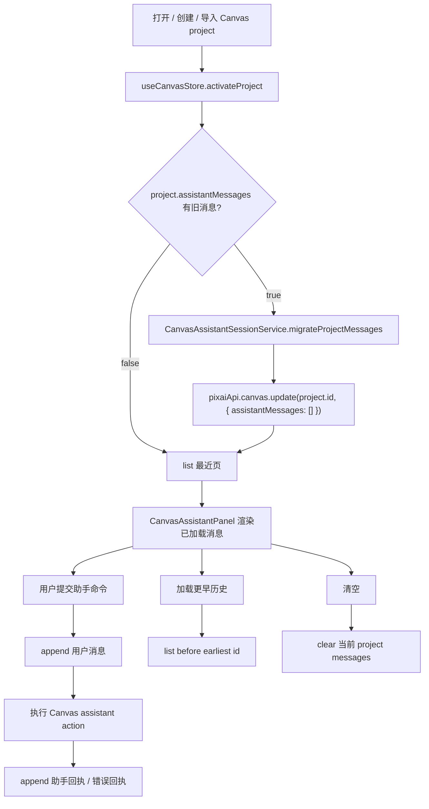

# Canvas Assistant Session Storage Core Design

> 用户已明确要求按长期最稳策略继续实现并测试通过；本 design 作为实现约束直接进入实现。

## 0. 术语约定

- **助手会话消息**：画布助手右侧面板中的 user / assistant 消息，属于某个 Canvas project。
- **会话存储**：独立于 Canvas project JSON 的本地持久化层，本轮用 SQLite 表承载。
- **最近页**：打开项目时默认加载的最新 N 条消息，UI 按时间正序展示。
- **历史页**：点击加载更多时取当前最早消息之前的一页。
- **旧内嵌消息**：上一轮保存在 `CanvasProject.assistantMessages` 中的消息，只作为迁移输入。

## 1. 决策与约束

### 1.1 需求摘要

当前助手聊天已能随项目恢复，但消息直接保存在 `CanvasProject.assistantMessages`。长期策略要解决三个问题：消息多时项目 JSON 变大、删除/清理没有独立生命周期、UI 不能分批加载。

本 feature 完成后：

- 助手消息长期事实源迁移到本地 SQLite。
- Canvas project 保存节点/连线/视口时不再携带聊天历史。
- 打开项目默认加载最近消息，能加载更早历史。
- 用户能清空当前项目助手聊天，不影响画布节点。
- 删除 Canvas project 会级联清理助手聊天。
- 旧 `assistantMessages` 自动迁移，重启恢复不丢。

明确不做：

- 不做全文搜索、云同步、会话分支、工具调用日志。
- 不把聊天历史默认导出进 Canvas project JSON。
- 不把整个 AppDatabase 或 CanvasProjectService 迁入 SQLite。
- 不改变助手解析、节点调度、Canvas workflow 或生成链路。

### 1.2 复杂度档位

- 结构 = modules：新增 Rust SQLite 命令、前端 session service、store 会话状态和 panel 分页 UI，避免继续扩大 project JSON。
- 持久化 = migration-aware：旧内嵌消息需要一次迁移并清空旧字段，重复打开不可重复写入。
- 健壮性 = L2：数据库失败时显示错误并保留 UI 当前状态，不影响画布节点操作。
- 可测试性 = tested：Rust 单测覆盖 SQLite helper；TS service/store/component 测试覆盖迁移、分页、清空和删除清理。
- 其余维度走项目默认。

### 1.3 关键决策

- **使用 Rust 侧 `rusqlite` 而不是前端大 JSON**。助手消息是高增长序列数据，适合查询和分页；但先只开放极窄命令，不把数据库抽象泄露到 UI。
- **`CanvasProject.assistantMessages` 降级为兼容字段**。保留类型用于旧数据/导入迁移；长期写入走 `CanvasAssistantSessionService`。
- **分页由 store 编排，panel 只收 props**。面板不直接读数据库，避免 UI 绑定持久化细节。
- **清空和删除清理都走项目级 API**。清空只删消息；删除项目必须调用会话清理，避免孤儿记录。

## 2. 名词与编排

### 2.1 名词层

#### 现状

- `CanvasProjectService` 用 `pixai-canvas-projects` JSON 保存 project 数组，包含 `nodes/connections/viewport`，上一轮新增了可选 `assistantMessages`。
- `CanvasAssistantPanel` 从 `activeProject?.assistantMessages` 接收消息，每次提交调用 `updateAssistantMessages()`，最终通过 `pixaiApi.canvas.update()` 写回 project。
- `src/lib/platform.ts` 只有通用 `readJsonState/writeJsonState`，Tauri Rust 侧没有 SQL 命令。

#### 变化

新增共享类型：

```ts
export type CanvasAssistantMessage = {
  id: string
  role: 'assistant' | 'user'
  content: string
  createdAt?: string
}

export type CanvasAssistantSessionMessage = CanvasAssistantMessage & {
  projectId: string
  createdAt: string
}

export type CanvasAssistantSessionPage = {
  messages: CanvasAssistantSessionMessage[]
  total: number
  hasMore: boolean
}
```

新增前端服务契约：

```ts
class CanvasAssistantSessionService {
  list(projectId: string, options?: { limit?: number; before?: string | null }): Promise<CanvasAssistantSessionPage>
  append(projectId: string, messages: CanvasAssistantMessage[]): Promise<CanvasAssistantSessionMessage[]>
  clear(projectId: string): Promise<void>
  deleteProject(projectId: string): Promise<void>
  migrateProjectMessages(project: CanvasProject): Promise<CanvasProject | null>
}
```

`CanvasProject.assistantMessages` 保留为可选兼容字段，但 `CanvasProjectService.update()` 不再把它作为常规写入目标；导出项目时输出空数组或省略旧消息，避免默认导出聊天历史。

### 2.2 编排层



#### 现状

- 项目打开只加载 `activeProject`，助手历史跟着 project 一次性进入 React。
- 每次助手消息变化会调用 project update，节点/连线保存也会顺带携带消息。
- 删除项目只删除 project JSON，不存在助手消息级联概念。

#### 变化

- `useCanvasStore` 新增助手消息页状态和 actions：`loadAssistantMessages`、`loadMoreAssistantMessages`、`appendAssistantMessages`、`clearAssistantMessages`。
- 项目变为 active 后统一调用 `activateCanvasProject()` helper：设置 active project、迁移旧消息、加载最近页。
- `CanvasAssistantPanel` 提交时调用 `onAppendMessages([message])`，不再传全量消息数组。
- 加载更多以前端当前最早 message id 作为 `before` 游标。
- 删除 project 时先删 project，再调用 session cleanup；即使 cleanup 失败也不恢复已删除 project，但要暴露 errorMessage。

#### 流程级约束

- 追加消息幂等：同 id 只保存一次。
- 分页按 `createdAt/id` 稳定排序；UI 渲染正序。
- 迁移旧消息必须只发生一次：迁移成功后清空旧 `assistantMessages`。
- 清空当前聊天不改变 nodes/connections/viewport/history。
- project JSON 导出不默认包含聊天历史。

### 2.3 挂载点清单

- `src-tauri/src/lib.rs`：SQLite 命令和 helper；删除后会话本地数据库能力消失。
- `src/lib/platform.ts`：浏览器/Tauri 统一 platform 封装；删除后前端不能调用会话数据库。
- `src/services/canvas-assistant-sessions.ts` + `src/services/app-api.ts`：会话服务和 `pixaiApi.canvasAssistant`；删除后 store 没有稳定 API。
- `src/store/canvas-store.ts`：active project 会话状态、迁移、分页、清空和删除清理编排；删除后 UI 无法跨项目管理会话。
- `src/components/canvas/CanvasAssistantPanel.tsx` / `CanvasWorkspace.tsx`：加载更多、清空和 append props；删除后用户看不到分页/清空行为。

### 2.4 推进策略

1. 持久化基础：Rust `rusqlite` 依赖、SQLite 表和 Tauri commands。
   - 退出信号：Rust helper 单测覆盖 append/list/clear/deleteProject。
2. 前端服务契约：platform 封装、session service、pixaiApi。
   - 退出信号：service test 覆盖分页、幂等和旧消息迁移。
3. Store 编排：迁移旧消息、active project 最近页、加载更多、清空、删除清理。
   - 退出信号：store test 覆盖打开迁移、append、load more、clear、delete cleanup。
4. UI 接入：panel 改为 append 模式，增加加载更多和清空按钮。
   - 退出信号：CanvasWorkspace 组件测试覆盖重开恢复、分页加载、清空不删节点。
5. 验证与落档：定向测试、typecheck、全量检查，更新 architecture/requirement/roadmap/acceptance。
   - 退出信号：所有 checks passed，`pnpm check` 通过。

### 2.5 结构健康度与微重构

- 文件级：`CanvasAssistantPanel.tsx` 目前同时承载 UI 和动作执行，历史 feature acceptance 已记录后续可抽执行器；本次只改消息读写和顶部操作，不扩大解析逻辑，暂不拆执行器。
- 文件级：`canvas-store.ts` 已偏大，但 Canvas project active 状态、节点 mutation 和项目生命周期都在该 store；会话加载和删除清理是 active project 生命周期的一部分，先保持同一 store，避免引入第二个 UI store。
- 目录级：`src/services/` 已有 `canvas-projects.ts`、`canvas-workflow.ts`、`canvas-assistant.ts`，新增 `canvas-assistant-sessions.ts` 符合现有命名边界。
- Rust 文件级：`src-tauri/src/lib.rs` 已很大，但项目当前所有 Tauri commands 都集中在这里。本次先用小型 helper 函数保持局部可测，不做跨文件 Rust 模块拆分，避免把行为变更和结构移动混在一起。

结论：本 feature 不做只搬不改行为的微重构。`lib.rs` 继续变大是已存在结构债，后续如果要拆 Tauri command 模块，应单独走 `cs-refactor`。

## 3. 验收契约

### 3.1 关键场景清单

- 打开带旧 `assistantMessages` 的 Canvas project 时，消息迁移到独立会话存储，project 的旧字段被清空，再次打开不会重复消息。
- 发送助手命令时，用户消息和助手回执被追加到会话存储；重启/重新打开 workspace 后能恢复。
- 当消息超过默认页大小时，打开只加载最近页；点击加载更多能取回更早消息，顺序正确。
- 点击清空当前聊天后，右侧助手回到欢迎态；当前项目节点、连线和视口不变。
- 删除 Canvas project 后，对应助手会话消息被删除，其他项目消息不受影响。
- 导出 Canvas project JSON 不默认包含聊天历史。
- 未识别命令和非法连接仍会产生助手回执，但不会改变 nodes/connections。

### 3.2 明确不做的反向核对项

- 不引入云同步、远端 API 或账号协作。
- 不调用 Provider/prompt API 来理解助手消息。
- 不改变 Canvas workflow 预算、生成节点执行语义或 history 事实源。
- 不默认导出聊天历史。

## 4. 与项目级架构文档的关系

验收通过后更新：

- `.codestable/architecture/ARCHITECTURE.md`
  - Canvas 模式和已知约束中补充助手消息长期事实源已迁到本地 SQLite 会话存储。
- `.codestable/architecture/ui-shadcn-workbench.md`
  - CanvasAssistantPanel 描述补充分页加载、清空和独立会话存储。
  - CanvasProjectService 描述明确 `assistantMessages` 只是旧数据迁移字段，不是长期事实源。
- `.codestable/requirements/canvas-assistant.md`
  - 边界更新：助手对话现在会在本机持久化，但不随项目 JSON 默认导出、不跨项目同步。
